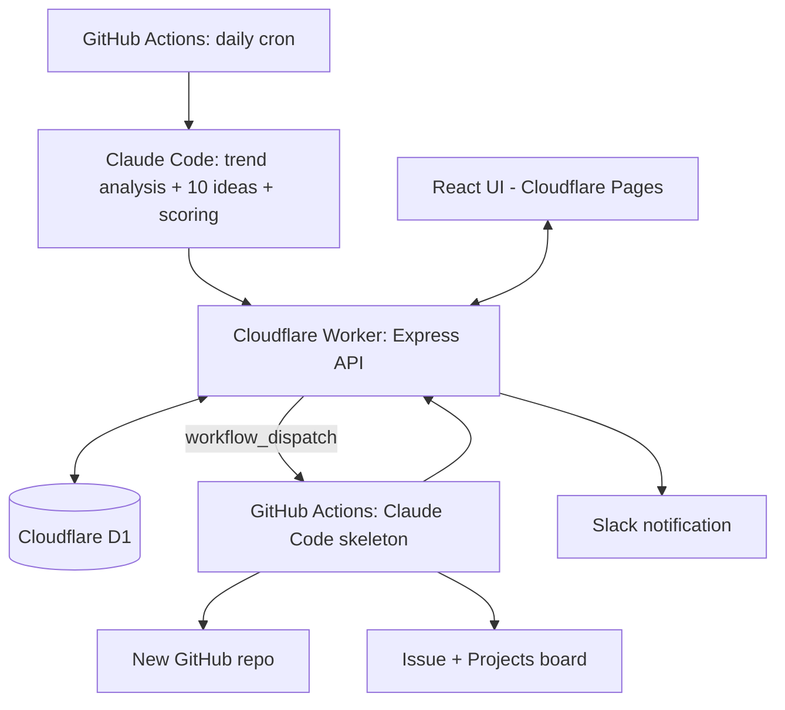

# CLAUDE.md

This file provides guidance to Claude Code (claude.ai/code) when working with code in this repository.

## Project status

**Faz 0 (setup) is done.** `docs/PROJE.md` is the authoritative project plan (written in Turkish); everything below is derived from it. GitHub repo, Cloudflare Worker (API), Cloudflare Pages/Workers static assets (web), and the D1 database all exist and are wired together and verified live (see "Faz 0 — what's live" below).

**Faz 1 (idea pipeline) is done.** D1 schema, the `ideas` CRUD/batch API, the trend-collection scripts (Reddit, App Store, Product Hunt, Hacker News), and `daily-ideas.yml` (the actual cron + `workflow_dispatch` workflow, using `anthropics/claude-code-action@v1` to generate ideas) all exist and have been verified with a real, successful production run — see "Faz 1 — what's live" below for the full pipeline and the non-obvious bugs that had to be fixed to get there.

**Faz 2 (UI) is done.** `apps/web` is a real app now (not the Vite starter): idea list (grouped by date, sortable, filterable) and idea detail (full fields, star rating, note, archive) screens, talking directly to the API cross-origin through CORS. See "Faz 2 — what's live" below.

**Critical process rule from `docs/PROJE.md`'s final section:** do not code around anything listed under "Açık sorular" (open questions) without clarifying with the user first — don't assume, ask. As decisions are made, keep the "Kesinleşen kararlar" (finalized decisions) table and "Açık sorular" list in `docs/PROJE.md` up to date. Work phase by phase (see Roadmap below), and at the end of each phase show the user how to test what was built.

## Commands

```bash
pnpm install            # install all workspace deps (run from repo root)

pnpm dev:web            # apps/web: vite dev server
pnpm dev:api            # apps/api: wrangler dev (local Worker + local D1 sim)

pnpm build              # typecheck+build web, typecheck api
pnpm typecheck          # web + api + scripts
pnpm lint               # web + api + scripts (oxlint)

# deploy (real Cloudflare resources — costs nothing on free tier, but is a live change)
pnpm --filter web deploy    # builds then `wrangler deploy` (static assets)
pnpm --filter api deploy    # `wrangler deploy` (the Express Worker)

# D1 migrations (apps/api/migrations/*.sql) — run from apps/api
npx wrangler d1 migrations apply app-idea-factory-db --local   # local sim
npx wrangler d1 migrations apply app-idea-factory-db --remote  # real Cloudflare D1 (live change)

# trend collection — run from scripts/ (needs PRODUCTHUNT_TOKEN env var for real PH data,
# otherwise that source is skipped)
pnpm collect-trends [output-path]   # defaults to scripts/output/trend-summary.<date>.json (gitignored)
```

There are no automated tests yet — nothing in Faz 0/1's scope needs more than typecheck/lint plus the manual verification steps below. Add a real test runner once Faz 1's idea-generation logic (the part with actual branching/parsing) lands.

## Faz 0 — what's live

- **GitHub repo:** https://github.com/utkualbayrak/app-idea-factory (public, per the finalized decision).
- **API Worker:** `apps/api`, deployed at https://app-idea-factory-api.utkualbayrakrak.workers.dev — Express app run via `nodejs_compat` + `httpServerHandler` (see `apps/api/src/index.ts`), bound to D1 via `env.DB` (accessed through `import { env } from "cloudflare:workers"`, see `apps/api/src/app.ts`). See "Faz 1 — what's live" for the real routes.
- **D1 database:** `app-idea-factory-db` (id in `apps/api/wrangler.jsonc`). Schema landed in Faz 1 (see below).
- **Web app:** `apps/web`, deployed at https://app-idea-factory.utkualbayrakrak.workers.dev — still the unmodified Vite+React+TS starter page; real screens come in Faz 2. Deployed as a Cloudflare Workers **static-assets** site (`apps/web/wrangler.jsonc`, `@cloudflare/vite-plugin`) — this is Cloudflare's current mechanism for what `docs/PROJE.md` calls "Cloudflare Pages" (Cloudflare merged Pages into Workers in 2026); same free tier, same product intent, just deployed with `wrangler deploy` instead of a separate `pages` command.
- **Package manager:** pnpm workspaces (`pnpm-workspace.yaml`: `apps/*`, `scripts`). `wrangler`/`@cloudflare/vite-plugin`/`esbuild` build scripts are pre-approved via `pnpm.onlyBuiltDependencies` in the root `package.json` — needed for `wrangler dev`/`deploy` to work after a fresh `pnpm install`.

### Faz 0 — secrets and access (done)

- **Cloudflare Access** (Zero Trust, owner's email only) protects both the web app and the API Worker, each as its own self-hosted Access application. The API app has two policies (OR'd): email login for the owner, and a Service Auth policy for a Cloudflare Access service token named `github-actions-workflow` — verified via `curl` with `CF-Access-Client-Id`/`CF-Access-Client-Secret` headers returning `200` from `/health`, and a header-less request getting redirected (`302`) to the Access login.
- **GitHub Actions repo secrets** (`gh secret list --repo utkualbayrak/app-idea-factory`): `WORKFLOW_API_SHARED_SECRET`, `CLAUDE_CODE_OAUTH_TOKEN`, `CF_ACCESS_CLIENT_ID`, `CF_ACCESS_CLIENT_SECRET`, `SKELETON_REPO_PAT` (see note below on PAT scope).
- **Cloudflare Worker secrets** (`wrangler secret list` in `apps/api`): `WORKFLOW_API_SHARED_SECRET` (mirrors the GitHub one, for verifying calls from the workflow), `SLACK_WEBHOOK_URL` (Worker sends Slack notifications per `docs/PROJE.md`, not the workflow — so this secret only needs to live on the Worker, not in GitHub Actions).
- **PAT scope deviation:** `docs/PROJE.md`'s "narrowest possible PAT" decision assumed a fine-grained GitHub PAT would work. It doesn't — fine-grained PATs don't support GitHub Projects (v2) at the user-account level. `SKELETON_REPO_PAT` is a **classic** PAT (`repo` + `project` scopes) instead. See the note in `docs/PROJE.md` under "Kesinleşen kararlar".
- None of `.github/workflows/*.yml` exist yet — those land in Faz 1 (`daily-ideas.yml`) and Faz 3 (`build-skeleton.yml`), and are what will actually consume these secrets.
- **`PRODUCTHUNT_TOKEN`** (GitHub secret, read-only Product Hunt developer token) — set. Expected by `scripts/lib/producthunt.ts`; skipped gracefully if absent.

## Faz 1 — what's live

- **D1 schema:** `apps/api/migrations/0001_init_schema.sql` — `ideas`, `tasks`, `trend_snapshots` tables per `docs/PROJE.md`'s "Veri modeli". Applied to both local (`--local`) and the real remote D1. `tasks` isn't used by any code yet (that's Faz 3).
- **Idea API** (`apps/api/src/app.ts`, validated with zod in `apps/api/src/schema.ts`):
  - `GET /ideas` (optional `?batch_date=`), `GET /ideas/:id`, `PATCH /ideas/:id` — unauthenticated at the app layer, rely on Cloudflare Access at the edge (browser/UI use, Faz 2).
  - `GET /ideas/recent-names` (`?days=`, default 90), `POST /ideas/batch` (`{ batch_date, ideas: [...] }`) — workflow-only, gated by `apps/api/src/auth.ts`'s `requireWorkflowSecret` middleware (`X-Workflow-Secret` header checked against `env.WORKFLOW_API_SHARED_SECRET`).
  - `scores` fields (`market`, `feasibility_solo_dev`, `originality`, `overall`) are validated as **1-10 integers** — `docs/PROJE.md`'s idea schema example didn't specify a scale, this was picked and is only encoded in `apps/api/src/schema.ts`; revisit if it doesn't fit once real idea generation is wired up.
  - Local dev needs `apps/api/.dev.vars` (gitignored; copy `.dev.vars.example`) for `WORKFLOW_API_SHARED_SECRET` since `wrangler secret put` only sets the value on the deployed Worker, not local dev.
- **Trend collection** (`scripts/`, its own pnpm workspace package, run with `pnpm collect-trends` from inside `scripts/`): `scripts/collect-trends.ts` orchestrates four independent sources (`scripts/lib/reddit.ts`, `appstore.ts`, `producthunt.ts`, `hackernews.ts`) — one failing never blocks the others, each section carries its own `error` string when degraded. Output is a `TrendSummary` JSON, consumed by `prompts/daily-ideas.md` in the real workflow. Doesn't write to D1 yet (no `trend_snapshots` writes); that can be added later if wanted, the daily run doesn't rely on it. `SKIP_REDDIT=true` env var skips Reddit entirely — useful when iterating on the rest of the pipeline, since Reddit alone adds ~11 minutes (see below).
  - **Reddit:** no official API — public `.json` with a `.rss` (Atom) fallback on failure, subreddit groups/params defined in `config/subreddits.json` (edit that file, not the code, to change sources). **Confirmed in production, not just the dev sandbox (2026-09-30):** ran the real `daily-ideas.yml` on GitHub Actions — `.json` was blocked and `.rss` fallback kicked in for every group there too, identically to local testing. `fetchWithBackoff` (reads `x-ratelimit-reset`, waits, retries once) makes it eventually succeed, but the whole Reddit step alone took ~11 of the run's ~12 total minutes, and all items came through degraded (title + link only, no score/body/comment-count). **Decision: left as-is** — the main repo is public so GitHub Actions minutes are free/unlimited, and 12 minutes is well inside the workflow's 20-minute timeout, so this is a data-quality tradeoff, not a cost or reliability one. Revisit only if the user follows through on Reddit's manual "Data Access Request" (see below).
  - **Official Reddit API — tried, blocked on Reddit's side (2026-09-30):** attempted to switch to OAuth (a "script"-type Reddit app + `client_credentials` grant against `oauth.reddit.com`) for reliability. Reddit now requires a manual "Data Access Request" support-ticket review for any non-Devvit API app — no self-serve app creation, no defined turnaround time. The OAuth implementation was built, tested (worked once `REDDIT_CLIENT_ID`/`SECRET` would exist), then reverted since credentials can't actually be obtained right now. If the user submits and gets approved for that request later, the OAuth version is recoverable from git history (commit `8ed245d`, "Reddit için resmi OAuth API'ye geç") — reapply `scripts/lib/reddit-auth.ts` and the OAuth-based `scripts/lib/reddit.ts`.
  - **App Store:** Apple's free, unauthenticated `rss.applemarketingtools.com` top-free/top-paid charts (US + TR) plus `itunes.apple.com/lookup` for ratings (also free, bulk by ID) — surfaces both "top of chart" and "popular but rated low" (≥1000 ratings, sorted by lowest rating) items. Each chart/lookup call retries once on transient failure (observed intermittent `504`s from Apple) and failures are isolated per country/kind, not fatal to the section.
  - **Apple customer-reviews RSS — tried, doesn't work:** the old `itunes.apple.com/.../rss/customerreviews/...` endpoint (meant to pull actual complaint text for low-rated popular apps) returns a valid-looking feed shell but zero `entry` items for every app tested, in both `json` and `xml` formats. Not implemented; don't re-attempt without first re-verifying the endpoint actually returns entries.
  - **Product Hunt:** official GraphQL v2 API, needs `PRODUCTHUNT_TOKEN` (set, see above) — gracefully skips (not an error) when the token is absent.
  - **Hacker News:** official Algolia HN Search API (`hn.algolia.com/api/v1`, no auth), `scripts/lib/hackernews.ts`. Last-24h "Ask HN" posts (sorted by points, capped) plus last-week posts/comments matching a few pain-point phrases (`search_by_date`). **Non-obvious bug fixed here, don't reintroduce it:** Algolia's `query` param without quotes is bag-of-words OR matching, not phrase matching — with common words like "is"/"there"/"app" that means the filter is a no-op and `search_by_date` just returns whatever's most recent, completely unrelated to the query (verified: same garbage results across 4 different phrases). Phrases MUST be wrapped in literal double quotes inside the query string (`"${phrase}"`) to get real phrase matching. Also dropped `"app that"` from the phrase list — even quoted it was too generic (~95 hits/week, mostly noise); stick to the more specific phrases already there unless you've verified a new one's precision the same way.
  - **Google Play:** skipped entirely — no free/official trend API exists; noted in `docs/PROJE.md`'s Faz 5 roadmap to revisit.
- **Pipeline glue** (`scripts/lib/api-client.ts`, `fetch-recent-names.ts`, `validate-ideas.ts`, `submit-ideas.ts`): call the deployed API through Cloudflare Access (`CF-Access-Client-Id`/`Secret` headers) + `X-Workflow-Secret`. `idea-schema.ts` duplicates `apps/api/src/schema.ts`'s zod schema by hand (separate pnpm workspaces, no shared package) — keep them in sync if either changes. `api-client.ts`'s `fetchJson` checks `content-type` is `application/json`, not just `res.ok` — a Cloudflare Access auth failure silently redirects to an HTML login page with a `200` status, which `res.ok` alone wouldn't catch (this happened, see below).
- **`prompts/daily-ideas.md`:** the actual instructions given to Claude Code — schema, language rules (`name` English, everything else Turkish), 1-10 integer score guide, instruction to read `scripts/output/{trends,recent-names}.json` and write `scripts/output/ideas.json` as a bare 10-element JSON array.
- **`.github/workflows/daily-ideas.yml`:** cron (`0 3 * * *` = 06:00 Türkiye) + `workflow_dispatch`. Steps: checkout → pnpm/node setup → install → `fetch-recent-names` → `collect-trends` → `anthropics/claude-code-action@v1` (automation mode via the `prompt` input) → `validate-ideas` → `submit-ideas`. **Verified end-to-end with a real successful run (2026-09-30)** — 10 ideas generated and landed in production D1. Getting there required fixing four non-obvious issues in sequence, in case they resurface:
  1. `CF_ACCESS_CLIENT_ID`/`CF_ACCESS_CLIENT_SECRET` GitHub secrets were initially bad (likely a copy-paste/whitespace issue when first set) — calls silently redirected to Cloudflare Access's login page instead of erroring. Fixed by resetting both secrets via `printf '%s' 'value' | gh secret set NAME`. If this recurs, `api-client.ts`'s error message shows `redirected`/`final_url` — a `final_url` pointing at `*.cloudflareaccess.com/cdn-cgi/access/login/...` means the Access headers aren't being accepted, not an app-level bug.
  2. `anthropics/claude-code-action@v1` needs `permissions: id-token: write` on the job (not just `contents: read`) — without it, action fails immediately with "Could not fetch an OIDC token".
  3. The **Claude Code GitHub App** (https://github.com/apps/claude) must be installed on the repo — separate from the `CLAUDE_CODE_OAUTH_TOKEN` secret. Without it: "401 Unauthorized - Claude Code is not installed on this repository."
  4. Default `claude_args` run with `permissionMode: "default"`, which prompts for approval on every `Write`/`Edit` call — with no human to approve, every write is silently denied. Claude behaved correctly here (refused to route around it via Bash, reported clearly it couldn't finish), but the file never got written. Fixed with `claude_args: "--max-turns 15 --permission-mode acceptEdits"` (auto-approves file edits specifically, doesn't blanket-bypass everything like `bypassPermissions` would).

## Faz 2 — what's live

- **`apps/web`** is a real app: `src/pages/IdeaListPage.tsx` (grouped by `batch_date`, each group rendered as an `IdeaTable`, filter controls for category/status/min-rating/unrated-only) and `src/pages/IdeaDetailPage.tsx` (all fields, score breakdown bars, interactive star rating, note textarea with explicit save, archive/unarchive toggle, a disabled "Geliştir (yakında)" button since task creation is Faz 3). Routing via `react-router-dom` (`BrowserRouter`, routes in `App.tsx`). `src/lib/api.ts` is the only place that talks to the API.
- **UI stack (Faz 2, 2026-09-30 decision):** Tailwind CSS v4 (`@tailwindcss/vite` plugin, CSS-first config — no `tailwind.config.js`) + shadcn/ui (`components.json`, `new-york` style, components live in `src/components/ui/`) + `@tanstack/react-table` for `src/components/IdeaTable.tsx` (sortable columns via clickable headers, one table instance per date group — `useReactTable` is called inside `IdeaTable`, never in a loop in the parent, to respect the rules of hooks). Theme is tweakcn's **"Caffeine"** preset, applied as raw CSS variables in `src/index.css` (`:root` for light, `@media (prefers-color-scheme: dark)` override for dark — no manual toggle, matches the rest of the app's system-preference-only approach). `src/lib/utils.ts` has the standard shadcn `cn()` helper.
  - **`@tanstack/react-table` is pinned to `8.21.3`, not latest:** whatever installs as "latest" in this environment resolves to a `9.x` with a completely different, feature-flag/factory-based API (`createCoreRowModel`, `assignTableAPIs`, no `useReactTable` export) that has no reliable documentation to work from. Don't upgrade without actually reading that version's real API first — the v8 hooks-based API (`useReactTable`, `getCoreRowModel`, `ColumnDef<T>`) is what `IdeaTable.tsx` is written against.
  - **The `shadcn` CLI (`npx shadcn@latest add ...`) cannot resolve the `@/*` path alias correctly in this pnpm-workspace monorepo layout** — it silently writes components into a literal `apps/web/@/components/ui/` directory instead of `apps/web/src/components/ui/`, and generates `import { cn } from "cn"` (a real but wrong npm package it auto-installs) instead of `import { cn } from "@/lib/utils"`. Both times this was run, `tsconfig.app.json` needed `baseUrl: "."` present (alongside `paths`) for the CLI to resolve anything at all — but `baseUrl` alone fails `tsc -b` here ("deprecated, will stop functioning in TypeScript 7.0"). Working pattern: temporarily add `baseUrl` back, run `shadcn add`, then manually `mv` the output from `apps/web/@/components/ui/` to `apps/web/src/components/ui/`, `sed` any `from "cn"` to `from "@/lib/utils"`, `pnpm remove cn --filter web`, delete the leftover `apps/web/@/` directory, and remove `baseUrl` again before typechecking.
- **Cross-origin API access:** the web app and API are on different hostnames, each its own Cloudflare Access application — so browser calls are genuinely cross-origin with credentials (Access's session cookie is per-hostname). `apps/api/src/app.ts` adds `cors()` with `credentials: true`; the frontend calls `fetch(..., { credentials: "include" })`. `origin` is a **function** `(origin, callback) => ...` (not a plain value — that was tried first and is wrong per the `cors` package's actual API) that reflects back the request's `Origin` header if it's in the comma-separated `env.WEB_ORIGIN` allowlist, else falls back to the first entry. `WEB_ORIGIN` is a `vars` entry in `apps/api/wrangler.jsonc` (prod: both the custom domain and the `*.workers.dev` URL, comma-separated — the web app is reachable at **`https://ideas.utkualbayrak.dev`**, a custom domain added directly in Cloudflare, not through this repo's config; keep both origins listed until/unless the `workers.dev` one is retired) and overridden in `apps/api/.dev.vars` to `http://localhost:5173` for local dev (`vars` from wrangler.jsonc are local-dev-overridable the same way secrets are).
- **Cloudflare Access blocks CORS preflight by default — non-obvious, cost real debugging time:** a CORS preflight (`OPTIONS`) request never carries credentials/cookies (that's the Fetch spec, not a bug), so Access — sitting in front of the Worker — sees an unauthenticated request and returns its own `403` HTML instead of letting it reach the Worker's own (correct) CORS handling. The browser then reports a plain "CORS error" with no more detail, which doesn't point at Access as the cause. **Fix (already applied, don't redo):** on the web app's Access application, Zero Trust → Access → Applications → (the app protecting the web hostname) → CORS settings → toggle on **"Bypass options requests to origin"**. This sends `OPTIONS` straight to the Worker, where `cors()` handles it properly; the actual `GET`/`PATCH`/etc. requests are still fully Access-protected. If CORS errors resurface after adding a new domain/app, check this toggle first before touching code.
- **The actual (non-preflight) request also needs its own Access login — separate from the web app's:** Access sessions are cookied per hostname. Logging into `ideas.utkualbayrak.dev` does not authenticate the browser for `app-idea-factory-api.utkualbayrakrak.workers.dev` — that's a different Access application with its own session. A user who's only ever visited the web app will have every API call 302-redirect to Access's login page (which, being cross-origin, `fetch` can't follow the way a page navigation would, and it surfaces in DevTools as a CORS error, same symptom as the preflight issue above but a different cause). Fix is on the user's side, not code: visit the API's own URL directly once (e.g. its `/health` route) and complete the Access login there too.
- **Local dev:** `apps/web/.env.development` sets `VITE_API_BASE_URL=http://localhost:8787` so `pnpm dev` in `apps/web` talks to a locally-running `wrangler dev` API automatically; production builds fall back to the real deployed API URL (hardcoded default in `api.ts`) since there's no `.env.production` override.
- **Deploy gotcha, don't repeat it:** `apps/web`'s `wrangler.jsonc` `name` field controls what `wrangler deploy` actually deploys to — it drifted to `"web"` at some point (vs. the Pages-era project name `"app-idea-factory"` used for the *first* deploy back in Faz 0, which went through `wrangler pages project create` and doesn't read that field the same way). A later plain `wrangler deploy` created a **second, separate live Worker** at `web.utkualbayrakrak.workers.dev` before this was caught and deleted. Before deploying `apps/web`, sanity-check `wrangler.jsonc`'s `name` is still `"app-idea-factory"` — if a deploy ever reports a URL that doesn't match the one in this doc, stop and check that field rather than assuming it's fine.
- Verified manually end-to-end via the Chrome extension against local dev servers (re-verified after the shadcn/TanStack Table rebuild too): list renders grouped/filtered correctly, clicking a column header sorts that group's table, star rating and note both persist across a page reload (real API round-trip, not just local state), archive toggle updates both the detail page and table row. No console errors.
- Not built yet (Faz 3+): the task/"Geliştir" form, `tasks` table usage, GitHub Projects/Issues integration, Slack notifications.

## What this project is

A personal automation platform that:
1. Generates 10 original mobile app ideas every morning based on real trend data.
2. Lists them in a mobile-first React UI where the user rates (1-5 stars), notes, sorts, and filters them.
3. Lets the user pick an idea, choose platform/scope, and assign a "Develop" task.
4. On "Develop", automatically runs Claude Code to scaffold that idea into a new, separate GitHub repo.
5. Integrates the process with Slack (notifications) and GitHub Issues + Projects (task tracking).

## Finalized architecture decisions

These are locked in and should not be second-guessed without discussing with the user:

- **Hosting:** Cloudflare only, free tier — no service requiring a paid plan.
- **Frontend:** React (mobile-first, PWA) on Cloudflare Pages.
- **Backend:** Node.js/Express on Cloudflare Workers (`nodejs_compat` + `httpServerHandler`).
- **Database:** Cloudflare D1 (SQLite, free tier).
- **Repo structure:** single monorepo — frontend, backend, and workflows together.
- **Language:** TypeScript everywhere (frontend, API, scripts).
- **Claude access:** Claude Pro subscription only, via the official Claude Code GitHub Action using an OAuth token from `claude setup-token`. **No direct Anthropic API usage/credits** — this is why all Claude work (including idea generation) runs inside GitHub Actions, never from the Worker.
- **Scheduling:** daily idea generation via GitHub Actions `schedule` cron at 06:00 Türkiye time (`0 3 * * *` UTC); the Worker never runs the scheduler, only serves the API/DB.
- **Scaffolding output:** each chosen idea gets its own **private** GitHub repo on the personal account; the main repo stays **public** (so Actions minutes are unlimited, but nothing secret can live in it).
- **UI protection:** Cloudflare Access (Zero Trust free tier), restricted to the owner's email only.
- **No auto-development:** generated ideas are never developed automatically — a repo/skeleton is created only when the user explicitly clicks "Develop"; Claude Code only scaffolds, it does not continue building afterward.
- **Scaffold trigger:** submitting the task form starts skeleton generation immediately, without a separate approval step.
- **Ratings are cosmetic only:** user star ratings/notes never feed back into idea generation (only past idea *names* are used, for duplicate avoidance).
- **Notifications:** Slack free tier, single incoming webhook, sent from the Worker (not from the workflow directly).
- **Task tracking:** GitHub Issues + GitHub Projects (v2, GraphQL API), single board on the personal account; issues/board updates are made by the skeleton workflow, not the Worker.
- **No budget-limit feature** is planned in-app.
- **Idea content language:** descriptions in Turkish; the idea `name` itself is a short, memorable English app name (e.g. "MealMate").

## Architecture (planned)



### Flow 1 — Daily idea generation (automatic)

1. Cron fires at 06:00 Türkiye time. Workflow is also `workflow_dispatch`-triggerable for manual runs/catch-up. (Scheduled workflows auto-disable after 60 days with no commits — plan for a keepalive step.)
2. Workflow fetches recent idea names from the Worker API (duplicate avoidance).
3. A Node.js script collects trend data (Reddit, App Store/Google Play, Product Hunt) into a file.
4. Claude Code runs with the trend file + historical idea names, producing 10 ideas + scores in the defined JSON schema (see below).
5. Workflow validates the JSON (schema + duplicate check) and POSTs it to the Worker API.
6. Worker writes to D1 and optionally sends a Slack morning summary.

### Flow 2 — Skeleton generation (manual, per idea)

1. User picks an idea in the UI and fills out the task form.
2. Worker records the task in D1 as `queued` and triggers the skeleton workflow via `workflow_dispatch`.
3. Workflow creates a new private GitHub repo, opens an issue in it with idea + task params, adds it to the Projects board as "In progress".
4. Workflow runs Claude Code with the idea + task params, pushes the result to the new repo, comments a summary on the issue, sets board status to "Done" (or "Failed").
5. Workflow reports the result (repo URL, issue URL, status, error) back to the Worker API.
6. Worker updates the task and sends a Slack message with the repo link.

## Components (planned layout)

- **`apps/web`** — Vite + React + TypeScript, mobile-first PWA. Screens: daily idea list (grouped by date, sortable/filterable by Claude score, user score, category, status), idea detail (full description + score breakdown + user rating/note + "Develop" button), task form, tasks list (queued/running/done/failed, repo/issue links, retry). Rating an idea never triggers automation; only "Develop" + the task form starts skeleton generation. If a task already exists for an idea, "Develop" shows task status instead of allowing a second repo.
- **`apps/api`** — Express + TypeScript on Cloudflare Workers, D1 via binding. Planned endpoints: `GET /ideas`, `GET /ideas/:id`, `PATCH /ideas/:id`, `GET /ideas/recent-names`, `POST /ideas/batch` (workflow-only), `POST /tasks`, `GET /tasks`, `POST /tasks/:id/retry`, `POST /tasks/:id/result` (workflow-only). Workflow-called endpoints are protected by a shared secret. Free-tier limits (100k requests/day, 10ms CPU/call) mean the Worker must stay thin — just DB read/write and triggering external services.
- **`.github/workflows`** — `daily-ideas.yml` (Flow 1), `build-skeleton.yml` (Flow 2, `workflow_dispatch`), plus helper scripts under `scripts/` (trend collection, JSON validation, API submission — Node.js + TypeScript) and instruction templates under `prompts/` used by the Claude Code GitHub Action.

### Idea JSON schema

`name` is English; all other text fields are Turkish:

```json
{
  "name": "MealMate",
  "one_liner": "Buzdolabındaki malzemelerden haftalık yemek planı çıkaran asistan",
  "problem": "string (Turkish)",
  "target_audience": "string (Turkish)",
  "core_features": ["string (Turkish)"],
  "monetization": "string (Turkish)",
  "category": "string",
  "inspiration_source": "string (url)",
  "scores": { "market": 1, "feasibility_solo_dev": 1, "originality": 1, "overall": 1 }
}
```

### Task form fields

Platform (iOS/Swift, Android/Kotlin, cross-platform React Native/Expo or Flutter), backend need (none/Supabase/Firebase/custom API), auth (none/email/social), MVP feature selection (3-5 suggested) + free-text additions, design preference (light/dark, minimal/colorful), free-text notes.

### Skeleton repo expectations

Private repo, name derived from the idea's English name (e.g. `mealmate-app`, suffixed on collision). Must contain a working project structure, navigation, sample MVP screens, a README (idea summary, setup, architecture), basic lint/format config, and the full idea JSON saved as `IDEA.md` in the new repo.

## Data model (D1, draft)

- **ideas**: id, created_at, batch_date, name, one_liner, problem, target_audience, core_features (json), monetization, category, inspiration_source, scores (json), user_rating (1-5, nullable), user_note, status (new / archived / in_development / developed)
- **tasks**: id, idea_id, created_at, updated_at, params (json), status (queued / running / done / failed), repo_url, issue_url, project_item_id, workflow_run_id, error
- **trend_snapshots**: id, fetched_at, source, payload (json)

## Planned folder structure

```
/
├── CLAUDE.md
├── docs/
│   └── PROJE.md
├── config/
│   └── subreddits.json   (trend collection source list, edited here not in code)
├── apps/
│   ├── web/          (React + Vite)
│   └── api/          (Express, Cloudflare Worker, D1 migrations)
├── scripts/          (trend collection, validation, API client — own pnpm package)
├── prompts/          (Claude Code instruction templates)
└── .github/
    └── workflows/
```


## Security constraints

- UI and API must sit behind Cloudflare Access; only the owner's email can log in.
- GitHub Actions → API calls pass Cloudflare Access via a service token, plus an app-level shared-secret check.
- Because the main repo is public:
  - No secrets, internal config beyond the API address, or personal data may be committed.
  - Workflow logs and Claude Code output must never contain secrets/tokens.
  - No `pull_request_target` usage (fork PRs must not reach secrets).
  - `workflow_dispatch` must only be triggerable by users with write access.
- Secrets live only in Cloudflare secrets / GitHub Actions secrets, never in the frontend or repo: `CLAUDE_CODE_OAUTH_TOKEN`, a fine-grained PAT scoped to private-repo creation + content write + issues write + Projects write, the workflow↔Worker shared secret, the Cloudflare Access service token, and the Slack webhook URL.

## Roadmap (phases)

1. **Faz 0 — Setup:** monorepo skeleton, Cloudflare Pages + Worker + D1 wiring, GitHub secrets, Claude Code token.
2. **Faz 1 — Idea pipeline:** D1 schema, API endpoints, trend-collection scripts, `daily-ideas.yml`.
3. **Faz 2 — UI:** access protection, idea list, detail screen, rate/archive.
4. **Faz 3 — Task & skeleton:** task form, `build-skeleton.yml`, repo/issue creation, result callback, retry.
5. **Faz 4 — Integrations:** Slack notifications, Projects board (issue creation ships in Faz 3).
6. **Faz 5 — Refinements:** better duplicate detection, new trend sources, assigning tasks from Slack, continuing development in skeleton repos via `@claude` mentions.
