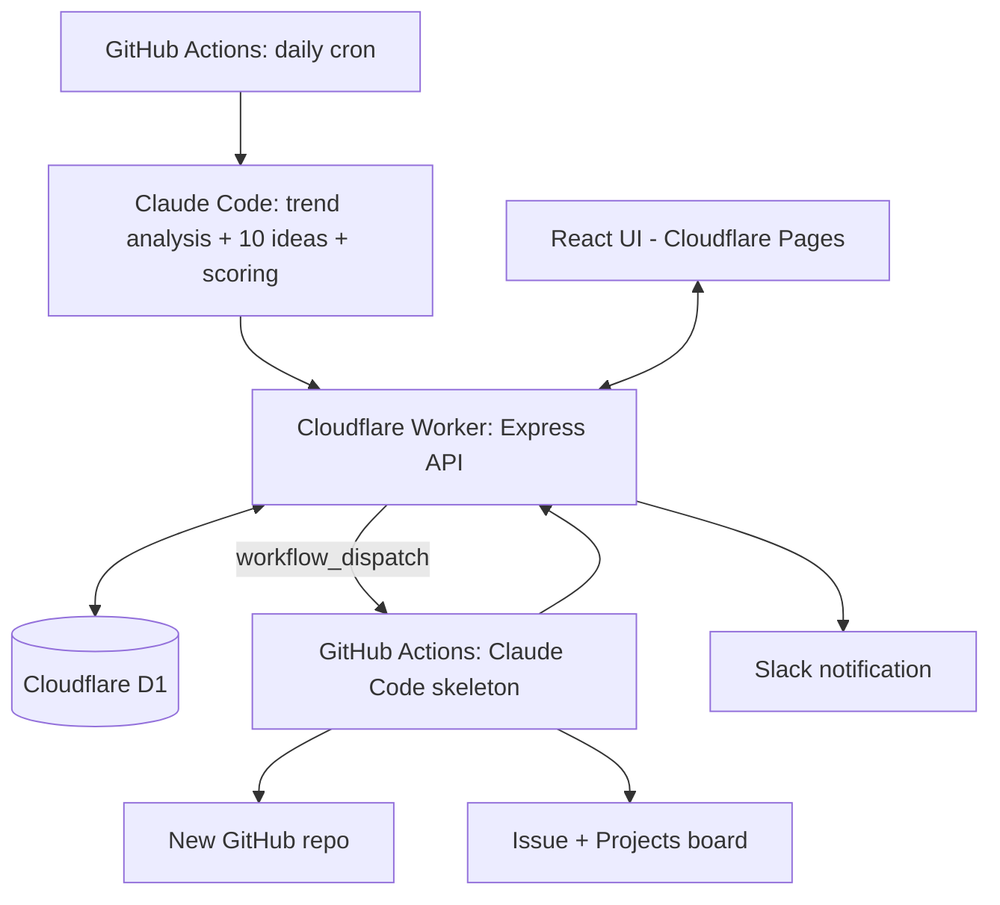

# CLAUDE.md

This file provides guidance to Claude Code (claude.ai/code) when working with code in this repository.

## Project status

**Display name is "Ideas"** (renamed from "App Idea Factory" on 2026-10-03: page title, manifest, sidebar, READMEs, skeleton commit author/README text). Logo: coral speech bubble with a navy spark, generated with OpenAI gpt-image-1; PNG icons in `apps/web/public` (favicon 32/64, apple-touch 180, manifest 192/512 + maskable), theme color `#ff7271`. Infra names (GitHub repo `app-idea-factory`, Worker `app-idea-factory`, D1 `app-idea-factory-db`, domains, `localStorage`/`sessionStorage` keys) deliberately keep the old name — renaming them would break live resources or reset stored preferences.

**Faz 0 (setup) is done.** `docs/PROJE.md` is the authoritative project plan (written in Turkish); everything below is derived from it. GitHub repo, Cloudflare Worker (API), Cloudflare Pages/Workers static assets (web), and the D1 database all exist and are wired together and verified live (see "Faz 0 — what's live" below).

**Faz 1 (idea pipeline) is done.** D1 schema, the `ideas` CRUD/batch API, the trend-collection scripts (Reddit, App Store, Product Hunt, Hacker News), and `daily-ideas.yml` (the actual cron + `workflow_dispatch` workflow, using `anthropics/claude-code-action@v1` to generate ideas) all exist and have been verified with a real, successful production run — see "Faz 1 — what's live" below for the full pipeline and the non-obvious bugs that had to be fixed to get there.

**Faz 2 (UI) is done.** `apps/web` is a real app now (not the Vite starter): idea list (grouped by date, sortable, filterable) and idea detail (full fields, user rating, note, on_hold/delete) screens, talking directly to the API cross-origin through CORS. See "Faz 2 — what's live" below.

**Faz 3 (task & skeleton) is done.** The flow was redesigned with the user before starting: "Geliştir" → task form → Claude writes 4 planning docs → idea goes to `awaiting_development` → user reviews/edits docs → "Geliştirmeye başla" → skeleton repo. A real Plan Idea + Build Skeleton run succeeded in production on 2026-10-01. Decisions are in `docs/PROJE.md` "Kesinleşen kararlar" (rows dated Faz 3). See "Faz 3A/3B/3C — what's live" below.

**Post-Faz-3 round (2026-10-02, done): development → test → ready-to-ship lifecycle.** A third `notes.txt` list (14 items), worked through in 6 groups with the same commit/push-per-group process as the 2nd feedback round. Approved plan: `/Users/utkualbayrak/.claude/plans/post-faz3-lifecycle.md`; decisions are the 2026-10-02 rows in `docs/PROJE.md`. Groups: 1 status model + list screens (done), 2 repo sync (done), 3 "Geliştirildi" form (done), 4 test process (done), 5 manual idea entry (done), 6 target platform + gesture tips (done). All 6 groups are done. See "Post-Faz-3 Grup 1 — what's live" below.

**Post-Faz-2 feedback pass is done (2026-09-30):** the user filed a 26-item feedback list (`notes.txt`, gitignored) before starting Faz 3, and asked to work through it first in 4 dependency-ordered groups — see the approved plan for full scope. **All 4 groups (data model/scoring, UI consistency, new screens, background AI features) are done and user-verified in production (2026-10-01)** — see "Grup 1" through "Grup 4 — what's live" below. A second pre-Faz-3 feedback round (`notes.txt` again) comes next, then Faz 3 (task form, `build-skeleton.yml`).

**Critical process rule from `docs/PROJE.md`'s final section:** do not code around anything listed under "Açık sorular" (open questions) without clarifying with the user first — don't assume, ask. As decisions are made, keep the "Kesinleşen kararlar" (finalized decisions) table and "Açık sorular" list in `docs/PROJE.md` up to date. Work phase by phase (see Roadmap below), and at the end of each phase show the user how to test what was built.

## Commands

```bash
pnpm install            # install all workspace deps (run from repo root)

pnpm dev:web            # apps/web: vite dev server
pnpm dev:api            # apps/api: wrangler dev (local Worker + local D1 sim)

pnpm build              # typecheck+build web, typecheck api
pnpm typecheck          # web + api + scripts
pnpm lint               # web + api + scripts (oxlint)

# deploy (real Cloudflare resources — costs nothing on free tier, but is a live change)
# As of 2026-09-30, a push to main auto-deploys both via .github/workflows/deploy.yml —
# manual deploy below is only for out-of-band deploys (e.g. testing a branch).
pnpm --filter web deploy    # builds then `wrangler deploy` (static assets)
pnpm --filter api deploy    # `wrangler deploy` (the Express Worker)

# D1 migrations (apps/api/migrations/*.sql) — run from apps/api
npx wrangler d1 migrations apply app-idea-factory-db --local   # local sim
npx wrangler d1 migrations apply app-idea-factory-db --remote  # real Cloudflare D1 (live change)

# trend collection — run from scripts/ (needs PRODUCTHUNT_TOKEN env var for real PH data,
# otherwise that source is skipped)
pnpm collect-trends [output-path]   # defaults to scripts/output/trend-summary.<date>.json (gitignored)
```

There are no automated tests yet — nothing in Faz 0/1's scope needs more than typecheck/lint plus the manual verification steps below. Add a real test runner once Faz 1's idea-generation logic (the part with actual branching/parsing) lands.

## Faz 0 — what's live

- **GitHub repo:** https://github.com/utkualbayrak/app-idea-factory (public, per the finalized decision).
- **API Worker:** `apps/api`, deployed at **`https://ideas-api.utkualbayrak.dev`** (custom domain — see the Faz 2 cross-site-cookie note below for why; the old `app-idea-factory-api.utkualbayrakrak.workers.dev` is deliberately disabled now, see same note) — Express app run via `nodejs_compat` + `httpServerHandler` (see `apps/api/src/index.ts`), bound to D1 via `env.DB` (accessed through `import { env } from "cloudflare:workers"`, see `apps/api/src/app.ts`). See "Faz 1 — what's live" for the real routes.
- **D1 database:** `app-idea-factory-db` (id in `apps/api/wrangler.jsonc`). Schema landed in Faz 1 (see below).
- **Web app:** `apps/web`, deployed at https://app-idea-factory.utkualbayrakrak.workers.dev — still the unmodified Vite+React+TS starter page; real screens come in Faz 2. Deployed as a Cloudflare Workers **static-assets** site (`apps/web/wrangler.jsonc`, `@cloudflare/vite-plugin`) — this is Cloudflare's current mechanism for what `docs/PROJE.md` calls "Cloudflare Pages" (Cloudflare merged Pages into Workers in 2026); same free tier, same product intent, just deployed with `wrangler deploy` instead of a separate `pages` command.
- **Package manager:** pnpm workspaces (`pnpm-workspace.yaml`: `apps/*`, `scripts`). `wrangler`/`@cloudflare/vite-plugin`/`esbuild` build scripts are pre-approved via `pnpm.onlyBuiltDependencies` in the root `package.json` — needed for `wrangler dev`/`deploy` to work after a fresh `pnpm install`.
- **Auto-deploy on push (added 2026-09-30):** `.github/workflows/deploy.yml` runs on every push to `main` (+ `workflow_dispatch`), two parallel jobs (`deploy-api`, `deploy-web`) each just running that package's own `pnpm run deploy` script with `CLOUDFLARE_API_TOKEN` (GitHub secret, a scoped API token — not the local OAuth login) and `CLOUDFLARE_ACCOUNT_ID` (hardcoded in the workflow file, not a secret — account IDs aren't sensitive). **This does NOT run D1 migrations** — `apps/api/migrations/*.sql` still needs `npx wrangler d1 migrations apply app-idea-factory-db --remote` run by hand (from `apps/api`) whenever a push includes a new migration; the deploy workflow deploying new code that expects a not-yet-applied schema change will break production until the migration is applied. Sequence migrations before pushing, not after.

### Faz 0 — secrets and access (done)

- **Cloudflare Access** (Zero Trust, owner's email only) protects both the web app and the API Worker, each as its own self-hosted Access application. The API app has two policies (OR'd): email login for the owner, and a Service Auth policy for a Cloudflare Access service token named `github-actions-workflow` — verified via `curl` with `CF-Access-Client-Id`/`CF-Access-Client-Secret` headers returning `200` from `/health`, and a header-less request getting redirected (`302`) to the Access login.
- **GitHub Actions repo secrets** (`gh secret list --repo utkualbayrak/app-idea-factory`): `WORKFLOW_API_SHARED_SECRET`, `CLAUDE_CODE_OAUTH_TOKEN`, `CF_ACCESS_CLIENT_ID`, `CF_ACCESS_CLIENT_SECRET`, `SKELETON_REPO_PAT` (see note below on PAT scope), `CLOUDFLARE_API_TOKEN` (added 2026-09-30 for `.github/workflows/deploy.yml`, see "Auto-deploy on push" below — a scoped API token, not the local `wrangler` OAuth login).
- **Cloudflare Worker secrets** (`wrangler secret list` in `apps/api`): `WORKFLOW_API_SHARED_SECRET` (mirrors the GitHub one, for verifying calls from the workflow), `SLACK_WEBHOOK_URL` (Worker sends Slack notifications per `docs/PROJE.md`, not the workflow — so this secret only needs to live on the Worker, not in GitHub Actions). `GH_WORKFLOW_DISPATCH_TOKEN` (the `SKELETON_REPO_PAT` value with `workflow` scope added, used by `/admin/trigger-workflow` — see "Grup 3 — what's live" below).
- **PAT scope deviation:** `docs/PROJE.md`'s "narrowest possible PAT" decision assumed a fine-grained GitHub PAT would work. It doesn't — fine-grained PATs don't support GitHub Projects (v2) at the user-account level. `SKELETON_REPO_PAT` is a **classic** PAT (`repo` + `project` scopes) instead. See the note in `docs/PROJE.md` under "Kesinleşen kararlar".
- None of `.github/workflows/*.yml` exist yet — those land in Faz 1 (`daily-ideas.yml`) and Faz 3 (`build-skeleton.yml`), and are what will actually consume these secrets.
- **`PRODUCTHUNT_TOKEN`** (GitHub secret, read-only Product Hunt developer token) — set. Expected by `scripts/lib/producthunt.ts`; skipped gracefully if absent.

## Faz 1 — what's live

- **D1 schema:** `apps/api/migrations/0001_init_schema.sql` — `ideas`, `tasks`, `trend_snapshots` tables per `docs/PROJE.md`'s "Veri modeli". Applied to both local (`--local`) and the real remote D1. `tasks` isn't used by any code yet (that's Faz 3).
- **Idea API** (`apps/api/src/app.ts`, validated with zod in `apps/api/src/schema.ts`):
  - `GET /ideas` (optional `?batch_date=`), `GET /ideas/:id`, `PATCH /ideas/:id` — unauthenticated at the app layer, rely on Cloudflare Access at the edge (browser/UI use, Faz 2).
  - `GET /ideas/recent-names` (`?days=`, default 90), `POST /ideas/batch` (`{ batch_date, ideas: [...] }`) — workflow-only, gated by `apps/api/src/auth.ts`'s `requireWorkflowSecret` middleware (`X-Workflow-Secret` header checked against `env.WORKFLOW_API_SHARED_SECRET`).
  - `scores` fields (`market`, `feasibility_solo_dev`, `originality`, `overall`) are validated as **1-10 integers** — `docs/PROJE.md`'s idea schema example didn't specify a scale, this was picked and is only encoded in `apps/api/src/schema.ts`; revisit if it doesn't fit once real idea generation is wired up.
  - Local dev needs `apps/api/.dev.vars` (gitignored; copy `.dev.vars.example`) for `WORKFLOW_API_SHARED_SECRET` since `wrangler secret put` only sets the value on the deployed Worker, not local dev.
- **Trend collection** (`scripts/`, its own pnpm workspace package, run with `pnpm collect-trends` from inside `scripts/`): `scripts/collect-trends.ts` orchestrates four independent sources (`scripts/lib/reddit.ts`, `appstore.ts`, `producthunt.ts`, `hackernews.ts`) — one failing never blocks the others, each section carries its own `error` string when degraded. Output is a `TrendSummary` JSON, consumed by `prompts/daily-ideas.md` in the real workflow. Doesn't write to D1 yet (no `trend_snapshots` writes); that can be added later if wanted, the daily run doesn't rely on it. `SKIP_REDDIT=true` env var skips Reddit entirely — useful when iterating on the rest of the pipeline, since Reddit alone adds ~11 minutes (see below).
  - **Reddit:** no official API — public `.json` with a `.rss` (Atom) fallback on failure, subreddit groups/params defined in `config/subreddits.json` (edit that file, not the code, to change sources). **Confirmed in production, not just the dev sandbox (2026-09-30):** ran the real `daily-ideas.yml` on GitHub Actions — `.json` was blocked and `.rss` fallback kicked in for every group there too, identically to local testing. `fetchWithBackoff` (reads `x-ratelimit-reset`, waits, retries once) makes it eventually succeed, but the whole Reddit step alone took ~11 of the run's ~12 total minutes, and all items came through degraded (title + link only, no score/body/comment-count). **Decision: left as-is** — the main repo is public so GitHub Actions minutes are free/unlimited, and 12 minutes is well inside the workflow's 20-minute timeout, so this is a data-quality tradeoff, not a cost or reliability one. Revisit only if the user follows through on Reddit's manual "Data Access Request" (see below).
  - **Official Reddit API — tried, blocked on Reddit's side (2026-09-30):** attempted to switch to OAuth (a "script"-type Reddit app + `client_credentials` grant against `oauth.reddit.com`) for reliability. Reddit now requires a manual "Data Access Request" support-ticket review for any non-Devvit API app — no self-serve app creation, no defined turnaround time. The OAuth implementation was built, tested (worked once `REDDIT_CLIENT_ID`/`SECRET` would exist), then reverted since credentials can't actually be obtained right now. If the user submits and gets approved for that request later, the OAuth version is recoverable from git history (commit `8ed245d`, "Reddit için resmi OAuth API'ye geç") — reapply `scripts/lib/reddit-auth.ts` and the OAuth-based `scripts/lib/reddit.ts`.
  - **App Store:** Apple's free, unauthenticated `rss.applemarketingtools.com` top-free/top-paid charts (US + TR) plus `itunes.apple.com/lookup` for ratings (also free, bulk by ID) — surfaces both "top of chart" and "popular but rated low" (≥1000 ratings, sorted by lowest rating) items. Each chart/lookup call retries once on transient failure (observed intermittent `504`s from Apple) and failures are isolated per country/kind, not fatal to the section.
  - **Apple customer-reviews RSS — tried, doesn't work:** the old `itunes.apple.com/.../rss/customerreviews/...` endpoint (meant to pull actual complaint text for low-rated popular apps) returns a valid-looking feed shell but zero `entry` items for every app tested, in both `json` and `xml` formats. Not implemented; don't re-attempt without first re-verifying the endpoint actually returns entries.
  - **Product Hunt:** official GraphQL v2 API, needs `PRODUCTHUNT_TOKEN` (set, see above) — gracefully skips (not an error) when the token is absent.
  - **Hacker News:** official Algolia HN Search API (`hn.algolia.com/api/v1`, no auth), `scripts/lib/hackernews.ts`. Last-24h "Ask HN" posts (sorted by points, capped) plus last-week posts/comments matching a few pain-point phrases (`search_by_date`). **Non-obvious bug fixed here, don't reintroduce it:** Algolia's `query` param without quotes is bag-of-words OR matching, not phrase matching — with common words like "is"/"there"/"app" that means the filter is a no-op and `search_by_date` just returns whatever's most recent, completely unrelated to the query (verified: same garbage results across 4 different phrases). Phrases MUST be wrapped in literal double quotes inside the query string (`"${phrase}"`) to get real phrase matching. Also dropped `"app that"` from the phrase list — even quoted it was too generic (~95 hits/week, mostly noise); stick to the more specific phrases already there unless you've verified a new one's precision the same way.
  - **Google Play:** skipped entirely — no free/official trend API exists; noted in `docs/PROJE.md`'s Faz 5 roadmap to revisit.
- **Pipeline glue** (`scripts/lib/api-client.ts`, `fetch-recent-names.ts`, `validate-ideas.ts`, `submit-ideas.ts`): call the deployed API through Cloudflare Access (`CF-Access-Client-Id`/`Secret` headers) + `X-Workflow-Secret`. `idea-schema.ts` duplicates `apps/api/src/schema.ts`'s zod schema by hand (separate pnpm workspaces, no shared package) — keep them in sync if either changes. `api-client.ts`'s `fetchJson` checks `content-type` is `application/json`, not just `res.ok` — a Cloudflare Access auth failure silently redirects to an HTML login page with a `200` status, which `res.ok` alone wouldn't catch (this happened, see below).
- **`prompts/daily-ideas.md`:** the actual instructions given to Claude Code — schema, language rules (`name` English, everything else Turkish), 1-10 integer score guide, instruction to read `scripts/output/{trends,recent-names}.json` and write `scripts/output/ideas.json` as a bare 10-element JSON array.
- **`.github/workflows/daily-ideas.yml`:** cron (`0 3 * * *` = 06:00 Türkiye) + `workflow_dispatch`. Steps: checkout → pnpm/node setup → install → `fetch-recent-names` → `collect-trends` → `anthropics/claude-code-action@v1` (automation mode via the `prompt` input) → `validate-ideas` → `submit-ideas`. **Verified end-to-end with a real successful run (2026-09-30)** — 10 ideas generated and landed in production D1. Getting there required fixing four non-obvious issues in sequence, in case they resurface:
  1. `CF_ACCESS_CLIENT_ID`/`CF_ACCESS_CLIENT_SECRET` GitHub secrets were initially bad (likely a copy-paste/whitespace issue when first set) — calls silently redirected to Cloudflare Access's login page instead of erroring. Fixed by resetting both secrets via `printf '%s' 'value' | gh secret set NAME`. If this recurs, `api-client.ts`'s error message shows `redirected`/`final_url` — a `final_url` pointing at `*.cloudflareaccess.com/cdn-cgi/access/login/...` means the Access headers aren't being accepted, not an app-level bug.
  2. `anthropics/claude-code-action@v1` needs `permissions: id-token: write` on the job (not just `contents: read`) — without it, action fails immediately with "Could not fetch an OIDC token".
  3. The **Claude Code GitHub App** (https://github.com/apps/claude) must be installed on the repo — separate from the `CLAUDE_CODE_OAUTH_TOKEN` secret. Without it: "401 Unauthorized - Claude Code is not installed on this repository."
  4. Default `claude_args` run with `permissionMode: "default"`, which prompts for approval on every `Write`/`Edit` call — with no human to approve, every write is silently denied. Claude behaved correctly here (refused to route around it via Bash, reported clearly it couldn't finish), but the file never got written. Fixed with `claude_args: "--max-turns 15 --permission-mode acceptEdits"` (auto-approves file edits specifically, doesn't blanket-bypass everything like `bypassPermissions` would).

## Faz 2 — what's live

- **`apps/web`** is a real app: `src/pages/IdeaListPage.tsx` (one single `IdeaTable` since 2nd-round Grup B — the per-`batch_date` grouping is gone; filter controls for category/status/min-rating/unrated-only) and `src/pages/IdeaDetailPage.tsx` (all fields, score breakdown bars, note textarea with explicit save, a disabled "Geliştir (yakında)" button since task creation is Faz 3). Routing via `react-router-dom` (`BrowserRouter`, routes in `App.tsx`). `src/lib/api.ts` is the only place that talks to the API. **As of Grup 1** (see below), user rating is an interactive `ScoreSlider` (not star rating), and the old single archive toggle is two separate on_hold/delete actions.
- **UI stack (Faz 2, 2026-09-30 decision):** Tailwind CSS v4 (`@tailwindcss/vite` plugin, CSS-first config — no `tailwind.config.js`) + shadcn/ui (`components.json`, `new-york` style, components live in `src/components/ui/`) + `@tanstack/react-table` for `src/components/IdeaTable.tsx` (sortable columns via clickable headers; `useReactTable` is called inside `IdeaTable`, never in a loop in the parent, to respect the rules of hooks). Theme is tweakcn's **"Caffeine"** preset, applied as raw CSS variables in `src/index.css`.
- **Manual light/dark toggle (Faz 2, 2026-09-30):** `src/components/theme-provider.tsx` is a small custom context (no `next-themes` — that's Next.js-only; this is the pattern shadcn's own Vite docs recommend). Resolves `localStorage["app-idea-factory-theme"]` first, falls back to `prefers-color-scheme` only on first-ever visit, then toggles a `.dark` class on `<html>`; `index.css` uses `@custom-variant dark (&:is(.dark *))` plus a `.dark { ... }` token block (replaced the old plain `@media (prefers-color-scheme: dark)` block from the first Caffeine pass — don't reintroduce that, it can't be overridden by the toggle). `ThemeToggle` (sun/moon `Button`) sits in `App.tsx`'s header.
- **`IdeaTable` renders two different DOM trees, not one table that CSS-reflows:** a `hidden md:block` `<table>` (all 5 columns) for desktop and a separate `md:hidden` stacked-card list for mobile (name + category + Claude score only — status/user-rating/one_liner are detail-page-only on mobile, by request), both driven by the same `table.getRowModel().rows` (sorted *and* paginated — `getPaginationRowModel()`, `PAGE_SIZE = 20` since 2nd-round Grup B) so order and page match between them. This was a direct response to feedback that mobile shouldn't just be a horizontally-scrollable version of the desktop table, and that desktop shouldn't need horizontal scroll either (the app's `<main>` is `max-w-6xl`, wide enough for all 5 columns without it — widen further before reaching for `overflow-x-auto` again if columns are added).
- **Claude score cells have a hover tooltip** (`ClaudeScoreCell` in `IdeaTable.tsx`, shadcn `Tooltip`/`TooltipTrigger`/`TooltipContent`, dotted underline as the visual affordance) showing the `market`/`feasibility_solo_dev`/`originality` breakdown behind the `overall` number shown in the cell — needs `TooltipProvider` wrapping the app, added in `main.tsx`.
- **List filters** (`IdeaListPage.tsx`) now also include per-score minimums for `market`/`feasibility_solo_dev`/`originality` (same UI pattern as the existing user-rating filter) and a `batch_date` range (`Input type="date"`, from/to, inclusive on both ends — leave one side empty for an open-ended range, or set both to the same date for a single day).
  - **`@tanstack/react-table` is pinned to `8.21.3`, not latest:** whatever installs as "latest" in this environment resolves to a `9.x` with a completely different, feature-flag/factory-based API (`createCoreRowModel`, `assignTableAPIs`, no `useReactTable` export) that has no reliable documentation to work from. Don't upgrade without actually reading that version's real API first — the v8 hooks-based API (`useReactTable`, `getCoreRowModel`, `ColumnDef<T>`) is what `IdeaTable.tsx` is written against.
  - **The `shadcn` CLI (`npx shadcn@latest add ...`) cannot resolve the `@/*` path alias correctly in this pnpm-workspace monorepo layout** — it silently writes components into a literal `apps/web/@/components/ui/` directory instead of `apps/web/src/components/ui/`, and generates `import { cn } from "cn"` (a real but wrong npm package it auto-installs) instead of `import { cn } from "@/lib/utils"`. Both times this was run, `tsconfig.app.json` needed `baseUrl: "."` present (alongside `paths`) for the CLI to resolve anything at all — but `baseUrl` alone fails `tsc -b` here ("deprecated, will stop functioning in TypeScript 7.0"). Working pattern: temporarily add `baseUrl` back, run `shadcn add`, then manually `mv` the output from `apps/web/@/components/ui/` to `apps/web/src/components/ui/`, `sed` any `from "cn"` to `from "@/lib/utils"`, `pnpm remove cn --filter web`, delete the leftover `apps/web/@/` directory, and remove `baseUrl` again before typechecking.
- **Cross-origin API access:** the web app and API are on different hostnames, each its own Cloudflare Access application — so browser calls are genuinely cross-origin with credentials (Access's session cookie is per-hostname). `apps/api/src/app.ts` adds `cors()` with `credentials: true`; the frontend calls `fetch(..., { credentials: "include" })`. `origin` is a **function** `(origin, callback) => ...` (not a plain value — that was tried first and is wrong per the `cors` package's actual API) that reflects back the request's `Origin` header if it's in the comma-separated `env.WEB_ORIGIN` allowlist, else falls back to the first entry. `WEB_ORIGIN` is a `vars` entry in `apps/api/wrangler.jsonc` (prod: both the custom domain and the `*.workers.dev` URL, comma-separated — the web app is reachable at **`https://ideas.utkualbayrak.dev`**, a custom domain added directly in Cloudflare, not through this repo's config; keep both origins listed until/unless the `workers.dev` one is retired) and overridden in `apps/api/.dev.vars` to `http://localhost:5173` for local dev (`vars` from wrangler.jsonc are local-dev-overridable the same way secrets are).
- **Cloudflare Access blocks CORS preflight by default — non-obvious, cost real debugging time:** a CORS preflight (`OPTIONS`) request never carries credentials/cookies (that's the Fetch spec, not a bug), so Access — sitting in front of the Worker — sees an unauthenticated request and returns its own `403` HTML instead of letting it reach the Worker's own (correct) CORS handling. The browser then reports a plain "CORS error" with no more detail, which doesn't point at Access as the cause. **Fix (already applied, don't redo):** on the web app's Access application, Zero Trust → Access → Applications → (the app protecting the web hostname) → CORS settings → toggle on **"Bypass options requests to origin"**. This sends `OPTIONS` straight to the Worker, where `cors()` handles it properly; the actual `GET`/`PATCH`/etc. requests are still fully Access-protected. If CORS errors resurface after adding a new domain/app, check this toggle first before touching code.
- **Cross-site cookies broke the API on mobile Safari — root-caused and fixed by moving the API to a same-site custom domain (Faz 2, 2026-09-30):** the API used to live on `app-idea-factory-api.utkualbayrakrak.workers.dev` while the web app is on `ideas.utkualbayrak.dev` — `workers.dev` is on the Public Suffix List, so those two hosts are different **sites** (different eTLD+1), not just different subdomains. Access's session cookie for the API was therefore a genuine third-party cookie from the web app's perspective. Desktop Chrome tolerated it; mobile Safari's default cross-site tracking prevention silently dropped it, so every API call failed on phones while working fine on desktop — and it wasn't fixable by "log into both Access apps," because ITP blocks sending the cookie in a third-party context even when it was legitimately obtained first-party. **Fix:** the API now lives at **`ideas-api.utkualbayrak.dev`** — same registrable domain as the web app (`utkualbayrak.dev`), so the cookie is same-site again (still cross-*origin*, which is why CORS config is still needed, but not cross-*site*). `app-idea-factory-api.utkualbayrakrak.workers.dev` is deliberately left disabled (see gotcha below) — don't resurrect it as a "fallback," it's the thing that was broken.
  - **Adding a Workers custom domain went briefly live with *zero* Access protection — this is a process rule now, not just a note:** the instant `wrangler deploy` provisions a `custom_domain: true` route, Cloudflare serves real traffic on it — DNS + cert provisioning takes a few seconds to a minute, and until Access has a policy covering that exact hostname, the Worker (D1 access, `PATCH` endpoints and all) is fully public. This happened for real here: `api.utkualbayrak.dev` was live and unprotected for a few minutes before it was caught. **Never add a `routes`/`custom_domain` entry before the Access application already has that hostname added as a destination with policies attached.** Verify with an unauthenticated `curl` immediately after deploying (expect a `302`/`403` from Access, not real JSON) — treat any `200` as an active incident, not a "check later."
  - **Removing a custom domain from `wrangler.jsonc` and redeploying does *not* tear it down** — `wrangler deploy` only adds/updates routes present in the config; an omitted one keeps serving traffic indefinitely (confirmed: still `200` after a config-only redeploy, and `wrangler triggers deploy` didn't fix it either). The only way found to actually remove one: call the Cloudflare API directly — `DELETE /accounts/{account_id}/workers/domains/{domain_id}` (list first with `GET .../workers/domains` to find the id; the OAuth token wrangler already has locally works fine as the bearer token, read from `~/Library/Preferences/.wrangler/config/default.toml`'s `oauth_token`). This is how the `api.utkualbayrak.dev` exposure above was actually closed.
  - **A bare `routes` array with `custom_domain: true` and no explicit `workers_dev` setting disables the `*.workers.dev` URL as a side effect** (wrangler warns about this in the deploy output — read it). That's what took down `app-idea-factory-api.utkualbayrakrak.workers.dev`; it's fine here since `ideas-api.utkualbayrak.dev` fully replaced it and every hardcoded default (`scripts/lib/api-client.ts`, `apps/web/src/lib/api.ts`) was updated to match, but if a Worker needs *both* URLs alive, set `"workers_dev": true` explicitly in that Worker's `wrangler.jsonc`.
- **Local dev:** `apps/web/.env.development` sets `VITE_API_BASE_URL=http://localhost:8787` so `pnpm dev` in `apps/web` talks to a locally-running `wrangler dev` API automatically; production builds fall back to the real deployed API URL (hardcoded default in `api.ts`) since there's no `.env.production` override.
- **Deploy gotcha, don't repeat it:** `apps/web`'s `wrangler.jsonc` `name` field controls what `wrangler deploy` actually deploys to — it drifted to `"web"` at some point (vs. the Pages-era project name `"app-idea-factory"` used for the *first* deploy back in Faz 0, which went through `wrangler pages project create` and doesn't read that field the same way). A later plain `wrangler deploy` created a **second, separate live Worker** at `web.utkualbayrakrak.workers.dev` before this was caught and deleted. Before deploying `apps/web`, sanity-check `wrangler.jsonc`'s `name` is still `"app-idea-factory"` — if a deploy ever reports a URL that doesn't match the one in this doc, stop and check that field rather than assuming it's fine.
- Verified manually end-to-end via the Chrome extension against local dev servers (re-verified after the shadcn/TanStack Table rebuild too): list renders grouped/filtered correctly, clicking a column header sorts that group's table, tooltip on Claude score shows the sub-score breakdown, theme toggle switches and repaints correctly, star rating and note both persist across a page reload (real API round-trip, not just local state), archive toggle updates both the detail page and table row. No console errors.
- **Could not get a real narrow/mobile viewport in this dev environment to visually verify responsive breakpoints — don't re-attempt the same three approaches:** `mcp__claude-in-chrome__resize_window` accepts the call but `window.innerWidth` never actually changes (stayed 2056px regardless of requested size); `window.open(url, name, 'width=...,height=...')` gets silently popup-blocked (not a user gesture); Chrome DevTools' own device-toolbar emulation wasn't attempted further since driving its UI via screenshot-coordinate clicks looked likely to be its own rabbit hole for uncertain payoff. What *was* done: careful review of every responsive class actually used (`hidden md:block` / `md:hidden` split in `IdeaTable`, `grid-cols-2 sm:grid-cols-3 md:grid-cols-4` filters, `sm:grid-cols-2` in the detail page) — all standard, well-documented Tailwind patterns, no hardcoded pixel widths anywhere outside shadcn's own generated `components/ui/*`. If a next session needs actual mobile-viewport screenshots, try Chrome DevTools Protocol device emulation directly (`Emulation.setDeviceMetricsOverride`) rather than these three.
- Not built yet (Faz 3+): the task/"Geliştir" form, `tasks` table usage, GitHub Projects/Issues integration, Slack notifications.

## Grup 1 — what's live

First of 4 groups from the post-Faz-2 feedback pass (see `notes.txt`, plan at implementation time was `/Users/utkualbayrak/.claude/plans/sunny-forging-volcano.md`). Data model and scoring system rework — everything later groups build on.

- **D1 schema:** `apps/api/migrations/0002_scoring_and_status_rework.sql` (never edit `0001`, always add a new migration file). SQLite can't `ALTER` a `CHECK` constraint or a column's type in place, so this migration recreates `ideas` (new table, `INSERT ... SELECT` with transforms, `DROP`, `RENAME`) rather than a plain `ALTER TABLE`. Changes: `user_rating` `INTEGER CHECK(1-5)` → `REAL CHECK(0-10)` (old values scaled `*2` to preserve intent); `status` CHECK gains `on_hold`/`deleted`, drops `archived` (existing `archived` rows migrated to `on_hold`); `inspiration_source` (single string) → `inspiration_sources` (JSON array, old value wrapped in `json_array()`); new `tags` (JSON array, default `'[]'` for old rows), `user_note_updated_at`, `last_reevaluated_at` (both nullable). Applied to local D1 (`--local`); **not yet applied to remote** — run `npx wrangler d1 migrations apply app-idea-factory-db --remote` from `apps/api` before/when deploying this group to production (user does this themselves per the verification protocol below).
- **Scores are now 0.00-10.00, step 0.25** (`z.number().min(0).max(10).multipleOf(0.25)` in both `apps/api/src/schema.ts` and `scripts/lib/idea-schema.ts` — keep these two in sync by hand, no shared package between the pnpm workspaces). Each of `market`/`feasibility_solo_dev`/`originality`/`overall` now has a sibling `*_reason` string field (Claude's one-sentence rationale) — `ideaScoresSchema` requires all 8 keys. `user_rating` uses the same 0-10/0.25-step value.
- **`GET /ideas` now filters out `status = 'deleted'`** at the SQL level (both the plain and `?batch_date=` queries in `apps/api/src/app.ts`) — per the finalized 3-state decision, `deleted` means "hidden from the list entirely, kept in D1 only for name-collision checking," so hiding belongs in the API, not just the UI. `GET /ideas/:id` does NOT filter — direct-by-id access still works for a deleted idea.
- **`PATCH /ideas/:id` auto-stamps `user_note_updated_at`** whenever the request body includes a `user_note` key at all (checked with `Object.hasOwn`, so explicitly setting it to `null` still stamps) — no manual revision history, just "when was it last touched," per the finalized decision.
- **Frontend:** `StarRating.tsx` is gone, replaced by `apps/web/src/components/ScoreSlider.tsx` (shadcn `Slider`, 0-10 range, 0.25 step, always interactive — there's no read-only/display variant; plain formatted text (`x.xx/10` or `—`) is used everywhere scores are just *displayed*, e.g. `IdeaTable`'s user-rating column and Claude-score tooltip). Added via the documented shadcn-CLI-in-this-monorepo workaround (see Faz 2 section above) — same steps, same `@/` stray-folder cleanup.
- **`IdeaDetailPage`'s old single "Arşivle" toggle button is now two buttons**, "Askıya al"/"Askıdan çıkar" (`on_hold`) and "Sil" (`deleted`, disabled once already deleted) — no confirmation dialog yet, that's explicitly Grup 2 scope (`AlertDialog` on all destructive actions).
- **`prompts/daily-ideas.md`** updated: score format/step, mandatory `*_reason` per score, `tags` generation (2-4 English tags), `inspiration_sources` as an array with explicit instruction to actively synthesize multiple trend signals into one idea (not just passively allowed), and `feasibility_solo_dev` now also weighs how easy/cheap the required third-party APIs are to access, not just raw solo-dev implementation difficulty.
- **Root `package.json`'s `typecheck`/`lint` scripts now actually include the `scripts` package** (they silently didn't before, despite this file's own "Commands" section claiming otherwise) — needed because `scripts/lib/idea-schema.ts` changed in this group and must stay in sync with the API's schema.
- **Verification protocol for this feedback pass (explicit user correction, applies to all 4 groups):** Claude runs `pnpm typecheck && pnpm lint && pnpm build` only. **No Chrome-based local or production testing from Claude** — the user tests locally (`wrangler dev`/`pnpm dev`) themselves and approves before the next group starts; same for production after deploy. Don't reach for the Chrome extension mid-group like in Faz 2. (The one exception found in Grup 2: fetching a *third-party* site's data — e.g. reading the Sandstone theme's actual CSS values off tweakcn's own page, since their registry JSON endpoint 500s — used the Chrome extension read-only, tab closed immediately after; that's research, not testing this app, so it doesn't violate the rule. Don't stretch this exception to cover verifying our own UI.)

## Grup 2 — what's live

Second of 4 groups from the post-Faz-2 feedback pass. UI consistency pass on top of Grup 1's data model — plus two items the user found while using Grup 1 in production and asked to fold into this group before continuing.

- **Theme swapped Caffeine → tweakcn "Sandstone"** (`src/index.css`, community theme https://tweakcn.com/themes/cmmi1ovml000404jlb6e44j42). **tweakcn's own theme registry JSON endpoint (`/r/themes/<id>.json`) is broken — persistent, reproducible `500`, confirmed via raw `curl` too, not a network/auth issue on our end.** Got the actual CSS values by opening the theme's public page in Chrome and clicking its own "Code" button (renders the CSS in a `<pre>` client-side) — if another tweakcn theme is needed later and the registry JSON is still down, repeat that (navigate to `https://tweakcn.com/themes/<id>`, click "Code", read the `<pre>` contents), don't re-attempt the JSON endpoint or hunt for an API route first.
- **Sidebar shell:** `App.tsx` rebuilt around shadcn's `Sidebar` block (`collapsible="icon"`, added via the documented CLI workaround — this run also silently regenerated `button.tsx`/`tooltip.tsx`/`input.tsx` since `sidebar` pulls them in as registry deps; diffed identical to what was already committed, no regression). Sidebar has the app name/logo, one nav entry ("Fikirler" — Grup 3 adds `/developed`, `/compare`, `/settings`, `/cron-runs` here), and a footer with a **logout link** (`<a href="/cdn-cgi/access/logout">`, Cloudflare Access's own logout endpoint — confirmed working, ends the whole Zero Trust session which is fine for a single-user app). On mobile, `SidebarTrigger` opens it as a Sheet (shadcn's built-in responsive behavior, no extra code needed). The old top header's app-name link moved into the sidebar; the remaining top bar is just `SidebarTrigger` + `ThemeToggle`, `h-14` (a fixed height now, not padding-derived — needed so `IdeaDetailPage`'s sticky sub-header below can align `top-14` against it exactly).
- **`Button` now has `cursor-pointer` (and `disabled:cursor-not-allowed`) in its base class** (`src/components/ui/button.tsx`) — shadcn's default template omits this (browsers don't give `<button>` a pointer cursor unlike `<a>`), which read as "nothing responds to hover" across the whole app. Also added `cursor-pointer` + a hover background to `IdeaTable`'s raw mobile-card `<button>` (not a `Button` component, needed its own fix).
- **Category/status color coding** (`src/lib/idea-colors.ts`): category → one of 8 Tailwind palette pairs (light/dark) picked by a deterministic string hash, so the same category always gets the same color with zero maintenance as new categories appear; status → a fixed small palette (`on_hold` amber, `in_development` violet, `developed` emerald, `new` sky, `deleted` muted). Applied to the `Badge` in both `IdeaTable` and `IdeaDetailPage`'s header. No `dataviz` skill used — didn't reach for it since simple deterministic hashing covered the need directly without unbounded category growth ever needing a manual palette update.
- **Onay gerektiren aksiyonlar + renklendirme** (notes.txt feedback caught *after* Grup 1 shipped: hold/delete buttons all looked identical and had no confirmation): `src/components/ConfirmButton.tsx` wraps shadcn `AlertDialog` into a single reusable button-with-confirm. `IdeaDetailPage` now has three distinct actions — "Askıya al" (amber-tinted outline), "Askıdan çıkar" (plain outline, shown instead once already on hold), "Sil" (`variant="destructive"`, red) — each behind its own confirm dialog with a real description of what happens. "Geliştir" stays a disabled placeholder (Faz 3 scope, explicitly excluded from this by the user).
- **Sticky sub-header on `IdeaDetailPage`** (also from the post-Grup-1 feedback): the "← Fikirler" back link + idea name + `one_liner` are wrapped in a `sticky top-14` block (`z-[5]`, below the app header's `z-20`) so they stay visible while the rest of the page (score card, info cards, note, actions) scrolls underneath — was a real usability problem before, especially with long notes, since the back button would scroll away. Single-scroll-container `position: sticky`, not a nested `overflow-auto` region — simpler and consistent with how the app header already did the same thing at the outer level.
- **Skor gerekçe popover + "?" yardım tooltip** (`src/components/ScoreReasonPopover.tsx`, `src/lib/score-help.ts`): each score label on `IdeaDetailPage` is now a button that opens a popover with Claude's `*_reason` text (from Grup 1's schema) plus a static "?" icon with a tooltip explaining what the parameter measures at all.
- **Birleşik puan** (`src/lib/scoring.ts`, `combinedScore = overall*0.4 + userRating*0.6`, `null` if no user rating yet): new sortable "Birleşik puan" column in `IdeaTable` (6 columns now, still fits `max-w-6xl` without horizontal scroll), shows `—` with a "kullanıcı puanı bekleniyor" tooltip when there's no user rating.
- **Truncate + tooltip:** list `one_liner` (`OneLinerCell` in `IdeaTable.tsx`, `line-clamp-1` + shadcn `Tooltip` — previously truncated with no way to read the rest) and detail-page inspiration source links (now shadcn `Tooltip` instead of the native `title` attribute, for visual consistency with everywhere else tooltips are used).
- **Filters rebuilt around one `Filters` object** (`IdeaListPage.tsx`) instead of ten separate `useState` calls: free-text search (matches name/one_liner/category/tags), persisted to `sessionStorage` (`app-idea-factory:idea-list-filters`, wrapped in try/catch — private-browsing contexts that block storage just fall back to in-memory state), and a "Temizle" button that's `disabled` exactly when the current filters equal `DEFAULT_FILTERS` (cheap `JSON.stringify` compare, fine at this object size).
- **Date range replaced with shadcn Calendar** (`src/components/DateRangeFilter.tsx`, `mode="range"`, popover-triggered) instead of two separate `<Input type="date">` fields — one control instead of two, per notes.txt.
- **New shadcn components added this group:** `alert-dialog`, `popover`, `calendar` (pulls in `react-day-picker` + `date-fns`, both added to `apps/web/package.json`), `sidebar` (pulls in `separator`, `sheet`, `skeleton`, `tooltip`, `input`, `button` as registry deps), `dropdown-menu`.

### Grup 2 fixes found in production, before Grup 3 started

- **`IdeaTable`'s `one_liner` truncate never actually worked — it's what the "Fikir" column line-clamp note above described, but the real bug was table-layout, not the clamp itself.** `<Table>` always wraps in `overflow-x-auto`; with `table-layout: auto` (the default) and no column widths, the browser sizes the "Fikir" column to fit its content, `line-clamp-1` had nothing bounded to clamp against, the row just wrapped to 2 lines and the table quietly grew wider than its container — visible as a horizontal scrollbar at the bottom, exactly the thing `CLAUDE.md` already said never to allow. **Fixed:** `IdeaTable` now renders `<Table className="table-fixed">` with an explicit per-column width map (`COLUMN_WIDTHS`/`getColumnWidths` — two variants, with/without the Grup 3 selection checkbox column, percentages always summing to 100), and `OneLinerCell` uses Tailwind's `truncate` (real single-line ellipsis) instead of `line-clamp-1`. Also added `overflow-hidden` to the **shared** `TableHead`/`TableCell` in `ui/table.tsx` as a structural guard — any future table (Grup 3's `/developed`, `/cron-runs`, etc.) inherits the "never overflow" property for free instead of relying on each table getting its widths exactly right.
- **Same root cause, different layout primitive, on `IdeaDetailPage` mobile:** the `sm:grid-cols-2` row pairing "Gelir modeli" with "İlham kaynakları" stretched the whole row off-screen on mobile because of the long raw `inspiration_sources` URLs — CSS Grid items default to `min-width: auto`, so one item's unbreakable long string forces the shared column width regardless of how short its neighbor's text is. **Fixed two ways:** (1) `InfoCard`'s `Card`/`CardContent` now always set `min-w-0` (safe on every usage, grid-paired or not) plus `break-words` as a second line of defense; (2) inspiration sources are no longer shown as raw links at all — see `SourceIcon` below.
- **`SourceIcon`** (`src/components/SourceIcon.tsx`): replaces the raw URL list for `inspiration_sources` with a small clickable logo tile per source — Reddit/Apple/Product Hunt via inlined `simpleicons.org` SVG paths (no new npm dependency, just hardcoded `<path>` data — `react-icons`/`simple-icons` packages were considered and skipped as overkill for 3 fixed icons), Hacker News via a hand-drawn orange "Y" badge (simple-icons has no distinct Hacker News mark, only Y Combinator's, which is a different, bigger brand — not worth pulling in for a close-but-wrong logo). Unknown hosts fall back to a generic `Link2` icon + hostname label, so this never breaks on a future 5th trend source. Used in both `IdeaDetailPage` and `ComparePage`.

## Grup 3 — what's live

Third of 4 groups. New screens on top of Grup 1/2's data model and UI conventions — the main idea list narrows to just "new"/"on_hold" ideas, everything else gets its own home.

- **`/developed`** (`DevelopedPage.tsx`): ideas with `status` `in_development`/`developed`, in a single `IdeaTable` like the main list, with just a status filter (no full filter bar — this list is small by nature). `IdeaListPage`'s base pool now excludes these two statuses entirely (`activeIdeas` filter, applied before every other filter) — they don't just disappear from view, they're structurally out of the main list's data, so category/search dropdowns etc. never reference them either. `IdeaDetailPage` shows a small "Geliştirme bilgileri" placeholder card for these statuses noting repo/issue links aren't wired up yet (that's Faz 3's task form, not this group).
- **Compare selection + `/compare?ids=a,b,c,d`:** `IdeaTable` takes optional `selectedIds`/`onToggleSelect`/`selectionFull` props — when present, a checkbox column appears (desktop: real table column via `buildColumns()`, now a function instead of a static array so it can conditionally prepend the column; mobile: a `Checkbox` inside the card row, `stopPropagation`'d so it doesn't also trigger navigation). Selection state itself lives in `IdeaListPage` (a plain `Set<string>`, capped at 4, `toggleSelect` wrapped in `useCallback` so it doesn't invalidate `IdeaTable`'s column `useMemo` every keystroke in the search box) — it has to live above the per-`batch_date` `IdeaTable` instances since selecting across two different date groups must work. A sticky pill at the bottom of the list (`sticky bottom-4`) shows the count and a "Karşılaştır" button once ≥1 is selected, enabled at ≥2. `ComparePage` reads `ids` from the query string (`useSearchParams`, deduped + capped at 4 client-side too, `useMemo`'d off the raw param string so the fetch effect doesn't loop), fetches each idea in parallel, and renders them in a plain `grid sm:grid-cols-2` — that alone produces the "2 side by side / 2-over-1 / 2x2" layouts the plan asked for depending on count, no manual layout toggle needed. Each card has its own `ScoreSlider` (rate while comparing) and an "X" to drop it from the comparison (updates the URL). **If removal leaves exactly 1 id, `<Navigate to="/ideas/:id" replace />`** — matches "tek fikir kalırsa detay/düzenleme görünümüne döner" from the plan. `IdeaDetailPage` also has a "Karşılaştır" dropdown (shadcn `DropdownMenu`, lazy-fetches the idea list only when first opened) to jump straight into a 2-way compare with any other idea.
- **`/settings`** (`SettingsPage.tsx` + `apps/api` `admin/settings` routes): `app_settings` is a plain key-value D1 table (migration `0003_settings_and_cron_runs.sql`) — a source with no row is treated as **enabled** (`stored.get(key) ?? true` in `GET /admin/settings`), so the table starts empty and needs no seed data. Four checkboxes (Reddit/App Store/Product Hunt/Hacker News), each `PATCH`es immediately on toggle with optimistic UI + rollback on failure. `collect-trends.ts`'s existing `SKIP_REDDIT` env-var pattern was generalized to `SKIP_APPSTORE`/`SKIP_PRODUCTHUNT`/`SKIP_HACKERNEWS` too; a new `scripts/fetch-settings.ts` step in `daily-ideas.yml` (runs before `collect-trends`) calls `GET /admin/settings` and appends the right `SKIP_*=true/false` lines to `$GITHUB_ENV` so later steps in the same job just see them as normal env vars.
  - **"Cron'u şimdi tetikle" button → `POST /admin/trigger-workflow`** (generalized in Grup 4 to take any of `daily-ideas.yml`/`reevaluate-idea.yml`/`find-competitors.yml` — see "Grup 4" below; originally a cron-only `/admin/trigger-cron`), which calls GitHub's `actions/workflows/<file>/dispatches` REST endpoint server-side using a new Worker secret, `GH_WORKFLOW_DISPATCH_TOKEN`. **Set and confirmed working by the user (2026-10-01).** Classic PATs need the `workflow` scope specifically for `workflow_dispatch` (separate from `repo`). Decided with the user (2026-09-30): the `workflow` scope was **added to the existing `SKELETON_REPO_PAT`** (same token value, no new PAT), and that same value was set via `wrangler secret put GH_WORKFLOW_DISPATCH_TOKEN` in `apps/api`. If dispatch ever starts failing with "Tetiklenemedi", check the PAT hasn't expired or lost the `workflow` scope first.
- **`/cron-runs`** (`CronRunsPage.tsx` + `cron_runs` D1 table, same migration): `daily-ideas.yml` now brackets the whole job — `scripts/start-cron-run.ts` right after install (`POST /admin/cron-runs`, writes the new row's id to `$GITHUB_ENV` as `CRON_RUN_ID`), and two mutually-exclusive `if: always() && success()` / `if: always() && failure()` steps at the very end calling `scripts/finish-cron-run.ts` (`PATCH /admin/cron-runs/:id`) — `always()` is required or GitHub Actions skips both finish steps entirely when an earlier step fails, leaving the run stuck at `status: 'running'` forever in the history. The success path reads `output/trends.json` and reports `{ source: item-count }` as `source_breakdown`; the failure path instead reports a link to the run's own GitHub Actions log (`error` field) since there's no cheap way to capture the actual failing step's message from a later step.
- **`/` is now the dashboard** (`DashboardPage.tsx`; the idea list moved to `/ideas`, and `App.tsx`'s old `<Route path="/" element={<Navigate to="/ideas" />} />` redirect from earlier in this group was replaced outright, not layered under it). Three metric cards (8.00+ combined-score count, in-development count, developed count — combined score is Grup 2's `combinedScore()`, falling back to Claude's raw `overall` when there's no user rating yet), a hand-rolled `PieChart` (plain `<div>` with a CSS `conic-gradient`, no charting library — the data is at most 4-5 slices, not worth a dependency) of the most recent cron run's `source_breakdown` using the theme's own `--chart-1`..`--chart-5` tokens for slice colors, and a short list of the 5 most-recently-created in-development/developed ideas linking to their detail pages.
- **Sidebar nav is now 5 items:** Gösterge paneli (`/`), Fikirler (`/ideas`), Geliştirilenler (`/developed`), Cron geçmişi (`/cron-runs`), Ayarlar (`/settings`). `/compare` deliberately has no nav entry — it's only reachable via selection or the detail-page dropdown, matching how the plan described it.

## Grup 4 — what's live

Fourth and last group of the post-Faz-2 feedback pass. Background AI features — the two that trigger a GitHub Actions workflow reuse Grup 3's `GH_WORKFLOW_DISPATCH_TOKEN` infra directly, which is why `/admin/trigger-cron` got generalized into `/admin/trigger-workflow` here instead of staying cron-only.

- **`/admin/trigger-workflow` is now generic:** body is `{ workflow: "daily-ideas.yml" | "reevaluate-idea.yml" | "find-competitors.yml", inputs?: Record<string,string> }` (`triggerWorkflowSchema` in `apps/api/src/schema.ts`) instead of a fixed cron-only endpoint — one GitHub dispatch call handles all three trigger buttons. `apps/web/src/components/WorkflowTriggerButton.tsx` is the shared UI for all three (loading state, success/failure message, same "GH_WORKFLOW_DISPATCH_TOKEN might not be set" hint on failure) — Settings' cron button, the detail page's "Notlarımla yeniden değerlendir", and its "Rakipleri bul" all use it.
- **Dışa aktar (Markdown export, notes.txt madde 1's "basit kısım"):** `src/lib/export-markdown.ts`'s `ideaToMarkdown()` builds a readable Markdown doc (name, description, problem/audience/features, monetization, inspiration sources, tags, full score breakdown with reasons, user rating, user note) and `IdeaDetailPage`'s "Dışa aktar" button copies it via `navigator.clipboard.writeText` — pure frontend, no backend involved, meant for pasting into another AI chat.
- **"Notlarımla yeniden değerlendir" (notes.txt madde 1's actual feature):** new `.github/workflows/reevaluate-idea.yml` (`workflow_dispatch`, `idea_id` input) — `scripts/fetch-idea.ts` writes the idea to a file, `prompts/reevaluate-idea.md` tells Claude Code to re-score `market`/`feasibility_solo_dev`/`originality`/`overall` (+ reasons, + optionally `tags`) weighing the user's note heavily, `scripts/submit-reevaluation.ts` validates against `reevaluationSchema` (mirrored in `scripts/lib/idea-schema.ts`, same "keep the two schemas in sync by hand" rule as everywhere else) and `PATCH`es `apps/api`'s new **`/admin/ideas/:id/reevaluate`** (workflow-only), which overwrites `scores` (+`tags` if provided) and stamps `last_reevaluated_at`. Since 2026-10-03 the fetch step runs `fetch-idea.ts … --with-competitors`, so `idea.json` also carries the stored `competitors` and the prompt judges originality against them (before that Claude never saw them and named competitors from memory). `find-competitors.yml` deliberately doesn't pass the flag, so old results don't steer a new search. The button on `IdeaDetailPage` is disabled until a note actually exists — re-evaluating without one wouldn't have a signal to react to. This is fire-and-forget from the UI's side (no polling) — same UX pattern as the cron trigger: a message says to check back in a few minutes, then the idea reloads with new scores whenever the user next visits.
- **"Rakipleri bul" (notes.txt madde 2):** new `.github/workflows/find-competitors.yml`, same `fetch-idea.ts` + `workflow_dispatch(idea_id)` shape, but `prompts/find-competitors.md` instead asks Claude Code to actually use web search to find 2-5 *real, verifiable* similar apps (explicitly told not to invent results — empty array is a valid, expected outcome for a genuinely novel idea) and `scripts/submit-competitors.ts` posts to the new **`/admin/competitors`** endpoint, backed by a new `idea_competitors` table (migration `0004_competitors_and_snapshots.sql`). Each run **replaces** that idea's competitors (`DELETE ... WHERE idea_id = ?` then batch-insert in the same `db().batch()` call) rather than accumulating duplicates across repeated runs. `IdeaDetailPage` has a "Rakipler" card listing them (clickable if a `url` was found) with the trigger button underneath; `GET /ideas/:id/competitors` is public/Access-only like the rest of the idea reads.
- **`trend_snapshots` is finally written to (notes.txt madde 5), after sitting unused since Faz 1:** migration `0004` adds a nullable `cron_run_id` column linking each snapshot row back to the cron run that produced it. `daily-ideas.yml` gets one new step, `scripts/submit-trend-snapshots.ts`, right after `collect-trends` — reads `trends.json`, POSTs each section as `{ source, payload: <the whole SourceSection object> }` to `POST /admin/trend-snapshots` (workflow-only). That same endpoint **deletes rows older than 24h before inserting**, so cleanup is a side effect of every write rather than a separate scheduled step — matches "24 saat sonra silinsin" without needing its own cron. Cron Geçmişi (`/cron-runs`) has a per-run "Kaynak detaylarını gör" expander that lazy-fetches `GET /admin/trend-snapshots?cron_run_id=<id>` and lists each source's actual collected items (title + link) — this is the "o günün elenmiş/seçilmemiş öğelerine erişim" the plan asked for.
- **Skip re-fetching App Store if a recent snapshot exists (notes.txt madde 13):** `collect-trends.ts` now calls a new `fetchLatestSnapshot("appstore")` (→ `GET /admin/trend-snapshots/latest?source=appstore`, workflow-only, filters to the last 24h server-side) before doing a real fetch; if a fresh snapshot's there, its stored payload is reused as-is and the real `collectAppStoreSection()` call is skipped entirely. **This check fails soft, not hard** — wrapped in try/catch, falls back to a normal fetch on any error (network, missing env vars, API down) — because `collect-trends.ts` is also still meant to work as a pure local/offline collector (`pnpm collect-trends` from `scripts/`, documented in this file's Commands section) with zero API connectivity; the snapshot-reuse is strictly an optimization, never a hard dependency. Only App Store got this treatment, matching the plan's specific example — not generalized to the other three sources.
- **New scripts this group** (`scripts/`, all added to `scripts/package.json`): `fetch-idea.ts`, `submit-reevaluation.ts`, `submit-competitors.ts`, `submit-trend-snapshots.ts`. New shared helpers in `scripts/lib/api-client.ts`: `fetchIdeaById`, `submitReevaluation`, `submitCompetitors`, `fetchLatestSnapshot`, `submitTrendSnapshots`.

## 2nd feedback round (pre-Faz-3, 2026-10-01) — process and Grup 0

A second `notes.txt` feedback list (10 items) is being worked through in 6 groups (0, A–E). Approved plan: `/Users/utkualbayrak/.claude/plans/proud-honking-cookie.md`. All 6 groups are done; Faz 3 is next.

- **Process rule for this round (supersedes the Grup 1 "Verification protocol" above):** at the end of each group Claude runs `pnpm typecheck && pnpm lint && pnpm build`, then **commits and pushes itself**. The push auto-deploys. Any new D1 migration is applied `--remote` **before** the push. The user tests in production. Claude never uses Chrome to test this app's UI. Wait for the user's OK before starting the next group.
- **`prompts/*.md` belong to the user.** The user rewrote all three prompts this round. Don't edit or revert prompt content; adapt code to the prompts' output contracts instead, and ask before proposing a prompt change.

### Grup 0 — what's live (code adapted to the rewritten prompts)

- **`find-competitors.md` output is now an object, not an array:** `{ status: "ok"|"search_failed"|"input_error", competitors: [{ app_name, url, similarity: "direct"|"partial"|"alternative", note }] }`, max 5 items. `url`, `similarity` and `note` are all required.
  - Schemas: `competitorsOutputSchema` in `scripts/lib/idea-schema.ts`, and `competitorSchema`/`competitorsSubmitSchema` in `apps/api/src/schema.ts`.
  - `submit-competitors.ts` exits 1 **without touching stored competitors** when `status !== "ok"`, so a broken search never wipes previous results and is never mistaken for "no competitors". `ok` with an empty list is valid and replaces the stored list.
  - Competitors are now returned in insertion order (`ORDER BY rowid`), which keeps the prompt's direct → partial → alternative ranking.
- **`reevaluate-idea.md` requires `change_summary`.** It is stored in `ideas.last_reevaluation_summary` and shown under "Son yeniden değerlendirme" on the detail page.
- **`daily-ideas.md` can deliberately write `[]` when trend data is too thin.**
  - `validate-ideas.ts` recognizes this case and fails with "Yetersiz trend verisi — fikir üretilmedi."
  - Every hard-fail reason is written to `output/failure-reason.txt`. `finish-cron-run.ts` prepends it to the log URL as `"<reason> | <url>"`, and `CronRunsPage`'s `RunError` renders that as text plus a log link.
  - Name duplicates are compared normalized (lowercase, alphanumerics only, trailing `s` dropped), so "Meal-Mates" collides with "MealMate".
  - Some checks only log a warning and never fail the run, so one bad link doesn't discard a day's 10 ideas:
    - inspiration URLs that don't appear in `trends.json`
    - name format (ASCII, no spaces, at most 20 chars)
    - score distribution and category count
- **`GET /ideas/recent-names` now also returns `ideas: [{name, one_liner, category}]`**, which the prompt uses to avoid repeating a concept under a new name. `names` is kept for backward compatibility.
  - It also fixes a latent bug: the `created_at` cutoff used to be compared against `datetime('now', ...)` (space-separated format) while `created_at` is stored as ISO (`T`/`Z`). The cutoff is now computed as ISO in JS.
- **Turn limits and timeouts were raised for the longer prompts.** In GitHub Actions minutes this is free (the repo is public), but it does count against the Pro usage limits.

| Workflow | max-turns | timeout |
|---|---|---|
| `daily-ideas` | 30 | 30 min |
| `find-competitors` | 30 | 20 min |
| `reevaluate-idea` | 15 | unchanged |

- Migration `0005_prompt_contract_fields.sql` (`idea_competitors.similarity`, `ideas.last_reevaluation_summary`) is applied to local and remote.

### Grup A — what's live (time zone fix, TR date format, page consistency)

- **Root cause of the "3 hours off" bug:** SQLite's `DEFAULT (datetime('now'))` writes UTC as `"YYYY-MM-DD HH:MM:SS"` with no zone marker, and browsers parse that as *local* time (TR, +3). Every column relying on the DB default was affected. The worst case was `cron_runs`, where `started_at` came from the default but `finished_at` was written with `toISOString()`, so a 20-minute run showed as 3 h 20 min.
  - **Fix:** `toUtcIso()` in `apps/api/src/db.ts` turns that format into `...Z` ISO and leaves real ISO untouched. Every serializer runs timestamps through it (`serializeIdea`, `serializeCronRun`, `serializeTrendSnapshot`, `serializeCompetitor`). `POST /admin/cron-runs` now writes `started_at` explicitly as ISO. No data migration was needed.
  - **Rule from now on:** new code writes timestamps with `new Date().toISOString()`, never relying on the `datetime('now')` default. Any new timestamp read path must go through `toUtcIso`.
  - Don't "fix" the `trend_snapshots` `fetched_at < datetime('now', '-24 hours')` comparisons. Both sides use the same SQLite format there, so they are correct as they are.
- **All dates go through `apps/web/src/lib/format-date.ts`.** Never call `toLocaleString()` directly.
  - `formatDate` → `01.10.2026`
  - `formatDateTime` → `01.10.2026 06:12`. Always rendered in `Europe/Istanbul`, regardless of the browser's time zone.
  - `formatBatchDate("2026-10-01")` → `01.10.2026`. Plain string reshuffle with no `Date`, so there is no midnight-UTC day shift.
  - `formatDuration` → `20 dk`, shown as "Süre" on cron runs.
  - `DateRangeFilter` uses the same format, and its calendar gets the `date-fns` `tr` locale.
- **`components/PageHeader.tsx`:** `PageHeader` (title, description, actions) and `PageMessage` (loading/error/empty text). Every top-level screen renders the header in its loading and error states too, so the title doesn't jump when data arrives.
  - The Fikirler list now has a title like every other screen.
  - `IdeaDetailPage` keeps its own sticky back-link header and only uses `PageMessage`.

### Grup B — what's live (single table, 20-row pagination, record counts)

- **Both `IdeaListPage` and `DevelopedPage` render one `IdeaTable`** with no date grouping.
  - A sortable **"Tarih"** column (`id: "date"`) sorts by `created_at`, so batches from the same day also order correctly, and displays `formatBatchDate(batch_date)`.
  - Default sort is `DEFAULT_SORTING = [{ id: "date", desc: true }]`, newest first.
  - Mobile cards show the date as a small second line.
  - Column widths in `getColumnWidths` still sum to 100% in both variants.
- **Pagination is controlled state, not TanStack's auto-reset.**
  - `PaginationState` lives in `IdeaTable` and `autoResetPageIndex: false` is set.
  - A `useEffect` on the `ideas` prop jumps back to page 1 whenever the filtered array changes.
  - Parents must therefore pass a **memoized** array (`useMemo`). A fresh array on every render would keep snapping back to page 1, e.g. on every compare-checkbox click.
- **The footer is always visible, even with a single page:**
  - "Toplam X kayıt", or "Toplam X kayıt · filtre sonrası Y" when the optional `totalCount` prop (pre-filter count) differs from TanStack's `getPrePaginationRowModel().rows.length`.
  - "· a–b arası gösteriliyor".
  - First, previous, next and last page buttons.
- **List screens fill the viewport and the table scrolls internally (post-Grup-E feedback, 2026-10-01).** `ListPageLayout` (`components/PageHeader.tsx`) is `h-[calc(100svh-6.5rem)]` (header `h-14` + main `py-6`) with `data-fill-viewport`, which drops `main`'s `pb-16` via `has-[[data-fill-viewport]]:pb-6` in `App.tsx`. Used by `IdeaListPage` and `DevelopedPage`.
  - `IdeaTable` is `flex-1 min-h-64`. The desktop table scrolls via the new `containerClassName` prop on `ui/table.tsx`'s `Table` and has a sticky header, whose bottom line is an inset shadow because border-collapse borders scroll away on sticky cells. The mobile card list scrolls in its own `overflow-y-auto` div. The pagination footer stays fixed below.
  - `min-h-64` is a deliberate escape hatch: on short phones with the tall filter panel, the page scrolls a little rather than shrinking the list to nothing.
  - The compare pill is no longer `sticky bottom-4`. It sits in normal flow under the table and shrinks it when it appears.
  - If the header height or `main` padding changes, update the `6.5rem` too.
- **The empty state is rendered inside the table** (a `colSpan` row, or a mobile `<p>`) via the `emptyMessage` prop, so the counts stay visible even when a filter matches nothing.

### Grup C — what's live (per-idea job history, activity badge)

- **Migration `0006_workflow_runs_and_activity.sql`:**
  - New `workflow_runs` table: `id`, `workflow`, `idea_id`, `status` (queued/running/success/failed), `created_at`, `started_at`, `finished_at`, `run_url`, `error`. All timestamps are explicit ISO.
  - New nullable `ideas` columns: `last_activity_at`, `last_activity_kind`, `activity_seen_at`.
  - Existing rows are backfilled from `last_reevaluated_at`/`user_note_updated_at`, with `seen = at` so old events don't show as unread.
- **Lifecycle of a per-idea job.** `IDEA_WORKFLOWS` = `reevaluate-idea.yml`, `find-competitors.yml`. `WORKFLOW_ACTIVITY` maps each one to its queued/ok/failed activity kinds.
  1. `POST /admin/trigger-workflow`, when given an idea workflow, requires `inputs.idea_id` and checks that the idea exists.
  2. It inserts a `queued` row, stamps `*_queued` activity, and passes the row id to GitHub as the `job_id` dispatch input.
  3. If the GitHub dispatch call fails, the row and the idea activity are marked failed immediately.
  4. Both workflows have an optional `job_id` input, passed to steps via the `JOB_ID` env var rather than inlined into `run:`, to avoid script injection.
  5. `scripts/start-workflow-run.ts` sets the row to `running` and stores `run_url`. When `job_id` is empty (a manual run from the GitHub UI or `gh workflow run`), it instead creates its own `running` row via `POST /admin/workflow-runs` (workflow-only). Without this, such runs were invisible and the detail page kept showing the previous, possibly failed, run. Either way, the row id is written to `$GITHUB_ENV` as `WORKFLOW_RUN_ID`.
  6. `scripts/finish-workflow-run.ts` runs from two `always()` steps, reads `$WORKFLOW_RUN_ID`, and sets success or failed, stamping the idea's ok/failed activity. Don't set `WORKFLOW_RUN_ID` (or pass `JOB_ID`) in those steps' `env:` — step-level env overrides `$GITHUB_ENV`.
  7. `find-competitors.yml` needs `--allowedTools WebSearch,WebFetch` in `claude_args`: `acceptEdits` only auto-approves file edits, so in headless mode web tools are silently denied and the prompt reports `search_failed`.
- **Failure reasons.** `submit-competitors.ts` and `submit-reevaluation.ts` write a readable reason to `output/failure-reason.txt`, and the failure finish step stores it as the run's `error`. Cases covered:
  - missing or invalid output file
  - schema mismatch
  - `status !== "ok"` from the competitors prompt
- **All three workflows' failure finish steps run on `failure() || cancelled()`.** A job that times out or is cancelled reports `cancelled()`, not `failure()`. Before this, a timeout left cron runs stuck at "running" forever.
- **Activity stamping on the API side:**
  - `PATCH /ideas/:id` stamps exactly one kind per request, in priority order: `status_changed`, `note_updated`, `rating_updated`.
  - `mark_seen: true` only sets `activity_seen_at` and stamps no activity. The detail page sends it on open when the idea is unread.
  - `/admin/ideas/:id/reevaluate` and `/admin/competitors` also stamp their success kind, so manual job_id-less runs still update the badge.
- **`ActivityBadge`** (`components/ActivityBadge.tsx`; pure helpers in `lib/activity.ts`) shows in `IdeaTable`'s status column, the mobile cards and the detail header:
  - It is always shown when there is any activity, with the time in a tooltip.
  - It is **unread** (dot + ring) only for job results (success/failed) newer than `activity_seen_at` and under 7 days old. The user's own note/rating/status changes are never unread.
  - It is dimmed after 7 days.
  - An in-progress kind older than 1 hour is shown dimmed as possibly stuck.
- **`IdeaTable` status column.** The id is still `status`, but it now sorts by `last_activity_at` (header "Durum · aktivite"). The column is 20% wide so it fits both badges stacked.
- **`/cron-runs` is now "Çalışma geçmişi" with two tabs.** The sidebar label was renamed too.
  - Tabs are a hand-written shadcn `ui/tabs.tsx` on `radix-ui`; the CLI was skipped because of the monorepo path bug.
  - "Günlük fikir üretimi" holds the old cron list.
  - "Fikir işleri" lists `GET /admin/workflow-runs`, which `LEFT JOIN`s the idea name. It has a name search, and each row shows status, job type, an idea link, times/duration and the error + log link.
  - Both tabs have a `SummaryStrip` with total/success/failed/in-progress counts.
  - The selected tab is kept in `?tab=jobs`.
- **The detail page shows a "Son arama" / "Son değerlendirme işi" line under each trigger button** (`LastRunLine`: time, status, error, log link). `WorkflowTriggerButton`'s new `onTriggered` callback refreshes the idea and its runs, so the badge flips to "Rakip aranıyor…" immediately.

### Grup D — what's live (dashboard widgets)

- **`DashboardPage` layout, top to bottom:**
  - **"Şu an" stat tiles.** These are point-in-time counts that ignore the period selector: total, new, on hold, unrated (new/on_hold without a user rating), 8.00+, in development, developed, and last cron status. Tiles with a target link to the relevant screen.
  - **"Dönem" selector**: Son 7 gün / Son 30 gün (default) / Tümü. It scopes everything below it in that section. Ranges are computed on `batch_date` strings, with "today" taken in `Europe/Istanbul`.
  - **Kategori dağılımı**: `components/dashboard/CategoryBars.tsx`.
  - **Günlük ortalama Claude puanı**: `components/dashboard/ScoreTrendChart.tsx`.
  - **Son fikir işleri** (`GET /admin/workflow-runs?limit=5`) and the existing **Son cron çalışması** pie card.
- **Chart rules, from the `dataviz` skill:**
  - Both charts are single-series, so they use **one** color, the new `--chart-series` token (`bg-chart-series`, `fill-chart-series`, `stroke-chart-series`), and have no legend.
  - That token was picked with the skill's `validate_palette.js`: light `oklch(0.62 0.13 72)` passes ≥3:1 contrast on the white card; dark `oklch(0.66 0.13 78)` sits inside the dark lightness band (0.48–0.67). The theme's own `--chart-1`/`--chart-5` failed: 2.2:1 contrast in light mode, and outside the lightness band in dark mode.
  - Don't recolor category bars per category: categories are nominal, and the skill's anti-patterns rule that out.
- **`CategoryBars`:**
  - Shows the top 7 categories plus "Diğer" once there are more than 8.
  - Bars are 12px with a 4px rounded data-end and a value at the tip in muted text.
  - The whole row is the hover/focus target, with a tooltip showing count, % and name.
- **`ScoreTrendChart`:**
  - Plain SVG measured with a callback-ref `ResizeObserver`, so it re-attaches when switching between the empty state and the chart.
  - One y-axis 0–10 with ticks 0/5/10; the x-axis is labeled only at the first and last day.
  - 2px line, 10% area wash, and a ringed end-dot with the last value labeled.
  - A crosshair and tooltip snap to the nearest day on pointer move, and arrow keys move it when focused.
  - A "Tablo olarak gör" `<details>` table makes every value reachable without hover.
- **No chart library was added.** The pie card is unchanged, still the `conic-gradient` approach.

### Grup E — what's live (README + repo protection)

- **`README.md` (English) and `README.tr.md` (Turkish) are parallel copies.** Keep them in sync when either changes. They cover:
  - what the app does, with a screen list and a mermaid architecture diagram (including the web Worker's `/api/*` service-binding proxy)
  - tech stack and repo layout
  - a full **"run your own copy"** guide: every owner-specific value to replace, by file; the Access setup order (Access app before custom domain); every Worker/GitHub secret and its purpose; Claude GitHub App; migrations-before-push; first run
  - local dev commands and a short gotchas list
  - Licensed MIT (`LICENSE`, added 2026-10-01 at the owner's request); both READMEs link it under "License"/"Lisans".
- **`deploy.yml` now declares `permissions: contents: read`.** The other three workflows already declared their own.
- **Repo protection ("orta" level, chosen by the user).** Applied via `gh api` after showing the user the exact commands:
  - a `main` branch ruleset blocking deletion and force-push, with **no** PR requirement, so direct pushes and auto-deploy keep working
  - fork PR workflow runs need approval for **all** outside contributors
  - the wiki is disabled
  - Repo-level `has_projects` was deliberately **left on**, because Faz 4 uses GitHub Projects (v2) and it wasn't worth risking.
  - Default `GITHUB_TOKEN` permissions were already read-only; no workflow uses `pull_request_target`.

## Faz 3A — what's live (task form, planning docs)

- **Migration `0007_tasks_and_planning_docs.sql`:**
  - `ideas.status` gains `awaiting_development` ("Geliştirme bekliyor"). The table is rebuilt (CHECK can't be altered).
  - **Rebuilding `ideas` now means rebuilding its FK children too.** D1 enforces foreign keys, and `workflow_runs`/`idea_competitors` reference `ideas(id)`. `PRAGMA defer_foreign_keys = true` does **not** work for drop-and-rename: SQLite counts deferred violations, the `DROP` increments the counter, the rows reappearing under the renamed table don't decrement it, and the commit fails (verified locally with `sqlite3`). 0007 copies children to `*_bak` tables, drops them, rebuilds `ideas`, recreates the children with identical schemas/indexes and copies back (competitors in `rowid` order). Any future `ideas` rebuild must do the same, and must include every child table that exists by then (`tasks` too).
  - `tasks` recreated (was empty): `idea_id` is `UNIQUE` (one task per idea), status `planning → ready → queued → running → done/failed`, plus `planning_failed`.
  - New `task_documents` (`task_id`, `kind` ∈ `prd`/`screens`/`tech_plan`/`roadmap`, Markdown `content`, `generated_at`, `user_edited_at`).
- **API:**
  - `POST /tasks` (`taskCreateSchema`): saves the form, sets the idea to `awaiting_development`, opens a `queued` `workflow_runs` row and dispatches `plan-idea.yml`. Allowed for a new/on_hold idea with no task, or to re-plan a task in `planning_failed`/`ready` (`TASK_REPLANNABLE_STATUSES`); otherwise `409`. Dispatch failure marks the task `planning_failed`.
  - `GET /ideas/:id/task` → `{ task, documents }` (task `null` if none). Also read by the workflow.
  - `POST /admin/tasks/documents` (workflow-only): replaces all 4 docs, sets the task `ready`, stamps `planned`. Refuses (`409`) once the task is past `ready`.
  - `plan-idea.yml` is in `IDEA_WORKFLOWS` (job history, activity badge: `plan_queued`/`planned`/`plan_failed`) but **not** in `DISPATCHABLE_WORKFLOWS` — it can only be started through `POST /tasks`. When its run fails, `PATCH /admin/workflow-runs/:id` also moves the task to `planning_failed` with the error; a manual (job_id-less) run moves a replannable task back to `planning`.
  - `express.json` limit raised to `1mb` for the documents payload.
  - `dispatchWorkflow()` helper is shared by `/admin/trigger-workflow` and `/tasks`.
- **Workflow `plan-idea.yml`:** same shape as `find-competitors.yml`. `scripts/fetch-task.ts` writes `output/idea.json` + `output/task-params.json`; Claude (`prompts/plan-idea.md`, 30 turns, 25 min, no web tools) writes `scripts/output/docs/{prd,screens,tech-plan,roadmap}.md`; `scripts/submit-plan-docs.ts` checks each exists, is ≥200 chars and starts with `# `, then submits. Any missing/invalid doc sends nothing (previous docs stay) and writes `failure-reason.txt`.
  - `scripts/lib/task-schema.ts` mirrors `taskParamsSchema` from `apps/api/src/schema.ts` by hand — keep them in sync.
  - `prompts/plan-idea.md` was drafted by Claude at the user's request; the user reviews it. Same ownership rule as the other prompts applies from here on.
- **Web:**
  - `/ideas/:id/develop` (`DevelopPage.tsx`): the task form. Selects for platform/backend/auth/theme/style, checkboxes over the idea's `core_features` (first 5 pre-selected) plus free-text additions (max 10, 3–5 suggested with a warning outside that), notes. Prefilled from the existing task when re-planning.
  - `IdeaDetailPage`: "Geliştir" (only for new/on_hold ideas without a task) links to the form. `DevelopmentCard` shows status, params, and the docs as read-only tabs rendered with `components/Markdown.tsx` (`react-markdown` + `remark-gfm`, styled per element, no raw HTML, no typography plugin). While the task is `planning` the page polls every 20s.
  - Status labels/colors and the dev-flow status set are centralized in `lib/idea-colors.ts` (`STATUS_LABELS`, `DEVELOPMENT_STATUSES`, `isInDevelopmentFlow`); workflow labels in `lib/activity.ts` (`WORKFLOW_LABELS`). Don't re-add per-page copies.
  - `awaiting_development` ideas leave the main list and appear in Geliştirilenler (status filter has all 3 dev-flow statuses). The detail page's back link goes to Geliştirilenler for them.
  - `LastRunLine` moved to `components/LastRunLine.tsx`.

## Faz 3B — what's live (doc editing, start build)

- `PATCH /tasks/:id/documents/:kind` saves a user edit (stamps `user_edited_at`), only while the task is `ready` — docs are locked from `queued` on.
- `POST /tasks/:id/build` starts the skeleton (from `ready`) or retries it (from `failed`, `TASK_BUILDABLE_STATUSES`): task → `queued`, idea → `in_development`, `workflow_runs` row, dispatches `build-skeleton.yml`. Needs all 4 docs. If the GitHub dispatch fails, task and idea go back to their previous statuses and the error is kept on the task.
- `taskRunHooks()` in `app.ts` maps `plan-idea.yml`/`build-skeleton.yml` run status onto the task: running → `planning`/`running` (and idea `in_development` for a manual build run), failed → `planning_failed`/`failed` with the error. Success paths go through their own endpoints (`/admin/tasks/documents`, `/admin/tasks/build`).
- `DevelopmentCard` holds per-document drafts in card state (Radix Tabs unmounts inactive tabs, so drafts can't live inside the tab). Each tab: Düzenle → Markdown textarea with Önizle toggle, explicit Kaydet/Vazgeç; a dot on the tab marks unsaved changes, and "Geliştirmeye başla" (confirm dialog) is disabled while any exist. "Tekrar dene" appears on `failed`; "Geliştirildi olarak işaretle" on `done` (and "Geliştiriliyor'a geri al" once developed) — the only UI path to `developed`, via plain `PATCH /ideas/:id`.
- The detail page polls every 20s while the task is `planning`/`queued`/`running` (`TASK_IN_PROGRESS_STATUSES`).

## Faz 3C — what's live (skeleton build)

- **`.github/workflows/build-skeleton.yml`** (dispatched only by `POST /tasks/:id/build`, or manually). Steps:
  1. `fetch-task.ts <idea> output output/approved-docs` writes idea, params, `task.json` (stored repo/issue URLs) and the 4 approved docs. The docs-dir arg is **build-only on purpose**: in `plan-idea.yml` old docs in Claude's output folder would get resubmitted as "new" if Claude failed to write one.
  2. `prepare-skeleton-repo.ts`: reuses the task's repo/issue on retry (comments "yeniden deneniyor"), otherwise creates a private `<slug>-app` repo (`-2`, `-3`… on collision, `auto_init` so it can be cloned) and an issue with the idea + params + doc links. Reports URLs to `PATCH /admin/tasks/build` immediately, so a later failure still leaves the repo linked for retry. Writes `SKELETON_REPO`/`SKELETON_ISSUE_NUMBER`/`SKELETON_PLATFORM`/`SKELETON_NAME` to `$GITHUB_ENV`.
  3. Clone into `skeleton/`, then `write-skeleton-files.ts` deletes everything except `.git` (first run: the auto_init README; retry: the previous attempt) and writes `docs/*.md` + `IDEA.md`. Git history is kept.
  4. Claude Code (`prompts/build-skeleton.md`). Expo: 120 turns + a restricted Bash allowlist (`npm`, `npx`, `node`, `ls`, `mkdir`, `cp`, `mv`, `rm`, `cat`, `cd`). Other platforms: 90 turns, no Bash at all (no toolchain, files only). Claude writes `scripts/output/skeleton-report.json` (`skeletonReportSchema` in `scripts/lib/task-schema.ts`). The Claude step is `continue-on-error`: claude-code-action fails the step when the turn count exceeds `--max-turns` even if Claude finished (seen 2026-10-03: 146/120 turns, all checks passed, run failed), so success is decided by `finish-skeleton.ts check` (report must exist and be `ok`) plus the Expo gate.
  5. Commit and push run `always()` once the skeleton dir was prepared, so partial work is inspectable even if Claude failed. The step first checks `origin` is still the expected repo (`create-expo-app` does its own `git init`, and a copied `.git` would clobber ours), then deletes nested `.git` dirs.
  6. `finish-skeleton.ts check` (report must be `ok`), then for Expo an independent `npm install` + `npx tsc --noEmit` gate, then `finish-skeleton.ts success` (issue comment + task `done`). On failure, `finish-skeleton.ts failed` comments the reason on the issue, and `finish-workflow-run.ts` marks the run and, via `taskRunHooks`, the task `failed`.
- **Secret handling (main repo is public):**
  - `SKELETON_REPO_PAT` is only in the env of the prepare, clone, push and report steps, never the Claude step.
  - The main repo is checked out with `persist-credentials: false`. The skeleton repo is cloned and pushed with a one-off `-c http.https://github.com/.extraheader=...` (base64 of `x-access-token:PAT`, masked), the same mechanism `actions/checkout` uses. So no token sits on disk where Claude could read it.
  - Keep it that way if you touch this workflow.
- `concurrency: build-skeleton-<idea_id>` prevents two builds writing to the same repo. Job timeout 75 min, Node 22 (newer Expo SDKs need it).
- `prompts/build-skeleton.md` was drafted by Claude for the user to review (same ownership rule as the other prompts). Non-Expo guidance in it: Flutter writes `lib/` + `pubspec.yaml` and leaves platform folders to `flutter create .`; iOS uses an XcodeGen `project.yml` instead of a hand-written `.xcodeproj`; Android skips the binary `gradle-wrapper.jar`.
- Not yet verified with a real run. The user tests Faz 3 end to end after 3C. Projects board and Slack are Faz 4.

## Post-Faz-3 Grup 1 — what's live (status model, Test / Ready screens)

- **Idea status flow:** `new`/`on_hold` → `awaiting_development` → `in_development` → `awaiting_test` → `testing` → `approved`; a test can send an idea back as `rework`, which returns to Geliştirilenler and goes back to `awaiting_test` through the same "developed" step. `developed` is gone; migration `0008` moved its rows to `awaiting_test`.
- **`ideas.status` has no SQL CHECK anymore (0008).** Valid statuses are `IDEA_STATUSES` in `apps/api/src/schema.ts`, and user-allowed transitions are `USER_STATUS_TRANSITIONS` there; `PATCH /ideas/:id` returns `409 invalid_status_transition` for anything else. Adding a status no longer needs an `ideas` rebuild. If a rebuild is ever needed for another reason, 0008 shows the current set of FK children to back up (`workflow_runs`, `idea_competitors`, `tasks`, and `task_documents` which hangs off `tasks`).
- `in_development`/`rework` → `awaiting_test` only goes through the "Geliştirildi" form (Grup 3). "Geliştiriliyor'a geri al" (`awaiting_test` → `in_development`) stays a plain PATCH. Test transitions come through their own endpoints (Grup 4).
- **Web:** status groups live in `lib/idea-colors.ts` (`DEVELOPMENT_STATUSES`, `TEST_STATUSES`, `READY_STATUSES`, `ideaSection()` for the detail back link, `isInIdeaPool()` for the main list). `pages/StatusListPage.tsx` is the shared list screen behind `/developed`, `/testing` (Test) and `/ready` (Dağıtıma hazır). The dashboard has 10 tiles (`md:grid-cols-5`): Revizyonda, Testte and Dağıtıma hazır were added, Geliştirildi removed.

## Post-Faz-3 Grup 2 — what's live (repo sync)

- **`POST /tasks/:id/sync`** (any task with a `repo_url`): the Worker calls GitHub directly with `GH_WORKFLOW_DISPATCH_TOKEN` (its `repo` scope reads the private skeleton repos), no workflow or Claude involved. Logic is in `apps/api/src/repo-sync.ts`: last 30 commits, then the recursive tree of HEAD, then every `*.md` (dependency/build folders excluded) whose blob sha changed since the last sync is fetched raw.
  - Free-plan subrequest limit (50 per request): at most 40 file fetches per sync, the rest is counted in `pending_count` and picked up by the next sync (their sha stays stale, so they still look changed). Files over 200 KB are stored with `content = NULL`.
  - Migration `0009`: `repo_files` (current content + `previous_content` for diffs) and `repo_syncs` (one row per sync: commits, `changes` list, `previous_head_sha`). **Deliberately no FK to `tasks`**, so they never join the FK-children rebuild list; they're a cache that can be rebuilt from the repo.
  - `GET /ideas/:id/task` now also returns `repo: { last_sync, files }`.
- **Web:** `RepoSyncPanel` inside `DevelopmentCard` (sync button, changed md files with expandable diff, commit list marking commits newer than the previous sync's HEAD). The 4 plan-doc tabs show a Repodaki / Onaylı / Fark toggle when the repo copy (`DOCUMENT_REPO_PATHS` in `lib/task-labels.ts`) differs from the approved doc; any other `docs/*.md` in the repo becomes an extra read-only tab. A sky dot marks tabs changed in the last sync. Diffs use `components/DiffView.tsx` on top of the `diff` (jsdiff v9) package.
- `lib/api.ts`'s `request()` now appends the API's `{ message }` to thrown errors (the `(HTTP nnn)` part is unchanged, existing `includes("HTTP 500")` checks still work).

## Post-Faz-3 Grup 3 — what's live ("Geliştirildi" form)

- **`/ideas/:id/developed`** (`DevReportPage.tsx`), reached from the "Geliştirildi" button in `DevelopmentCard` (task `done`, idea `in_development`/`rework`). No free-text areas, by request: roadmap checkboxes grouped by phase (with select-all per phase), and `RowListInput` (`components/RowListInput.tsx`, short editable rows + optional one-click suggestions) for missing features (MVP features suggested), extra features and notes.
  - The roadmap comes from the synced repo's `docs/roadmap.md` if present (so `- [x]` ticked in the repo arrive pre-checked), else from the approved roadmap doc. `lib/roadmap.ts` `parseRoadmap()` takes every `- [ ]`/`- [x]` line and assigns it the last heading as phase. The form has its own sync button; re-parsing keeps manual ticks.
- **`POST /ideas/:id/dev-report`** saves a `dev_reports` row (migration `0010`, no FK, same reasoning as 0009) and sets the idea to `awaiting_test`. Round rule: from `rework` → new round; from `in_development` → round 1, or overwrite the latest report if one exists (the idea was pulled back from "Test bekliyor"). `GET /ideas/:id/dev-reports` lists them, newest round first; `DevReportsCard` shows them on the detail page.

## Post-Faz-3 Grup 4 — what's live (test process)

- **`test_rounds`** (migration `0011`, no FK): one row per test attempt, `status` running → approved / rework / cancelled, `plan` JSON (tester_count, duration_days, start_date, platforms, channel, scenarios, success_criteria), `result` JSON (actual tester count/days, per-scenario passed/partial/failed/skipped, findings with severity/kind/platform/text, optional 0-10 satisfaction), `rework_reason` JSON (`summary` + `finding_indexes` into `result.findings`). Schemas: `testPlanSchema` / `testResultSubmitSchema` in `apps/api/src/schema.ts`.
- **Endpoints:** `POST /ideas/:id/test-rounds` (from `awaiting_test`; opens a round, idea → `testing`; `round` = latest dev report's round, or 1), `POST /test-rounds/:id/result` (closes a running round; `approved` → idea `approved`, `rework` → idea `rework`, reason required), `POST /test-rounds/:id/cancel` (round `cancelled`, idea back to `awaiting_test`), `GET /ideas/:id/test-rounds` (newest first). Several rounds can share a round number (cancel + restart), so no UNIQUE.
- The dev-report round rule (Grup 3) now uses max(latest report round, latest non-cancelled test round) + 1 when coming from `rework`, so ideas that reached testing without a report still number correctly.
- **Web:** `/ideas/:id/test/start` (`TestPlanPage`; platform/channel defaults from the task's platform via `lib/test-labels.ts`, scenario suggestions from MVP features + last report's extras) and `/ideas/:id/test/result` (`TestResultPage`; `FindingsInput` rows, `SegmentedControl` per scenario, decision with reason + finding picker, critical/major findings preselected). `TestCard` on the detail page shows the start button / running round (day N of M, result + cancel) / round history. `ReworkBanner` shows why the idea came back from testing, at the top of the detail page and the "Geliştirildi" form. `components/SegmentedControl.tsx` replaced `DevelopmentCard`'s local toggle.

## Post-Faz-3 Grup 5 — what's live (manual idea entry)

- **`/ideas/new`** (`NewIdeaPage.tsx`, "Fikir ekle" on the Fikirler list), two paths chosen with a `SegmentedControl`:
  - **"Anlat, Claude doldursun"** (`mode: "describe"`): optional name + free description (30–8000 chars). `POST /ideas/manual` stores it in `ideas.source_text`, with empty fields, name "Adsız fikir" if none was given, and the description's start as `one_liner`, then immediately queues `evaluate-idea.yml`.
  - **"Formu kendim doldurayım"** (`mode: "form"`): all fields entered by hand, no scores. The detail page offers "Claude ile değerlendir".
- Migration `0012` (plain `ALTER TABLE ADD COLUMN`, no rebuild): `ideas.origin` (`cron`/`manual`, default `cron`) and `ideas.source_text`. **Unscored ideas store the JSON string `'null'` in `scores`** (the column is NOT NULL and changing that would need a rebuild), so `Idea.scores` is `IdeaScores | null` on both sides. Every score consumer in the web app handles null ("—", "Henüz puanlanmadı", skipped in averages, excluded by min-score filters). Planning (`POST /tasks`, "Geliştir") and "Notlarımla yeniden değerlendir" require scores.
- Name collisions are checked in the API (`nameTaken()`, same normalization as `scripts/validate-ideas.ts`, against all ideas including deleted) on create and when Claude names a described idea.
- **`evaluate-idea.yml`** (dispatchable, in `IDEA_WORKFLOWS`, activity `evaluate_queued`/`evaluated`/`evaluate_failed`): fetch idea + all existing names (`fetch-recent-names.ts … 3650`), Claude with `prompts/evaluate-idea.md`, `submit-evaluation.ts` → `PATCH /admin/ideas/:id/evaluation`. The API decides the mode itself: if `source_text` is set and the idea is still unscored, it requires `fields` and overwrites the text fields ("completing"); otherwise it only writes scores, and tags/category only if they were empty. User-entered text is never overwritten.
- `prompts/evaluate-idea.md` was drafted by Claude for the user to review (same ownership rule as the other prompts). It reuses `daily-ideas.md`'s "3. Her fikir için alanlar" and "4. Puan rehberi" sections by reference instead of copying them. If those headings are renamed, update the reference.
- `queueIdeaJob()` in `app.ts` is the shared "insert queued `workflow_runs` row + stamp activity + dispatch + mark failed on dispatch error" helper (used by `/admin/trigger-workflow` and `/ideas/manual`).

## Post-Faz-3 Grup 6 — what's live (target devices)

- Task params gained **`targets`** (`["ios"]`, `["android"]` or both). `resolveTargets()` in `apps/api/src/schema.ts` is the single rule: `ios_swift` → iOS only, `android_kotlin` → Android only, Expo/Flutter → what the user picked (both if missing). `taskParamsSchema` applies it on write and `serializeTask` (`db.ts`) on read, so tasks created before this still return derived `targets` and `task-params.json` always has them. `scripts/lib/task-schema.ts` mirrors it as optional.
- `DevelopPage` shows "Hedef cihazlar" checkboxes for Expo/Flutter and a fixed note for native; `DevelopmentCard` and the skeleton issue body list the targets; `TestPlanPage`'s platform/channel defaults now come from `targets`.
- Prompts (user-approved 2026-10-02): `plan-idea.md` reads `targets` (documents cover only the target devices) and has an optional "Etkileşim ve hareket notları" section in `screens.md` (decision 13); `build-skeleton.md` limits Expo's `platforms` and Flutter's `flutter create --platforms` to `targets`.

## Post-Faz-3, 4th notes round — what's live

- **Last-commit status badge (Grup A):** `components/IdeaStatusBadge.tsx` is the status badge everywhere (list desktop + mobile for non-pool statuses, detail header, `DevelopmentCard` header once the skeleton is done). For `COMMIT_DATE_STATUSES` (`in_development`, `rework`, in `lib/idea-colors.ts`) it shows "Geliştiriliyor · 13.10.2026" with the skeleton repo's last commit date, fetched on every mount through `GET /ideas/:id/last-commit` (one GitHub call, nothing stored); only the badge shows a spinner meanwhile. `lib/api.ts` `fetchLastCommit` de-duplicates concurrent requests for the same idea (the table renders desktop and mobile trees at once), but never caches. Once seen, the stale "İskelet hazır" activity badge is hidden for those statuses.

- **Kanban (Grup B), `/board` (`pages/KanbanPage.tsx`, sidebar "Kanban"):** six columns (Geliştirme bekliyor, Geliştiriliyor, Revizyonda, Test bekliyor, Test ediliyor, Dağıtıma hazır), each its own color, built on `@dnd-kit/core` (pointer with a 6px threshold, touch long-press 200 ms, keyboard). **Dropping never changes status directly:** `dropAction()` maps the allowed from→to pairs to either a form opened in a `Dialog` on the board (`DevReportForm`, `TestPlanForm`, `TestResultForm` with the decision preset) or a short confirm (start skeleton build, undo "Test bekliyor", cancel test round); everything else is not droppable (column dims). Cancelling leaves the card where it was; success reloads the board. Each card shows the last status change ("Durum: 3 gün önce", exact time in the tooltip) and a "Detay" link to `/ideas/:id#gelistirme` or `#test`; the detail page scrolls to that card once its data has loaded.
  - The three form pages are now `XForm` components (`ideaId`, `onDone`, `onCancel`, `inDialog`) plus thin route wrappers, so the page and the board share one implementation.
  - `components/ui/dialog.tsx` was hand-written (shadcn new-york, same reason as `tabs.tsx`).
  - **`ideas.status_changed_at`** (migration `0013`) is written by a SQLite trigger (`ideas_status_changed_at`, fires on any status change) instead of in every status-changing code path; backfilled from the last `status_changed` activity or `created_at`. It is null for ideas inserted later whose status never changed, so the UI falls back to `created_at`. **Any future `ideas` rebuild must recreate this trigger.**

## Last updated by — what's live (2026-10-02)

Access lets several emails in now, so records keep **who last changed them**. There is no history or audit log, only the last change.
- **Identity:** `apps/api/src/identity.ts` (`resolveActor`, registered globally after `express.json`) verifies the `Cf-Access-Jwt-Assertion` JWT with WebCrypto against `https://<ACCESS_TEAM_DOMAIN>/cdn-cgi/access/certs`. The keys are cached at module scope and refetched on an unknown `kid` or after 1 h.
  - The result goes into `res.locals.actor` (read it with `actorOf(res)`):
    - user login → the JWT's email, lowercased
    - service token → `SYSTEM_ACTOR` (`"system"`)
    - anything unverifiable → `null`
  - Requests are never rejected here, since Access already guards the edge. `Cf-Access-Authenticated-User-Email` is deliberately ignored, because it can be spoofed.
  - `ACCESS_AUDS` must list **both** AUD tags. Requests through the web Worker's `/api` proxy carry the web app's AUD, while direct `ideas-api` requests carry the API app's. The AUD shows up as `kid=` in the Access login redirect URL.
  - Local dev has no JWT, so `DEV_ACTOR_EMAIL` in `.dev.vars` is used instead.
- **Columns (migration `0014`, all `ADD COLUMN`):**
  - On `ideas`: `updated_at`/`updated_by` (user changes only), plus `last_activity_by`. `stampActivity()` now takes a required `by` argument; workflow endpoints pass `SYSTEM_ACTOR`.
  - `tasks.updated_by` stays consistent with `tasks.updated_at`, so workflow hooks write `'system'`.
  - Also added: `task_documents.edited_by`, `dev_reports.updated_by`, `test_rounds.updated_by`, `app_settings.updated_by`, `repo_syncs.synced_by`.
  - New `user_names` table (email → display name).
  - **New user-facing write endpoints must stamp `actorOf(res)`.** Endpoints that change an idea's status also call `touchIdea()`. A `PATCH /ideas/:id` carrying only `mark_seen` stamps nothing.
- **Names:**
  - `GET/PUT/DELETE /admin/user-names[/:email]`. The `GET` also returns emails seen in any actor column, plus the caller's own email as `me`.
  - D1 rejects long `UNION` chains ("too many terms in compound SELECT"), so these are separate `SELECT DISTINCT`s inside one `batch`.
  - Web: `lib/user-names.tsx` (`UserNamesProvider` in `main.tsx`, `displayName()`: mapping → part before `@`, `system` → "Otomasyon"), `components/UpdatedBy.tsx`, and `components/UserNamesCard.tsx` on Settings.
  - Shown on: the detail header, `DevelopmentCard`, doc tabs, `RepoSyncPanel`, `DevReportsCard`, `TestCard` rounds and the `ActivityBadge` tooltip.
- **Per-user "seen" (migration `0015`):** the `idea_seen` table (`idea_id`, `email`, `seen_at`) has no FK. Its email column is also included in the user-names `GET`.
  - `withSeen()` in `app.ts` overlays the caller's `seen_at` onto `activity_seen_at` in `GET /ideas`, `GET /ideas/:id` and `PATCH /ideas/:id`. The web app needs no change.
  - `mark_seen` from a verified user upserts `idea_seen` and leaves `ideas.activity_seen_at` untouched. That column is now a frozen shared baseline: a person with no row falls back to it, and only unverified (`null`-actor) requests still write it.
  - Any new endpoint that returns ideas to the UI should go through `withSeen()`.

## Pool maintenance — Grup 1 (2026-10-03): backend, workflow, prompt draft

Plan: `/Users/utkualbayrak/.claude/plans/uygulamayla-ilgili-soyle-bir-velvety-wigderson.md` (groups 1, 2 UI, 2b archive, 3 issues — all done). Decisions are the "Havuz bakımı" rows in `docs/PROJE.md`.
- **Migration `0016`** (ADD COLUMN + new tables only):
  - `ideas.merged_into_id`, `stale_runs`, `archived_at`, `deleted_at` (the last three are for Grup 2b; `deleted_at` is already stamped by `PATCH /ideas/:id`).
  - `cron_runs.kind` (`daily`/`merge`) + `summary`.
  - `pool_proposals` and `retired_names`, both without FK.
- **New statuses `merged`/`archived`** (`IDEA_STATUSES`; no user transitions). `GET /ideas` hides them like `deleted`, `?status=archived` lists the archive. `POOL_STATUSES`/`DEV_FLOW_STATUSES` in `schema.ts`.
- `nameTaken(name, exceptIds)` now takes an array and also checks `retired_names`. A merged idea may reuse one of its sources' names.
- **Workflow endpoints:** `GET /admin/merge/due` (interval from `app_settings.merge_interval_days`, default 3, 2 h slack), `GET /admin/merge/input`, `POST /admin/merge/proposals`. The last one skips invalid proposals with a reason instead of failing, and auto-applies merges whose sources are all untouched (`untouched()`: status `new`, no rating, no note).
- **User endpoints:** `GET /proposals`, `GET /ideas/:id/proposals` (+ `merged_from`), `POST /proposals/:id/apply|reject|undo|accept`.
  - Undo only works while the merged idea is still in the pool; it deletes the merged idea and restores the sources' previous statuses.
  - Accept (feature) opens an issue in the target's skeleton repo when the task has a `repo_url`, then sets the source to `merged` with `merged_into_id` = the dev idea. So a dev idea's `merged_from` also lists accepted feature sources; the UI should tell them apart using the proposals.
- `GET /admin/cron-runs` defaults to `kind=daily`, so the existing screens are unchanged; `?kind=merge` lists maintenance runs. `/admin/settings` GET also returns `maintenance: {merge_interval_days, purge_after_days}`, and PATCH accepts those keys as integers.
- **`merge-ideas.yml`** has a `check` job (`check-merge-due.ts`, `force` input) and a `maintain` job:
  1. `start-cron-run.ts merge`
  2. `fetch-pool.ts` writes `output/pool.json` with one idea per line, and skips Claude when there's nothing to compare
  3. Claude runs `prompts/merge-ideas.md` (30 turns)
  4. `submit-proposals.ts` writes `output/run-summary.json`
  5. `finish-cron-run.ts`, which now sends that file as `summary`

  The user approved the prompt on 2026-10-03 and the schedule (`0 4 * * *`) is now on. It's in `DISPATCHABLE_WORKFLOWS`.
- `prompts/merge-ideas.md` was drafted by Claude and approved by the user (same ownership rule). It references `daily-ideas.md`'s "3." and "4." sections.

## Pool maintenance — Grup 2 (2026-10-03): UI + Settings job runner

- **`/proposals`** (`ProposalsPage.tsx`, sidebar "Öneriler" with a pending-count `SidebarMenuBadge` refreshed on every route change): tabs Bekleyen / Uygulanan / Reddedilen (`?tab=`), plus a "Havuz bakımını şimdi çalıştır" button. Cards are in `components/ProposalCards.tsx`:
  - `MergeProposalCard` shows the sources, the proposed merged idea, the reason, and apply/reject or undo.
  - `FeatureProposalCard` shows accept/reject, then the issue link or "iskelet kurulunca".
  - `IdeaSummaryTile` is reused on the detail page.
- **Detail page:**
  - "Birleşik" badge (also in `IdeaTable` as `MergedMark`).
  - `PoolBanners`: "birleştirildi / özellik olarak aktarıldı" for `merged` ideas, and a pending-proposal notice for pool ideas.
  - `MergedFromCard` (sources with notes and ratings, undo) and `FeatureSuggestionsCard` (dev ideas), both fed by `GET /ideas/:id/proposals`.
  - Hold and delete buttons are disabled outside the pool.
- **Settings:**
  - "Havuz bakımı" card with an interval select.
  - **`ManualJobsCard` ("İşleri elle çalıştır")**: every workflow except deploy can be run from here.
    - General jobs: daily ideas, pool maintenance (`force`).
    - Per-idea jobs, via an idea picker: evaluate, reevaluate, find competitors, re-plan (`POST /tasks` with the task's current params), build/retry skeleton (`POST /tasks/:id/build`), and repo sync.
    - Each job is disabled with a written reason when its preconditions aren't met, and shows its last run.
- **Çalışma geçmişi** has a third tab "Havuz bakımı" (`?tab=maintenance`, `cron_runs.kind=merge`, summary counts via `SUMMARY_LABELS`).
- **Dashboard** has a "Bekleyen öneri" tile; the grid is now `md:grid-cols-6`.

### Fixes after the first real maintenance run (2026-10-03)

- **The first run failed:** with 49 pool ideas Claude wrote more than 6 merges, and the hard schema `.max(6)` rejected the whole output. Now `scripts/lib/idea-schema.ts` has no max; `submit-proposals.ts` keeps the first `MAX_MERGES_PER_RUN`/`MAX_FEATURES_PER_RUN` and counts the rest as skipped. Those ideas stay in the pool for the next run. The API still enforces 6.
- **Running-state awareness for UI-triggered jobs:**
  - **Daily ideas / pool maintenance:** `/admin/trigger-workflow` refuses with `409 already_running` while a run of that kind is `running` and younger than `CRON_RUN_STALE_MS` (45 min). Otherwise it creates the `cron_runs` row **at dispatch time** and passes its id as the `run_id` workflow input.
  - **Per-idea jobs:** the API also returns 409 while the same workflow is `queued`/`running` for that idea and younger than 1 h (`IDEA_JOB_STALE_MS`).
- **How `run_id` flows through the scripts:**
  - `start-cron-run.ts` reuses `RUN_ID` (step env) and only PATCHes `status: running` + `run_url`. Without `RUN_ID` (cron schedule, manual GitHub run) it creates the row itself.
  - `finish-cron-run.ts` falls back to `RUN_ID` if `CRON_RUN_ID` was never set.
  - `merge-ideas.yml`'s `check` job closes the row when it fails, and `check-merge-due.ts` closes it when the run isn't due.
- Migration `0017` adds `cron_runs.run_url`.
- **Web:**
  - `components/CronJobControl.tsx` is used in Settings (both general jobs) and the Proposals header. It shows the last run, locks the button while the run is active, polls every 15 s, flags stuck runs, and calls `onFinished`.
  - `isRunActive`/`isCronRunActive` in `lib/activity.ts`.
  - The detail page and `ManualJobsCard` disable a per-idea job button while that job is active, and poll until it finishes.
  - `WorkflowTriggerButton` shows "zaten çalışıyor" on 409 and only blames the token on 500.
  - `RunError` moved to `components/RunError.tsx`.

## Pool maintenance — Grup 2b (2026-10-03): archive and purge

- **`POST /admin/maintenance/finalize`** (workflow-only, `finalize-maintenance.ts`) is the last step of `merge-ideas.yml`, after `submit-proposals`. It merges `archived`/`purged` into `run-summary.json`. In order:
  1. **Purge.** Deletes `archived` ideas past `archived_at + purge_after_days`, and `deleted` ideas past `deleted_at` (falling back to `status_changed_at`, then `created_at`). Ideas that some other idea's `merged_into_id` points to are never purged. FK children are deleted first (`task_documents`, `tasks`, `workflow_runs`, `idea_competitors`, `idea_seen`), at most 100 per run, and the normalized name goes into `retired_names`.
  2. **Stale counting** on `new` ideas. `maintenanceScore()` in `schema.ts` (mirrored in web `lib/scoring.ts`) below `ARCHIVE_SCORE_THRESHOLD` (7) → `stale_runs + 1`, otherwise 0. Skipped: `on_hold`, unscored ideas, ideas in a pending proposal, and ideas created after the run's `started_at` (new merged ideas).
  3. **Archive** at `ARCHIVE_AFTER_RUNS` (3). Status becomes `archived`; the text fields, `user_note` and `source_text` are emptied; the score reasons become `""` via `json_set`, so the numbers and the shape stay valid; competitors and workflow runs are deleted.
- **`POST /ideas/:id/restore`** (user): status `archived` → `new`, `stale_runs` 0, and the summary (name, one_liner, category, tags) is written to `source_text` with `scores = 'null'`. It then queues `evaluate-idea.yml`, whose "completing" mode refills the fields and keeps the name.
  - On the detail page the evaluate button now also shows for any unscored, non-archived idea, not only manual ones, so a restore whose dispatch failed can be retried.
- **Web:**
  - `/ideas/archive` (`ArchivePage.tsx`, linked from the Fikirler header): search, purge date (`formatPurgeDate`), "Geri getir". `ideaSection("archived")` points back to it.
  - `components/StaleBadge.tsx` shows "Arşive yaklaşıyor · n/3" in the table (desktop and mobile) and the detail header.
  - `ArchivedBanner` on the detail page.
  - Settings has a "Kalıcı silme" select (30/60/90/180/365 days) plus a rule explanation.
  - Dashboard has an "Arşive yaklaşan" tile (12 tiles, 6 columns).

## Pool maintenance — Grup 3 (2026-10-03): feature issues for repo-less ideas

- A feature proposal accepted while the target has no skeleton repo yet stays `applied` with `issue_url = NULL`.
- `prepare-skeleton-repo.ts` (`openFeatureIssues`) runs right after the repo and main issue are reported. It reads `GET /admin/ideas/:id/feature-issues` (workflow-only; the title and body come from the same `featureIssueBody()` as accept-time issues), opens each issue with `SKELETON_REPO_PAT`, and reports it back via `PATCH /admin/proposals/:id/issue`, which only fills an empty `issue_url`.
- Failures only warn; the build continues and the pending ones are retried on the next build attempt.
- All pool-maintenance groups (1, 2, 2b, 3) are done. READMEs (EN/TR) describe pool maintenance, the Proposals/Archive screens and the Settings job runner.

## Renaming an idea (2026-10-03)

- **`POST /ideas/:id/rename`** (`{ name, update_docs }`, `ideaRenameSchema`): only while the idea is `awaiting_development` and its task isn't `planning`, since the skeleton repo name is derived from the name at build time. `nameTaken()` against other ideas and `retired_names`; stamps the new `renamed` activity kind and `touchIdea`.
- With `update_docs` and the task `ready`, `replaceName()` in `app.ts` swaps the old name in all 4 `task_documents` (exact spelling, plus the lowercase one-word form → new name lowercased without non-alphanumerics, for bundle ids/repo names; never inside another word) and stamps `user_edited_at`/`edited_by` on changed docs.
- Web: `components/RenameIdeaButton.tsx` (pencil next to the title on the detail page, dialog with format hints and the docs checkbox); visibility rule is `canRenameIdea()` in `lib/idea-colors.ts`.

## Stage-aware export (2026-10-03)

- `lib/export-markdown.ts` `ideaToMarkdown({ idea, competitors, task, documents, repo, devReports, testRounds })` exports whatever the detail page has loaded: idea + scores + note, then competitors, task params/repo/issue, the 4 plan docs (repo copy when synced and different, headings demoted under one `# Name`), dev reports and test rounds. `documentsToMarkdown()` is docs only.
- `components/ExportMenu.tsx` is the shared "Dışa aktar" dropdown (copy to clipboard / download `.md`, content built on select so it's current). Used by the detail page's main button, `DevelopmentCard`'s "Tüm belgeleri dışa aktar", and each doc tab (exports the version on screen: draft while editing, repo or approved per the toggle) including extra repo `docs/*.md` tabs. File names via `exportFileName()` (`mealmate-prd.md`).

## Web target + design language (2026-10-03)

- **Nothing existing was removed; options were only added.** `TASK_PLATFORMS` gained `web` (React + Vite + TS, PWA). `TASK_TARGETS` gained `web`.
  - `resolveTargets()` rules: `web` → `["web"]`; Expo/Flutter → the chosen targets, falling back to `["ios","android"]` (so old tasks are unchanged).
- **Design fields.** `design.style` widened to `native/minimal/soft/colorful/editorial/professional/playful`; `minimal`/`colorful` keep their old values.
  - New `design.gamification` (`none/light/full`), `design.density` (`airy/balanced/compact`) and optional `design.references`.
  - Missing values are filled by `resolveDesign()` (`apps/api/src/schema.ts`), both on write and in `parseTaskParams` (`db.ts`) on read, so old tasks return the full shape. No migration was needed: params are stored as JSON.
  - `scripts/lib/task-schema.ts` mirrors these as optional fields.
- **Why gamification is a field, not a note:** `build-skeleton.md` never sees `notes`, it only reads the approved docs. `plan-idea.md` therefore treats the design fields as binding and writes a "Tasarım dili" item at the top of `screens.md`'s design notes; `build-skeleton.md` applies it.
  - With `none`, no streaks, badges, points or leaderboards appear in the MVP, even if the idea's features list them.
- **Web (UI):** `DevelopPage` shows a "Web" target for Expo/Flutter, plus the design selects with descriptions (`STYLE_DESCRIPTIONS`). `designSummary()` in `lib/task-labels.ts` is the one-line summary used by `DevelopmentCard` and the export.
- **Test process:** `TEST_PLATFORMS`/`FINDING_PLATFORMS` gained `web`; the finding value `both` now means "all" (label "Tümü"). New channel `web_url`. `FindingsInput` takes `platforms` and only offers the tested ones plus "Tümü".
- **`build-skeleton.yml`:**
  - `web` gets the same Node Bash allowlist as Expo (90 turns).
  - The verify gate runs for both Expo and web, and web additionally needs `npm run build`.

## What this project is

A personal automation platform that:
1. Generates 10 original mobile app ideas every morning based on real trend data.
2. Lists them in a mobile-first React UI where the user rates (0.00-10.00 slider), notes, sorts, and filters them.
3. Lets the user pick an idea, choose platform/scope, and assign a "Develop" task.
4. On "Develop", automatically runs Claude Code to scaffold that idea into a new, separate GitHub repo.
5. Integrates the process with Slack (notifications) and GitHub Issues + Projects (task tracking).

## Finalized architecture decisions

These are locked in and should not be second-guessed without discussing with the user:

- **Hosting:** Cloudflare only, free tier — no service requiring a paid plan.
- **Frontend:** React (mobile-first, PWA) on Cloudflare Pages.
- **Backend:** Node.js/Express on Cloudflare Workers (`nodejs_compat` + `httpServerHandler`).
- **Database:** Cloudflare D1 (SQLite, free tier).
- **Repo structure:** single monorepo — frontend, backend, and workflows together.
- **Language:** TypeScript everywhere (frontend, API, scripts).
- **Claude access:** Claude Pro subscription only, via the official Claude Code GitHub Action using an OAuth token from `claude setup-token`. **No direct Anthropic API usage/credits** — this is why all Claude work (including idea generation) runs inside GitHub Actions, never from the Worker.
- **Scheduling:** daily idea generation via GitHub Actions `schedule` cron at 06:00 Türkiye time (`0 3 * * *` UTC); the Worker never runs the scheduler, only serves the API/DB.
- **Scaffolding output:** each chosen idea gets its own **private** GitHub repo on the personal account; the main repo stays **public** (so Actions minutes are unlimited, but nothing secret can live in it).
- **UI protection:** Cloudflare Access (Zero Trust free tier), restricted to the emails in the Access policy (owner-only at first; several users since 2026-10-02, see "Last updated by").
- **No auto-development:** generated ideas are never developed automatically — a repo/skeleton is created only when the user explicitly clicks "Develop"; Claude Code only scaffolds, it does not continue building afterward.
- **Scaffold trigger:** submitting the task form starts skeleton generation immediately, without a separate approval step.
- **Ratings are cosmetic only:** user star ratings/notes never feed back into idea generation (only past idea *names* are used, for duplicate avoidance).
- **Notifications:** Slack free tier, single incoming webhook, sent from the Worker (not from the workflow directly).
- **Task tracking:** GitHub Issues + GitHub Projects (v2, GraphQL API), single board on the personal account; issues/board updates are made by the skeleton workflow, not the Worker.
- **No budget-limit feature** is planned in-app.
- **Idea content language:** descriptions in Turkish; the idea `name` itself is a short, memorable English app name (e.g. "MealMate").

## Architecture (planned)



### Flow 1 — Daily idea generation (automatic)

1. Cron fires at 06:00 Türkiye time. Workflow is also `workflow_dispatch`-triggerable for manual runs/catch-up. (Scheduled workflows auto-disable after 60 days with no commits — plan for a keepalive step.)
2. Workflow fetches recent idea names from the Worker API (duplicate avoidance).
3. A Node.js script collects trend data (Reddit, App Store/Google Play, Product Hunt) into a file.
4. Claude Code runs with the trend file + historical idea names, producing 10 ideas + scores in the defined JSON schema (see below).
5. Workflow validates the JSON (schema + duplicate check) and POSTs it to the Worker API.
6. Worker writes to D1 and optionally sends a Slack morning summary.

### Flow 2 — Skeleton generation (manual, per idea)

1. User picks an idea in the UI and fills out the task form.
2. Worker records the task in D1 as `queued` and triggers the skeleton workflow via `workflow_dispatch`.
3. Workflow creates a new private GitHub repo, opens an issue in it with idea + task params, adds it to the Projects board as "In progress".
4. Workflow runs Claude Code with the idea + task params, pushes the result to the new repo, comments a summary on the issue, sets board status to "Done" (or "Failed").
5. Workflow reports the result (repo URL, issue URL, status, error) back to the Worker API.
6. Worker updates the task and sends a Slack message with the repo link.

## Components (planned layout)

- **`apps/web`** — Vite + React + TypeScript, mobile-first PWA. Screens: daily idea list (grouped by date, sortable/filterable by Claude score, user score, category, status), idea detail (full description + score breakdown + user rating/note + "Develop" button), task form, tasks list (queued/running/done/failed, repo/issue links, retry). Rating an idea never triggers automation; only "Develop" + the task form starts skeleton generation. If a task already exists for an idea, "Develop" shows task status instead of allowing a second repo.
- **`apps/api`** — Express + TypeScript on Cloudflare Workers, D1 via binding. Planned endpoints: `GET /ideas`, `GET /ideas/:id`, `PATCH /ideas/:id`, `GET /ideas/recent-names`, `POST /ideas/batch` (workflow-only), `POST /tasks`, `GET /tasks`, `POST /tasks/:id/retry`, `POST /tasks/:id/result` (workflow-only). Workflow-called endpoints are protected by a shared secret. Free-tier limits (100k requests/day, 10ms CPU/call) mean the Worker must stay thin — just DB read/write and triggering external services.
- **`.github/workflows`** — `daily-ideas.yml` (Flow 1), `build-skeleton.yml` (Flow 2, `workflow_dispatch`), plus helper scripts under `scripts/` (trend collection, JSON validation, API submission — Node.js + TypeScript) and instruction templates under `prompts/` used by the Claude Code GitHub Action.

### Idea JSON schema

`name` is English; all other text fields are Turkish:

```json
{
  "name": "MealMate",
  "one_liner": "Buzdolabındaki malzemelerden haftalık yemek planı çıkaran asistan",
  "problem": "string (Turkish)",
  "target_audience": "string (Turkish)",
  "core_features": ["string (Turkish)"],
  "monetization": "string (Turkish)",
  "category": "string",
  "inspiration_sources": ["string (url)"],
  "tags": ["string (English, 2-4 tags)"],
  "scores": {
    "market": 0.00, "market_reason": "string (Turkish)",
    "feasibility_solo_dev": 0.00, "feasibility_solo_dev_reason": "string (Turkish)",
    "originality": 0.00, "originality_reason": "string (Turkish)",
    "overall": 0.00, "overall_reason": "string (Turkish)"
  }
}
```

Scores are 0.00-10.00, multiples of 0.25 only.

### Task form fields

Platform (iOS/Swift, Android/Kotlin, cross-platform React Native/Expo or Flutter, web React + Vite PWA) with targets (iOS/Android/web, chosen for Expo/Flutter), backend need (none/Supabase/Firebase/custom API), auth (none/email/social), MVP feature selection (3-5 suggested) + free-text additions, design (theme light/dark/both; visual style native/minimal/soft/colorful/editorial/professional/playful; gamification none/light/full; density airy/balanced/compact; optional reference apps), free-text notes.

### Skeleton repo expectations

Private repo, name derived from the idea's English name (e.g. `mealmate-app`, suffixed on collision). Must contain a working project structure, navigation, sample MVP screens, a README (idea summary, setup, architecture), basic lint/format config, and the full idea JSON saved as `IDEA.md` in the new repo.

## Data model (D1, draft)

- **ideas**: id, created_at, batch_date, name, one_liner, problem, target_audience, core_features (json), monetization, category, inspiration_sources (json array), tags (json array), scores (json, each sub-score + its reason text), user_rating (0.00-10.00 step 0.25, nullable), origin (cron / manual), source_text (nullable), status_changed_at (nullable, trigger-maintained since 0013), user_note, user_note_updated_at (nullable), last_reevaluated_at (nullable), last_reevaluation_summary (nullable), last_activity_at / last_activity_kind / activity_seen_at (nullable, 2nd round Grup C), status (new / on_hold / deleted / awaiting_development / in_development / rework / awaiting_test / testing / approved — no SQL CHECK since 0008, validated in the API)
- **tasks** (rebuilt in Faz 3A): id, idea_id (UNIQUE), created_at, updated_at, params (json), status (planning / planning_failed / ready / queued / running / done / failed), repo_url, issue_url, project_item_id, workflow_run_id, error
- **task_documents** (Faz 3A): task_id, kind (prd / screens / tech_plan / roadmap), content (Markdown), generated_at, user_edited_at
- **repo_files** / **repo_syncs** (post-Faz-3 Grup 2): md file cache and sync history per task, no FK (see 0009)
- **dev_reports** (post-Faz-3 Grup 3): id, idea_id, round (UNIQUE with idea_id), created_at, updated_at, roadmap_source, roadmap_items / missing_features / extra_features / notes (json), no FK
- **test_rounds** (post-Faz-3 Grup 4): id, idea_id, round, status (running / approved / rework / cancelled), created_at, updated_at, finished_at, plan / result / rework_reason (json), no FK
- **trend_snapshots**: id, fetched_at, source, payload (json), cron_run_id (nullable, added Grup 4 — links a snapshot back to the run that produced it)
- **app_settings** (Grup 3): key, value, updated_at — key-value, a missing key means that setting is enabled (see `SOURCE_SETTING_KEYS` in `apps/api/src/schema.ts`)
- **cron_runs** (Grup 3): id, started_at, finished_at (nullable), status (running / success / failed), source_breakdown (json, nullable), error (nullable)
- **workflow_runs** (2nd round Grup C): id, workflow, idea_id, status (queued / running / success / failed), created_at, started_at, finished_at, run_url, error
- **idea_competitors** (Grup 4): id, idea_id, app_name, url (nullable), note (nullable), similarity (nullable, 2nd round Grup 0), created_at

## Planned folder structure

```
/
├── CLAUDE.md
├── docs/
│   └── PROJE.md
├── config/
│   └── subreddits.json   (trend collection source list, edited here not in code)
├── apps/
│   ├── web/          (React + Vite)
│   └── api/          (Express, Cloudflare Worker, D1 migrations)
├── scripts/          (trend collection, validation, API client — own pnpm package)
├── prompts/          (Claude Code instruction templates)
└── .github/
    └── workflows/
```


## Security constraints

- UI and API must sit behind Cloudflare Access; only emails in the Access policy can log in.
- GitHub Actions → API calls pass Cloudflare Access via a service token, plus an app-level shared-secret check.
- Because the main repo is public:
  - No secrets, internal config beyond the API address, or personal data may be committed.
  - Workflow logs and Claude Code output must never contain secrets/tokens.
  - No `pull_request_target` usage (fork PRs must not reach secrets).
  - `workflow_dispatch` must only be triggerable by users with write access.
- Secrets live only in Cloudflare secrets / GitHub Actions secrets, never in the frontend or repo: `CLAUDE_CODE_OAUTH_TOKEN`, a fine-grained PAT scoped to private-repo creation + content write + issues write + Projects write, the workflow↔Worker shared secret, the Cloudflare Access service token, and the Slack webhook URL.

## Roadmap (phases)

1. **Faz 0 — Setup:** monorepo skeleton, Cloudflare Pages + Worker + D1 wiring, GitHub secrets, Claude Code token.
2. **Faz 1 — Idea pipeline:** D1 schema, API endpoints, trend-collection scripts, `daily-ideas.yml`.
3. **Faz 2 — UI:** access protection, idea list, detail screen, rate/archive.
4. **Faz 3 — Task & skeleton:** task form, `build-skeleton.yml`, repo/issue creation, result callback, retry.
5. **Faz 4 — Integrations:** Slack notifications, Projects board (issue creation ships in Faz 3).
6. **Faz 5 — Refinements:** better duplicate detection, new trend sources, assigning tasks from Slack, continuing development in skeleton repos via `@claude` mentions.
