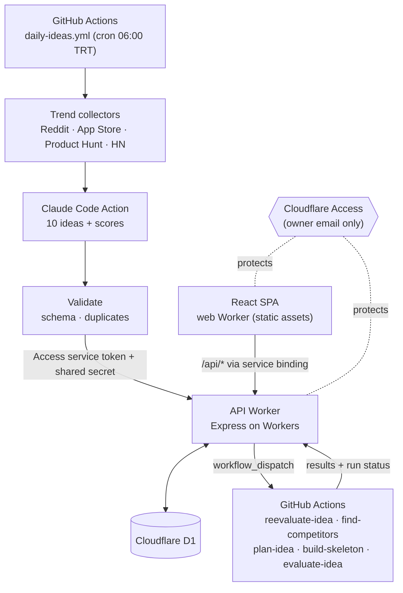

<div align="center">

# 💡 App Idea Factory

**Every morning, ten fresh mobile app ideas — mined from real trends, scored by Claude, waiting in your own dashboard.**

[](#tech-stack)
[](#tech-stack)
[](#tech-stack)
[](#tech-stack)
[-2ea44f)](#tech-stack)

**English** · [Türkçe](README.tr.md)

</div>

---

## What it does

App Idea Factory is a personal, fully automated idea pipeline that runs on free tiers only:

1. **Collects trends** every day at 06:00 (Türkiye time) from Reddit, the App Store charts, Product Hunt and Hacker News.
2. **Generates 10 original mobile app ideas** with Claude Code inside GitHub Actions, synthesizing signals across sources and checking them against the last 90 days of ideas so nothing repeats.
3. **Scores each idea** (market, solo-dev feasibility, originality, overall; 0–10 in 0.25 steps), with a one-sentence reason for every score.
4. **Lists them in a mobile-first web app** where you rate, annotate, filter, compare and shortlist ideas.
5. **Runs background AI jobs on demand:** re-evaluate an idea in light of your notes, or search the web for real competing apps.
6. **Turns a chosen idea into a project:** fill a short task form (platform, backend, auth, MVP features, design) and Claude writes four planning documents (PRD, screens & flows, tech plan, roadmap). You review and edit them in the app, then hit *Start development* — Claude Code builds a skeleton app from those documents in a new **private** GitHub repo and opens a tracking issue.

> The UI and idea descriptions are in **Turkish**. Idea names are short English app names (e.g. *MealMate*). Prompts live in [`prompts/`](prompts) if you want to change the language or the scoring rubric.

### Screens

| Screen | What you get |
|---|---|
| **Dashboard** | Live counters, category distribution, daily average score trend, latest jobs and the latest trend run |
| **Ideas** | One sortable, filterable table (search, category, status, score minimums, date range), 20 per page, compare up to 4 |
| **Add idea** | Enter an idea the daily run did not find: describe it freely and let Claude fill in the fields and score it, or fill in the form yourself and have Claude score it later |
| **Idea detail** | Full idea, score breakdown with Claude's reasoning, your 0–10 rating and note, competitors, re-evaluation, Markdown export |
| **Develop** | Task form for an idea: platform, backend, auth, MVP features, design, notes |
| **Kanban** | Development, test and ready-to-ship ideas as color-coded columns. Dragging a card to another column opens that step's form (or a short confirmation); the status only changes once it is submitted |
| **Developed** | Ideas in the development flow: awaiting your review of the planning docs, skeleton in progress or built, and ideas sent back from testing (rework). The detail page shows the docs (editable until you start), repo/issue links, retry, and a repo sync that pulls recent commits and changed Markdown files |
| **Test** | Developed ideas waiting for or under testing. A test plan (testers, days, platforms, channel, scenarios, success criteria) starts a round; the result form records per-scenario outcomes, findings and the decision: approve, or send back to development with a reason |
| **Ready to ship** | Ideas whose test was approved |
| **Compare** | 2–4 ideas side by side, rate while comparing |
| **Run history** | Daily generation runs (with every collected trend item) and per-idea jobs, with durations and log links |
| **Settings** | Toggle trend sources, trigger the daily run manually |

## Architecture



**Key idea: Claude never runs on the server.** All Claude work happens inside GitHub Actions using a Claude Pro/Max subscription token (`claude setup-token`), so there is no per-token API bill. The Worker only stores data and dispatches workflows.

## Tech stack

| Layer | Choice |
|---|---|
| Frontend | React 19 + Vite + TypeScript, Tailwind CSS v4, shadcn/ui, TanStack Table — served as Cloudflare Workers static assets |
| API | Express on Cloudflare Workers (`nodejs_compat` + `httpServerHandler`), zod validation |
| Database | Cloudflare D1 (SQLite) with plain SQL migrations |
| AI | [`anthropics/claude-code-action`](https://github.com/anthropics/claude-code-action) in GitHub Actions |
| Auth | Cloudflare Access (Zero Trust free tier) + a service token for workflows |
| Tooling | pnpm workspaces, oxlint, `tsc` |

## Repository layout

```
apps/
  web/          React SPA + a tiny Worker that serves it and proxies /api/* to the API Worker
  api/          Express API Worker, D1 migrations (apps/api/migrations/*.sql)
scripts/        Trend collectors, validation, API client used by the workflows
prompts/        Instructions given to Claude Code (daily ideas, re-evaluation, competitors, planning docs, skeleton)
config/         subreddits.json — which subreddits are collected
.github/workflows/
  daily-ideas.yml        cron + manual: collect → generate → validate → submit
  reevaluate-idea.yml    on demand: re-score an idea using your note
  find-competitors.yml   on demand: web-search real competing apps
  plan-idea.yml          on "Develop": write the 4 planning documents
  build-skeleton.yml     on "Start development": private repo + issue + skeleton from the approved docs
  deploy.yml             push to main → deploy both Workers
```

## Run your own copy

This repo is wired to its owner's Cloudflare account and domains. To run your own instance you'll replace a handful of values and set up your own secrets. Budget about an hour.

### Prerequisites

- Node.js ≥ 22 and pnpm 10 (`corepack enable`)
- A Cloudflare account (free) with a domain on Cloudflare (optional but recommended — see the cookie note below)
- A GitHub account and the [`gh` CLI](https://cli.github.com/)
- A Claude Pro or Max subscription (for `claude setup-token`)

### 1. Clone and install

```bash
git clone https://github.com/<you>/app-idea-factory.git
cd app-idea-factory
pnpm install
npx wrangler login
```

> Keep your copy **public** if you want unlimited free GitHub Actions minutes (the daily run takes ~15 minutes). Never commit secrets — everything sensitive lives in Cloudflare/GitHub secrets.

### 2. Create the database

```bash
cd apps/api
npx wrangler d1 create app-idea-factory-db       # copy the database_id it prints
npx wrangler d1 migrations apply app-idea-factory-db --remote
```

### 3. Replace the owner-specific values

| File | What to change |
|---|---|
| `apps/api/wrangler.jsonc` | `database_id`; the `routes` custom domain (or remove `routes` and set `"workers_dev": true`); `WEB_ORIGIN` (your web app URL(s), comma-separated) |
| `apps/web/wrangler.jsonc` | `name` if you want a different Worker name; `services[0].service` must match the API Worker's `name` |
| `apps/api/src/app.ts` | `GITHUB_REPO` → `<you>/app-idea-factory` (used to dispatch workflows) |
| `scripts/lib/api-client.ts` | Default `BASE_URL` → your API URL (or set an `API_BASE_URL` env var in the workflows) |
| `scripts/lib/reddit.ts` | `USER_AGENT` → point at your repo |
| `.github/workflows/deploy.yml` | `CLOUDFLARE_ACCOUNT_ID` (twice) → your account ID |

> **Use a custom domain you own for both Workers** (e.g. `ideas.example.com` and `ideas-api.example.com`). `*.workers.dev` is on the Public Suffix List, so a web app and an API on different `workers.dev` hosts are different *sites*, and Safari silently drops the cross-site Access cookie.

### 4. Lock it down with Cloudflare Access — before going live

In **Zero Trust → Access → Applications**, create two **self-hosted** applications: one for the web hostname, one for the API hostname.

- **Both:** an *Allow* policy for your email only.
- **API app only:** a second policy of type **Service Auth** for a new **service token** (Access → Service credentials). Save its Client ID/Secret for step 5.

> ⚠️ **Order matters.** The moment `wrangler deploy` attaches a custom domain, it serves real traffic. Create the Access application for a hostname **before** the first deploy that adds it, then verify with `curl -I https://<api-host>/health` — you must get a `302`/`403` from Access, never `200`.

### 5. Secrets

Generate a shared secret once (`openssl rand -hex 32`) and use the same value in both places below.

**Cloudflare Worker secrets** (run in `apps/api`, `npx wrangler secret put <NAME>`):

| Name | Purpose |
|---|---|
| `WORKFLOW_API_SHARED_SECRET` | Workflows authenticate to workflow-only endpoints with it |
| `GH_WORKFLOW_DISPATCH_TOKEN` | Classic GitHub PAT with `repo` + `workflow` scopes — powers the "run now", "re-evaluate", "find competitors", "develop" and "start development" buttons |
| `SLACK_WEBHOOK_URL` | Optional, reserved for upcoming Slack notifications |

**GitHub Actions secrets** (`printf '%s' 'value' | gh secret set <NAME>` — `printf` avoids a stray newline, which breaks Access headers silently):

| Name | Purpose |
|---|---|
| `WORKFLOW_API_SHARED_SECRET` | Same value as the Worker secret |
| `CF_ACCESS_CLIENT_ID` / `CF_ACCESS_CLIENT_SECRET` | The Access service token from step 4 |
| `CLAUDE_CODE_OAUTH_TOKEN` | Output of `claude setup-token` |
| `CLOUDFLARE_API_TOKEN` | Cloudflare API token from the *Edit Cloudflare Workers* template (used by `deploy.yml`) |
| `SKELETON_REPO_PAT` | Classic GitHub PAT with `repo` (+ `project` for the upcoming Projects board) scope — `build-skeleton.yml` creates the private skeleton repo, pushes to it and opens/comments the issue. Never exposed to the Claude Code step |
| `PRODUCTHUNT_TOKEN` | Optional — Product Hunt developer token; the source is skipped without it |

### 6. Install the Claude GitHub App

Install [github.com/apps/claude](https://github.com/apps/claude) on your repository. The OAuth token alone isn't enough — without the app, the action fails with *"Claude Code is not installed on this repository"*.

### 7. Deploy

Push to `main` — `deploy.yml` deploys the API and web Workers. (Or manually: `pnpm --filter api deploy && pnpm --filter web deploy`.)

> `deploy.yml` does **not** run database migrations. When a change adds a file under `apps/api/migrations/`, apply it with `npx wrangler d1 migrations apply app-idea-factory-db --remote` **before** pushing.

### 8. First run

Open the web app → **Ayarlar** (Settings) → *Cron'u şimdi tetikle*, or run **Daily Ideas** from the Actions tab. After ~15 minutes, ten ideas appear in the list.

> GitHub disables scheduled workflows after 60 days without repository activity — re-enable it from the Actions tab if that happens.

## Local development

```bash
cp apps/api/.dev.vars.example apps/api/.dev.vars
(cd apps/api && npx wrangler d1 migrations apply app-idea-factory-db --local)

pnpm dev:api     # wrangler dev on http://localhost:8787 with a local D1
pnpm dev:web     # vite on http://localhost:5173, talks to the local API (apps/web/.env.development)
```

Useful commands:

```bash
pnpm typecheck && pnpm lint && pnpm build

cd scripts
SKIP_REDDIT=true pnpm collect-trends     # collect trends locally into scripts/output/
```

## Gotchas worth knowing

- **SQLite timestamps:** `datetime('now')` returns UTC *without* a zone marker; browsers read it as local time. The API normalizes these to ISO (`toUtcIso`) — write new timestamps with `new Date().toISOString()`.
- **Reddit** blocks `.json` from cloud IPs; the collector falls back to RSS and works, but slowly (~11 min). Set `SKIP_REDDIT=true` while iterating.
- **Removing a custom domain** from `wrangler.jsonc` does not unpublish it — delete it via the Cloudflare dashboard/API.
- **shadcn CLI** misresolves the `@/` alias in this pnpm monorepo; new UI components may need to be moved into `apps/web/src/components/ui/` by hand.

## Status

Idea generation, the UI, run history and the on-demand AI jobs are live. Next up: picking an idea and having Claude Code scaffold it into its own private repository, with GitHub Issues/Projects tracking and Slack notifications. See [`docs/PROJE.md`](docs/PROJE.md) (Turkish) for the full plan.

## License

[MIT](LICENSE)
