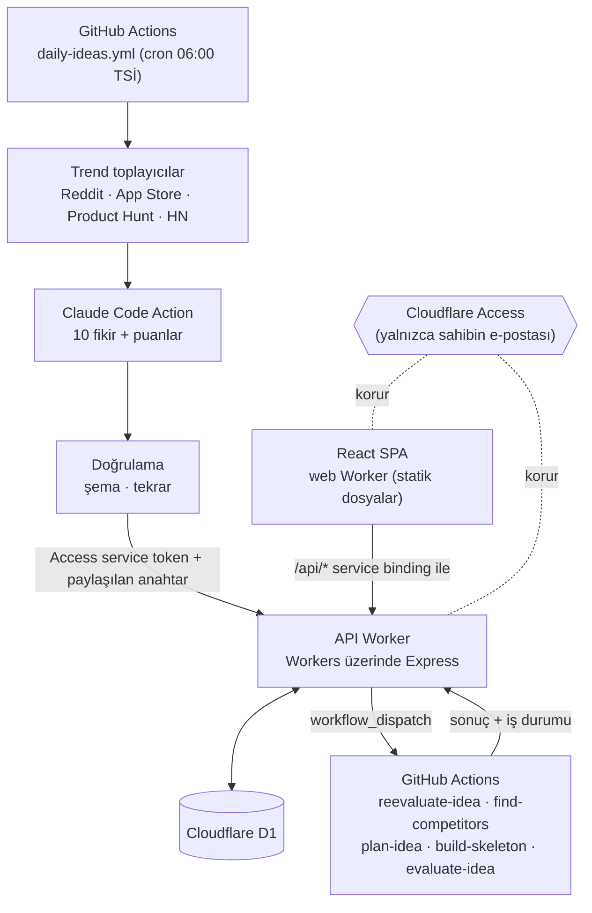

<div align="center">

# 💡 App Idea Factory

**Her sabah, gerçek trendlerden çıkarılmış, Claude'un puanladığı 10 yeni mobil uygulama fikri — kendi panelinde seni bekliyor.**

[](#teknoloji-yığını)
[](#teknoloji-yığını)
[](#teknoloji-yığını)
[](#teknoloji-yığını)
[-2ea44f)](#teknoloji-yığını)

[English](README.md) · **Türkçe**

</div>

---

## Ne yapıyor?

App Idea Factory, tamamen ücretsiz planlar üzerinde çalışan kişisel ve otomatik bir fikir hattı:

1. **Trendleri toplar:** Her gün 06:00'da (Türkiye saati) Reddit, App Store listeleri, Product Hunt ve Hacker News'ten.
2. **10 özgün mobil uygulama fikri üretir:** GitHub Actions içinde Claude Code ile; farklı kaynaklardaki sinyalleri birleştirir, son 90 günün fikirleriyle karşılaştırıp tekrarı önler.
3. **Her fikri puanlar:** pazar, solo geliştirici için uygulanabilirlik, özgünlük, genel (0–10, 0.25 adımlarla) — her puanın tek cümlelik gerekçesiyle.
4. **Mobil öncelikli bir web uygulamasında listeler:** puan ver, not al, filtrele, karşılaştır, kısa liste çıkar.
5. **İstediğinde arka planda AI işi çalıştırır:** notlarına göre fikri yeniden değerlendirir ya da web'de gerçek rakip uygulamaları arar.
6. **Seçtiğin fikri projeye dönüştürür:** kısa bir görev formu doldurursun (platform, backend, auth, MVP özellikleri, tasarım), Claude dört planlama belgesi yazar (PRD, ekranlar ve akışlar, teknik plan, yol haritası). Belgeleri uygulamada inceleyip düzenlersin, sonra *Geliştirmeye başla* dersin — Claude Code bu belgelere göre yeni bir **özel** GitHub reposunda uygulama iskeletini kurar ve takip için bir issue açar.

> Arayüz ve fikir açıklamaları **Türkçe**; fikir adları kısa İngilizce uygulama adları (örn. *MealMate*). Dili ya da puanlama ölçütlerini değiştirmek istersen talimatlar [`prompts/`](prompts) klasöründe.

### Ekranlar

| Ekran | İçerik |
|---|---|
| **Gösterge paneli** | Anlık sayaçlar, kategori dağılımı, günlük ortalama puan trendi, son işler ve son trend çalışması |
| **Fikirler** | Tek, sıralanabilir ve filtrelenebilir tablo (arama, kategori, durum, minimum puanlar, tarih aralığı), sayfa başına 20, 4'e kadar karşılaştırma |
| **Fikir ekle** | Günlük taramanın bulamadığı bir fikri gir: serbestçe anlat, Claude alanları doldurup puanlasın; ya da formu kendin doldur, Claude sonra puanlasın |
| **Fikir detayı** | Fikrin tamamı, Claude'un gerekçeleriyle puan dökümü, 0–10 puanın ve notun, rakipler, yeniden değerlendirme, Markdown dışa aktarma |
| **Geliştir** | Fikir için görev formu: platform, backend, auth, MVP özellikleri, tasarım, notlar |
| **Geliştirilenler** | Geliştirme akışındaki fikirler: planlama belgeleri onayını bekleyenler, iskeleti kurulanlar ya da kurulmuş olanlar, testten revizyona dönenler. Detay sayfasında belgeler (başlatana kadar düzenlenebilir), repo/issue linkleri, tekrar dene ve son commit'leri ve değişen Markdown dosyalarını çeken repo senkronu |
| **Test** | Geliştirilmiş, test bekleyen ya da testi süren fikirler. Test planı (kişi, gün, platform, kanal, senaryolar, başarı kriterleri) bir tur başlatır; sonuç formu senaryo sonuçlarını, bulguları ve kararı kaydeder: onay ya da sebebiyle geliştirmeye geri gönderme |
| **Dağıtıma hazır** | Testi onaylanmış fikirler |
| **Karşılaştırma** | 2–4 fikir yan yana, karşılaştırırken puan verme |
| **Çalışma geçmişi** | Günlük üretim çalışmaları (toplanan her trend öğesiyle) ve fikir bazlı işler; süre ve log linkleriyle |
| **Ayarlar** | Trend kaynaklarını aç/kapat, günlük çalışmayı elle tetikle |

## Mimari



**Temel fikir: Claude hiçbir zaman sunucuda çalışmaz.** Tüm Claude işi GitHub Actions içinde, Claude Pro/Max aboneliğinin token'ıyla (`claude setup-token`) yapılır; token başına API faturası yoktur. Worker yalnızca veriyi saklar ve workflow tetikler.

## Teknoloji yığını

| Katman | Seçim |
|---|---|
| Ön yüz | React 19 + Vite + TypeScript, Tailwind CSS v4, shadcn/ui, TanStack Table — Cloudflare Workers statik dosyaları olarak sunulur |
| API | Cloudflare Workers üzerinde Express (`nodejs_compat` + `httpServerHandler`), zod doğrulaması |
| Veritabanı | Cloudflare D1 (SQLite), düz SQL migration'lar |
| Yapay zekâ | GitHub Actions içinde [`anthropics/claude-code-action`](https://github.com/anthropics/claude-code-action) |
| Kimlik doğrulama | Cloudflare Access (Zero Trust ücretsiz plan) + workflow'lar için service token |
| Araçlar | pnpm workspaces, oxlint, `tsc` |

## Klasör yapısı

```
apps/
  web/          React SPA + onu sunan ve /api/* isteklerini API Worker'a ileten küçük bir Worker
  api/          Express API Worker, D1 migration'ları (apps/api/migrations/*.sql)
scripts/        Workflow'ların kullandığı trend toplayıcılar, doğrulama, API istemcisi
prompts/        Claude Code'a verilen talimatlar (günlük fikir, yeniden değerlendirme, rakipler, planlama belgeleri, iskelet)
config/         subreddits.json — hangi subreddit'lerin toplanacağı
.github/workflows/
  daily-ideas.yml        cron + elle: topla → üret → doğrula → gönder
  reevaluate-idea.yml    isteğe bağlı: fikri notuna göre yeniden puanla
  find-competitors.yml   isteğe bağlı: web'de gerçek rakip uygulamaları ara
  plan-idea.yml          "Geliştir" ile: 4 planlama belgesini yaz
  build-skeleton.yml     "Geliştirmeye başla" ile: özel repo + issue + onaylı belgelerden iskelet
  deploy.yml             main'e push → iki Worker'ı da deploy et
```

## Kendi kopyanı çalıştır

Bu repo, sahibinin Cloudflare hesabına ve alan adlarına bağlı. Kendi kopyanı çalıştırmak için birkaç değeri değiştirip kendi secret'larını tanımlaman gerekiyor. Yaklaşık bir saat ayır.

### Gereksinimler

- Node.js ≥ 22 ve pnpm 10 (`corepack enable`)
- Cloudflare hesabı (ücretsiz) ve Cloudflare'de bir alan adı (zorunlu değil ama önerilir — aşağıdaki çerez notuna bak)
- GitHub hesabı ve [`gh` CLI](https://cli.github.com/)
- Claude Pro veya Max aboneliği (`claude setup-token` için)

### 1. Klonla ve kur

```bash
git clone https://github.com/<sen>/app-idea-factory.git
cd app-idea-factory
pnpm install
npx wrangler login
```

> Sınırsız ücretsiz GitHub Actions dakikası istiyorsan kopyanı **public** tut (günlük çalışma ~15 dakika sürüyor). Asla secret commit'leme — hassas her şey Cloudflare/GitHub secret'larında durur.

### 2. Veritabanını oluştur

```bash
cd apps/api
npx wrangler d1 create app-idea-factory-db       # yazdırdığı database_id'yi kopyala
npx wrangler d1 migrations apply app-idea-factory-db --remote
```

### 3. Sahibe özel değerleri değiştir

| Dosya | Ne değişecek |
|---|---|
| `apps/api/wrangler.jsonc` | `database_id`; `routes` altındaki özel alan adı (ya da `routes`'u silip `"workers_dev": true` ekle); `WEB_ORIGIN` (web uygulamanın adres(ler)i, virgülle ayrılmış) |
| `apps/web/wrangler.jsonc` | Farklı bir Worker adı istiyorsan `name`; `services[0].service` API Worker'ın `name`'iyle aynı olmalı |
| `apps/api/src/app.ts` | `GITHUB_REPO` → `<sen>/app-idea-factory` (workflow tetiklemek için) |
| `scripts/lib/api-client.ts` | Varsayılan `BASE_URL` → kendi API adresin (ya da workflow'larda `API_BASE_URL` env değişkeni ver) |
| `scripts/lib/reddit.ts` | `USER_AGENT` → kendi reponu göstersin |
| `.github/workflows/deploy.yml` | `CLOUDFLARE_ACCOUNT_ID` (iki yerde) → kendi hesap id'n |

> **İki Worker için de sahibi olduğun bir alan adı kullan** (örn. `ideas.example.com` ve `ideas-api.example.com`). `*.workers.dev` Public Suffix List'te olduğu için farklı `workers.dev` adreslerindeki web uygulaması ve API farklı *site* sayılır; Safari, siteler arası Access çerezini sessizce düşürür.

### 4. Yayına almadan önce Cloudflare Access ile kilitle

**Zero Trust → Access → Applications** altında iki **self-hosted** uygulama oluştur: biri web adresi, biri API adresi için.

- **İkisinde de:** yalnızca kendi e-postana izin veren bir *Allow* politikası.
- **Sadece API'de:** **Service Auth** türünde ikinci bir politika, yeni bir **service token** için (Access → Service credentials). Client ID/Secret'ı 5. adım için sakla.

> ⚠️ **Sıra önemli.** `wrangler deploy` bir özel alan adını bağladığı anda o adres gerçek trafik almaya başlar. Bir adres için Access uygulamasını, o adresi ekleyen ilk deploy'dan **önce** oluştur; sonra `curl -I https://<api-adresi>/health` ile doğrula — Access'ten `302`/`403` gelmeli, asla `200` değil.

### 5. Secret'lar

Bir kere paylaşılan anahtar üret (`openssl rand -hex 32`) ve aşağıdaki iki yerde de aynı değeri kullan.

**Cloudflare Worker secret'ları** (`apps/api` içinde, `npx wrangler secret put <AD>`):

| Ad | Amaç |
|---|---|
| `WORKFLOW_API_SHARED_SECRET` | Workflow'lar yalnızca kendilerine açık uçlara bununla kimlik doğrular |
| `GH_WORKFLOW_DISPATCH_TOKEN` | `repo` + `workflow` scope'lu klasik GitHub PAT — "şimdi çalıştır", "yeniden değerlendir", "rakipleri bul", "geliştir" ve "geliştirmeye başla" butonlarını çalıştırır |
| `SLACK_WEBHOOK_URL` | İsteğe bağlı, yakında gelecek Slack bildirimleri için ayrılmış |

**GitHub Actions secret'ları** (`printf '%s' 'değer' | gh secret set <AD>` — `printf`, Access header'larını sessizce bozan fazladan satır sonunu engeller):

| Ad | Amaç |
|---|---|
| `WORKFLOW_API_SHARED_SECRET` | Worker secret'ıyla aynı değer |
| `CF_ACCESS_CLIENT_ID` / `CF_ACCESS_CLIENT_SECRET` | 4. adımdaki Access service token'ı |
| `CLAUDE_CODE_OAUTH_TOKEN` | `claude setup-token` çıktısı |
| `CLOUDFLARE_API_TOKEN` | *Edit Cloudflare Workers* şablonundan Cloudflare API token'ı (`deploy.yml` kullanır) |
| `SKELETON_REPO_PAT` | `repo` (+ yakında gelecek Projects panosu için `project`) scope'lu klasik GitHub PAT — `build-skeleton.yml` özel iskelet reposunu açar, ona push eder ve issue açar/yorum yazar. Claude Code adımına hiç verilmez |
| `PRODUCTHUNT_TOKEN` | İsteğe bağlı — Product Hunt developer token'ı; yoksa bu kaynak atlanır |

### 6. Claude GitHub App'i kur

[github.com/apps/claude](https://github.com/apps/claude) uygulamasını repona kur. OAuth token tek başına yetmez — uygulama yoksa action *"Claude Code is not installed on this repository"* hatasıyla düşer.

### 7. Deploy

`main`'e push et — `deploy.yml` API ve web Worker'larını deploy eder. (Elle: `pnpm --filter api deploy && pnpm --filter web deploy`.)

> `deploy.yml` veritabanı migration'larını **çalıştırmaz**. Bir değişiklik `apps/api/migrations/` altına dosya ekliyorsa, push'tan **önce** `npx wrangler d1 migrations apply app-idea-factory-db --remote` ile uygula.

### 8. İlk çalıştırma

Web uygulamasını aç → **Ayarlar** → *Cron'u şimdi tetikle*, ya da Actions sekmesinden **Daily Ideas**'ı çalıştır. ~15 dakika sonra listede on fikir belirir.

> GitHub, repoda 60 gün hareket olmazsa zamanlanmış workflow'ları kapatır — olursa Actions sekmesinden yeniden aç.

## Yerel geliştirme

```bash
cp apps/api/.dev.vars.example apps/api/.dev.vars
(cd apps/api && npx wrangler d1 migrations apply app-idea-factory-db --local)

pnpm dev:api     # http://localhost:8787 üzerinde wrangler dev, yerel D1 ile
pnpm dev:web     # http://localhost:5173 üzerinde vite, yerel API'ye bağlanır (apps/web/.env.development)
```

İşe yarar komutlar:

```bash
pnpm typecheck && pnpm lint && pnpm build

cd scripts
SKIP_REDDIT=true pnpm collect-trends     # trendleri yerelde scripts/output/ altına topla
```

## Bilmekte fayda olan tuzaklar

- **SQLite zaman damgaları:** `datetime('now')` UTC döndürür ama saat dilimi işareti *olmadan*; tarayıcılar bunu yerel saat sanar. API bunları ISO'ya çevirir (`toUtcIso`) — yeni zaman damgalarını `new Date().toISOString()` ile yaz.
- **Reddit**, bulut IP'lerinden `.json` isteklerini engelliyor; toplayıcı RSS'e düşüp çalışıyor ama yavaş (~11 dk). Denemeler sırasında `SKIP_REDDIT=true` kullan.
- **Özel alan adını** `wrangler.jsonc`'den silmek yayından kaldırmaz — Cloudflare paneli/API'si üzerinden sil.
- **shadcn CLI** bu pnpm monoreposunda `@/` alias'ını yanlış çözüyor; yeni UI bileşenlerini elle `apps/web/src/components/ui/` altına taşıman gerekebilir.

## Durum

Fikir üretimi, arayüz, çalışma geçmişi ve isteğe bağlı AI işleri canlıda. Sıradaki: bir fikri seçip Claude Code'a kendi özel reposunda iskeletini kurdurmak; GitHub Issues/Projects takibi ve Slack bildirimleriyle birlikte. Planın tamamı için [`docs/PROJE.md`](docs/PROJE.md).

## Lisans

[MIT](LICENSE)
