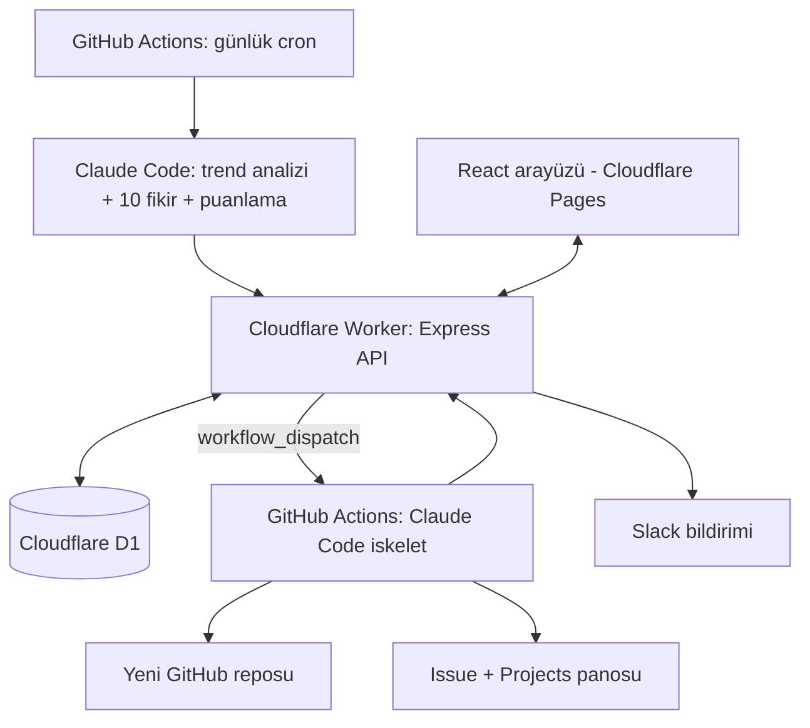

# Uygulama Fikri Fabrikası

Her gün otomatik olarak 10 mobil uygulama fikri üreten, bunları telefondan erişilebilen bir React arayüzünde listeleyen ve seçilen fikir için Claude Code aracılığıyla ayrı bir GitHub reposunda uygulama iskeleti oluşturan kişisel bir otomasyon platformu.

## Amaç

1. Her sabah gerçek trend verilerine dayanan 10 özgün mobil uygulama fikri üretmek.
2. Fikirleri telefondan rahatça gözden geçirmek, her birine kendi puanını (0.00-10.00, slider ile) ve notunu vermek, sıralamak ve filtrelemek.
3. Yalnızca kullanıcının seçtiği fikirler için platform ve kapsam seçip "Geliştir" görevi atamak.
4. "Geliştir" denince Claude Code'un otomatik olarak başlayıp o fikrin iskeletini yeni bir GitHub reposunda oluşturması.
5. Süreci Slack (bildirim) ve GitHub Issues + Projects (görev takibi) ile entegre etmek.

## Kesinleşen kararlar

| Konu | Karar |
|---|---|
| Hosting | Cloudflare, yalnızca ücretsiz plan. Ücretli plan gerektiren hiçbir servis kullanılmayacak. |
| Frontend | React (mobil öncelikli, PWA), Cloudflare Pages |
| Backend | Node.js, Express; Cloudflare Workers üzerinde (`nodejs_compat` + `httpServerHandler` ile) |
| Veritabanı | Cloudflare D1 (SQLite tabanlı, ücretsiz planda) |
| Repo yapısı | Tek repo (monorepo): frontend, backend, workflow'lar aynı yerde |
| GitHub | Kişisel GitHub hesabı |
| Claude erişimi | Claude Pro aboneliği. Claude Code GitHub Actions'ta `claude setup-token` ile üretilen OAuth token ile çalışır. Ek API kredisi kullanılmayacak. |
| İskelet çıktısı | Her fikre ayrı GitHub reposu (kişisel hesapta) |
| Ana repo görünürlüğü | Herkese açık (public). GitHub Actions dakikaları sınırsız; kod ve workflow logları herkese görünür. |
| İskelet repoları | Özel (private) |
| Dil | TypeScript (frontend, API ve betikler) |
| Arayüz koruması | Cloudflare Access (Zero Trust ücretsiz plan), yalnızca sahibin e-postası |
| Fikir üretim saati | Her gün 06:00 Türkiye saati (03:00 UTC, cron `0 3 * * *`) |
| Geliştirme kapsamı | Üretilen fikirlerin hiçbiri otomatik geliştirilmez. Repo ve iskelet yalnızca kullanıcının "Geliştir" dediği fikirler için oluşturulur. |
| Geliştir tetikleme | Görev formu gönderilince iskelet üretimi onay beklemeden otomatik başlar. Claude Code yalnızca iskeleti kurar; iskeletten sonra geliştirmeye kendiliğinden devam etmez. |
| Kullanıcı puanı | Her fikre 0.00-10.00 arası (0.25 adımlarla, slider component'i ile) kullanıcı puanı ve isteğe bağlı kısa not. Claude'un ürettiği puanlarla aynı ölçek ama ayrı tutulur. |
| Claude puanları | 0.00-10.00 arası, 0.25 adımlarla; her alt puanın (`market`, `feasibility_solo_dev`, `originality`, `overall`) yanında Claude'un o puanı neden verdiğini açıklayan kısa bir metin (`*_reason`) de üretiliyor. `feasibility_solo_dev` ayrıca gerekli API/kaynaklara erişimin ücretsiz/kolay mı yoksa ücretli/kısıtlı mı olduğunu da değerlendiriyor. |
| Fikir durumu | Üç ayrı durum: aktif (`new`), `on_hold` (kullanıcı üzerinde düşünüyor, listede soluk görünür ama görünür kalır), `deleted` (listeden tamamen gizlenir, yalnızca isim tekrarı kontrolü için DB'de kalır). Eski "arşivle" kavramı `on_hold`'a karşılık geliyor — ayrı bir "arşiv" durumu yok. |
| Birleşik puan | Kullanıcı puanı girilmiş fikirlerde liste sütununda `%40 Claude overall + %60 kullanıcı puanı` ile hesaplanan birleşik bir puan gösterilir; kullanıcı puanı yoksa `—` gösterilir. |
| Not geçmişi | Notun tam revizyon geçmişi tutulmaz (tek kullanıcılı uygulama) — yalnızca son güncelleme zamanı (`user_note_updated_at`) saklanır. |
| Etiketleme | Claude her fikir için 2-4 kısa İngilizce etiket (`tags`) üretir; arama/filtreleme bunları da kapsar. |
| İlham kaynağı | Artık tek bir url değil, dizi (`inspiration_sources`) — Claude birden fazla trend sinyalini birleştirip tek fikirde sentezleyebiliyor. |
| Puanların etkisi | Kullanıcı puanları ve notları fikir üretimini etkilemez. Amaç her gün geniş bir yelpazede fikir keşfetmek; üretim talimatına puan, not veya kullanıcı tercihi bilgisi gönderilmez. Geçmiş fikirler yalnızca tekrar kontrolü için (fikir adları) kullanılır. |
| Bildirim | Slack ücretsiz plan, incoming webhook |
| Görev takibi | GitHub Issues + GitHub Projects (kişisel hesapta tek pano) |
| Bütçe limiti | Uygulama içinde bütçe limiti özelliği yapılmayacak |
| Fikir dili | Açıklamalar Türkçe; fikrin adı İngilizce, uygulama adı gibi kısa ve akılda kalıcı (örn. "MealMate") |
| Cron tetikleme yetkisi (Grup 3, 2026-09-30) | Ayarlar ekranındaki "cron'u şimdi tetikle" butonu için ayrı bir token yerine mevcut `SKELETON_REPO_PAT`'e `workflow` scope'u eklendi (aynı token, yeni bir PAT yok). Worker'a `GH_WORKFLOW_DISPATCH_TOKEN` secret'ı olarak eklenmesi gerekiyor — bkz. CLAUDE.md "Grup 3 — what's live". |

## Bu kararların mimariye etkisi

- **Ek maliyet yok:** Cloudflare ücretsiz, GitHub Actions ücretsiz kota içinde, Claude kullanımı Pro aboneliğinden.
- **Claude çağrıları Worker'dan yapılmaz.** Pro aboneliği doğrudan API çağrısı için kullanılamaz; API ayrı ve ücretli kredi ister. Bu yüzden Claude'un gerektiği her iş (fikir üretimi dahil) GitHub Actions içinde Claude Code ile çalışır.
- **Zamanlayıcı GitHub Actions'ta:** Günlük fikir üretimi `schedule` (cron) tetikleyicili bir workflow'dur. Cloudflare Worker yalnızca arayüzün API'si ve veritabanı erişimi için kullanılır.
- **Pro kullanım limitleri:** Fikir üretimi ve iskelet üretimi Pro aboneliğinin kullanım limitlerinden düşer. Aynı gün yoğun iskelet üretimi limite takılabilir; görev kuyruğu buna göre tasarlanmalı (hata durumunda "tekrar dene").
- **Yeni repo oluşturma:** Workflow'un varsayılan `GITHUB_TOKEN`'ı başka repo oluşturamaz; repo oluşturma ve push yetkisi olan bir fine-grained Personal Access Token gerekir.

## Mimari



### Akış 1: Günlük fikir üretimi (otomatik)

1. GitHub Actions cron her sabah 06:00 Türkiye saatinde (`0 3 * * *`, UTC) tetiklenir.
   - GitHub zamanlanmış workflow'ları yoğun saatlerde birkaç dakikadan bir saate kadar gecikebilir; fikirlerin kalkış saatinde hazır olması için 06:00 yeterli pay bırakır.
   - Açık repolarda uzun süre (60 gün) hiç commit olmazsa GitHub zamanlanmış workflow'ları otomatik devre dışı bırakır. Önlem: günlük workflow'un sonunda küçük bir "keepalive" adımı veya periyodik kontrol.
   - Workflow `workflow_dispatch` ile elle de tetiklenebilir olmalı (test ve kaçan günler için).
2. Workflow, Worker API'sinden son N günün fikir adlarını çeker (tekrarı önlemek için).
3. Workflow trend verilerini toplar (Reddit, App Store / Google Play, Product Hunt) ve bir dosyaya yazar. Bu adım basit bir Node.js betiğidir.
4. Claude Code, trend dosyası + geçmiş fikir listesiyle çalıştırılır; tanımlı JSON şemasında 10 fikir ve puanlarını üretir.
5. Workflow JSON'u doğrular (şema kontrolü, tekrar kontrolü) ve Worker API'sine gönderir.
6. Worker D1'e yazar, isteğe bağlı olarak Slack'e sabah özeti atar.

#### Trend toplama detayları (Faz 1, 2026-09-30 kararı)

`scripts/collect-trends.ts` (ve `scripts/lib/*`) dört bağımsız kaynaktan veri toplar; biri hata verirse diğerleri devam eder, hata o kaynağın `error` alanına yazılır (ham hata workflow log'unda görünür, ayrıca ileride `trend_snapshots` tablosuna da yazılabilir — bu betik henüz D1'e yazmıyor, sadece bir JSON dosyası üretiyor).

- **Reddit** — resmi API kullanılmıyor, public `.json`/`.rss` endpoint'leri. Subreddit listesi kodda değil `config/subreddits.json`'da, 4 grup halinde:
  - *Doğrudan fikir toplulukları* (SomebodyMakeThis, AppIdeas, Lightbulb, Startup_Ideas, SideProject) — günün en çok oy alanları (`top`, `t=day`).
  - *Kurucu/iş toplulukları* (indiehackers, microsaas, SaaS, startups, Entrepreneur, EntrepreneurRideAlong, smallbusiness) — günün en çok oy alanları.
  - *Mobil kullanıcı toplulukları* (androidapps, iosapps, productivity) — günün en çok oy alanları.
  - *Niş "dert" toplulukları* (ADHD, personalfinance, loseit, Fitness, GetStudying, Parenting, digitalnomad, houseplants, Cooking, travel) — `top` yerine subreddit içi arama (`search`, `sort=new`, `t=week`), "is there an app / app that / wish there was / why is there no app" ifadeleri OR'lanarak tek istekte aranıyor.
  - Her istek `.json` ile denenir, 403/429 gibi bir hata gelirse aynı adresin `.rss` (Atom) sürümüne düşülür (score/yorum sayısı olmadan, sadece başlık+link). **Doğrulandı (2026-09-30, gerçek `daily-ideas.yml` çalıştırması):** GitHub Actions runner'ının IP'si de aynı şekilde engelleniyor/kısıtlanıyor — tüm gruplarda `.json` engellendi, `.rss` fallback'i kullanıldı. Veri yine de geliyor (o çalıştırmada 44 öğe) ama hepsi degrade (skor/gövde metni yok) ve toplama ~11 dakika sürüyor (backoff bekleme süreleri yüzünden). **Karar:** böyle bırakılıyor — ana repo public olduğu için GitHub Actions dakikaları ücretsiz/sınırsız, 20 dakikalık workflow timeout'una rahatça sığıyor, sadece veri kalitesi zayıf. İleride resmi Reddit API'sine geçiş hâlâ mümkün (bkz. "Resmi API denendi" notu).
  - **Resmi API denendi, şimdilik vazgeçildi (2026-09-30):** "script" tipi bir Reddit app oluşturmaya çalışıldı ama Reddit artık Devvit dışı (klasik REST API) kullanım için manuel bir "Data Access Request" destek formu dolduruyor — otomatik onay yok, insan incelemesi gerekiyor, süresi belirsiz. Kullanıcı isterse formu ayrıca doldurup gönderebilir; onay gelirse kod tekrar OAuth'a çevrilebilir (önceki commit'te duruyordu, geri alındı). Şimdilik `.json`/`.rss` fallback'iyle devam ediliyor.
  - İstekler arası 1.5 sn bekleme var, kullanıcı adı/kişisel bilgi trend özetine dahil edilmiyor.
  - Kullanıcı adı/kişisel bilgi trend özetine dahil edilmiyor.
- **App Store** — Apple'ın resmi, auth gerektirmeyen `rss.applemarketingtools.com` top-charts feed'i (top-free + top-paid, `us` + `tr`) ve puanlar için `itunes.apple.com/lookup` (bulk, ücretsiz, auth'suz). Bu ikisinden "düşük puanlı ama popüler" uygulamalar (≥1000 oy, en düşük puanlılar) ayrıca öne çıkarılıyor. **Test edildi, çalışmıyor:** Apple'ın eski "customer reviews" RSS'i (`itunes.apple.com/.../rss/customerreviews/...`) artık boş feed dönüyor (entry yok) — gerçek yorum metni toplama özelliği bu yüzden yok, sadece puan/oy sayısı sinyali kullanılıyor.
- **Product Hunt** — resmi GraphQL API v2 (`api.producthunt.com/v2/api/graphql`), `PRODUCTHUNT_TOKEN` (read-only developer token, bkz. Güvenlik bölümü) ile son 24 saatin lansmanları oy sırasına göre çekiliyor. Token yoksa veya istek başarısız olursa kaynak atlanır, hat durmaz.
- **Hacker News** (Faz 1, 2026-09-30 kararı) — resmi Algolia HN Search API (`hn.algolia.com/api/v1`), auth gerekmez. Son 24 saatin "Ask HN" gönderileri (puana göre sıralanıp kırpılıyor) + son bir haftada gönderi ve yorumlarda "is there an app", "wish there was", "why is there no app" ifadelerini içerenler (en yeniden eskiye). **Önemli teknik detay:** Algolia'nın `query` parametresi tırnaksız gönderilince kelime torbası (OR) gibi çalışıyor — "is", "there", "app" gibi yaygın kelimeler yüzünden filtre pratikte hiç uygulanmıyor, tamamen alakasız son yorumlar dönüyor (test edilip doğrulandı). Tam ifade eşleşmesi için sorgu kendi içinde çift tırnakla sarılmalı (`"is there an app"`). "app that" ifadesi tırnaklı halde bile çok gürültülü çıktı (haftada ~95 sonuç, çoğu alakasız), kullanılmıyor.
- **Google Play atlandı:** ücretsiz/resmi bir trend API'si yok, scraping kırılgan olurdu. Faz 5'e not düşüldü (bkz. Yol haritası).
- Ham veri Claude'a olduğu gibi gönderilmiyor; her kaynak/grup için en ilgili ~10-20 öğe seçilip kısa bir özet dosyasına (`scripts/output/trend-summary.<tarih>.json`, gitignore'lu) yazılıyor.

### Akış 2: İskelet üretimi (manuel)

1. Kullanıcı arayüzde fikri seçer, görev formunu doldurur.
2. Worker görevi D1'e `queued` olarak kaydeder ve iskelet workflow'unu `workflow_dispatch` ile tetikler.
3. Workflow yeni özel GitHub reposunu oluşturur, bu repoda fikir ve görev parametrelerini içeren bir issue açar, issue'yu Projects panosuna "In progress" olarak ekler.
4. Workflow Claude Code'u fikir + görev parametreleriyle çalıştırır, sonucu yeni repoya iter, issue'ya özet yorum yazar, pano durumunu "Done" (hata varsa "Failed") yapar.
5. Workflow sonucu (repo URL'si, issue URL'si, durum, hata) Worker API'sine bildirir.
6. Worker görevi günceller ve Slack'e repo linkiyle mesaj atar.

## Bileşenler

### 1. React arayüzü (`apps/web`)

- Vite + React + TypeScript, mobil öncelikli, PWA olarak telefona eklenebilir.
- Ekranlar:
  - **Günün fikirleri:** Tarihe göre gruplanmış liste. Her kartta Claude puanı ve kullanıcının puanı (0.00-10.00). Sıralama (Claude puanı, kullanıcı puanı, birleşik puan, tarih) ve filtreleme (kategori, puan, durum, puanlanmamışlar).
  - **Fikir detayı:** Açıklama, hedef kitle, temel özellikler, Claude puan dökümü (her alt puanın gerekçesiyle), ilham kaynakları, kullanıcı puanı (slider, 0.00-10.00) ve not alanı, "Geliştir" butonu.
  - **Görev formu:** Seçilen fikir için geliştirme parametreleri.
  - **Görevler:** Görev durumu (queued, running, done, failed), repo ve issue linkleri, "tekrar dene".
- Fikir aksiyonları: puan ver (slider), not yaz, askıya al (`on_hold`), sil (`deleted`, listeden gizlenir), "Geliştir". Puan vermek hiçbir otomatik işlem başlatmaz; yalnızca "Geliştir" + görev formu iskelet üretimini başlatır.
- Bir fikir için zaten görev varsa "Geliştir" butonu görev durumunu gösterir, ikinci repo açılmaz.

### 2. API (`apps/api`)

- Express + TypeScript, Cloudflare Workers üzerinde. D1'e binding ile erişir.
- Uç noktalar (taslak):
  - `GET /ideas`, `GET /ideas/:id`, `PATCH /ideas/:id` (kullanıcı puanı, not, durum: `on_hold`/`deleted`)
  - `GET /ideas/recent-names` (tekrar kontrolü için)
  - `POST /ideas/batch` (günlük fikirleri kaydetme; yalnızca workflow çağırır)
  - `POST /tasks`, `GET /tasks`, `POST /tasks/:id/retry`
  - `POST /tasks/:id/result` (yalnızca workflow çağırır)
- Workflow'un çağırdığı uçlar paylaşılan bir gizli anahtarla korunur.
- Ücretsiz plan kısıtları: günde 100.000 istek ve çağrı başına 10 ms CPU. Worker ağır iş yapmaz; yalnızca veri okur/yazar ve dış servisleri tetikler.

### 3. GitHub Actions workflow'ları (`.github/workflows`)

- `daily-ideas.yml`: Günlük cron, fikir üretimi (Akış 1).
- `build-skeleton.yml`: `workflow_dispatch`, iskelet üretimi (Akış 2).
- Yardımcı betikler (`scripts/`): trend toplama, JSON doğrulama, API'ye gönderim. Node.js + TypeScript.
- Claude Code resmi Claude Code GitHub Action ile çalıştırılır; talimat şablonları (`prompts/`) repoda tutulur.

### 4. Fikir şeması

`name` İngilizce, diğer metin alanları Türkçe:

```json
{
  "name": "MealMate",
  "one_liner": "Buzdolabındaki malzemelerden haftalık yemek planı çıkaran asistan",
  "problem": "string (Türkçe)",
  "target_audience": "string (Türkçe)",
  "core_features": ["string (Türkçe)"],
  "monetization": "string (Türkçe)",
  "category": "string",
  "inspiration_sources": ["string (url)"],
  "tags": ["string (İngilizce, 2-4 etiket)"],
  "scores": {
    "market": 0.00,
    "market_reason": "string (Türkçe)",
    "feasibility_solo_dev": 0.00,
    "feasibility_solo_dev_reason": "string (Türkçe)",
    "originality": 0.00,
    "originality_reason": "string (Türkçe)",
    "overall": 0.00,
    "overall_reason": "string (Türkçe)"
  }
}
```

Puanlar 0.00-10.00 arası, yalnızca 0.25'in katları (bkz. "Kesinleşen kararlar").

### 5. Görev formu alanları

- Platform: iOS (Swift), Android (Kotlin), çapraz platform (React Native / Expo, Flutter)
- Backend gerekli mi: yok / Supabase / Firebase / özel API
- Kimlik doğrulama: yok / e-posta / sosyal giriş
- MVP özellikleri: fikirdeki özelliklerden seçim + serbest ekleme (3-5 önerilir)
- Tasarım tercihi: açık/koyu tema, minimal/renkli
- Ek notlar: serbest metin

### 6. İskelet reposu beklentileri

- Repo özel (private) oluşturulur.
- Repo adı fikrin İngilizce adından türetilir (örn. `mealmate-app`); çakışma olursa sonek eklenir.
- İçerik: çalışan proje yapısı, navigasyon, MVP ekranlarının örnek halleri, README (fikir özeti, kurulum, mimari), temel lint/format ayarları.
- Fikrin tam JSON'u yeni repoda `IDEA.md` olarak saklanır.

### 7. Entegrasyonlar

- **Slack (ücretsiz plan):** Tek kanal, incoming webhook. Sabah fikir özeti (en yüksek puanlı 3 fikir, arayüz linkiyle), görev tamamlandı/başarısız bildirimleri. Ücretsiz planda mesaj geçmişi 90 gün; fikirler D1'de saklandığı için sorun değil. Slack mesajlarını Worker gönderir (günlük özet dahil, workflow fikirleri kaydettikten sonra).
- **GitHub Issues + Projects:**
  - Kişisel hesapta tek bir Projects panosu (örn. "App Idea Factory"), durumlar: Queued, In progress, Done, Failed.
  - Her iskelet görevi, iskelet reposunda bir issue olarak açılır ve panoya eklenir. Issue içeriği: fikir özeti, görev parametreleri, ana repodaki ilgili workflow çalıştırmasının linki.
  - Issue'lar ve pano güncellemeleri iskelet workflow'u tarafından yapılır (Worker değil).
  - Projects (v2) GraphQL API ile yönetilir; kişisel hesaptaki projeye erişim için gereken token türü ve yetkileri Faz 0'da doğrulanmalı.
- **İleride:** İskelet repolarında Claude Code GitHub Action kurulup issue'lardaki `@claude` etiketleriyle geliştirmeye devam edilebilir. Not: iskelet repoları özel olduğu için oradaki çalışmalar GitHub Actions ücretsiz aylık dakika kotasından düşer.

## Veri modeli (D1, taslak)

- **ideas:** id, created_at, batch_date, name, one_liner, problem, target_audience, core_features (json), monetization, category, inspiration_sources (json array), tags (json array), scores (json, her alt puan + gerekçesi), user_rating (0.00-10.00, 0.25 adımlarla, boş olabilir), user_note, user_note_updated_at (boş olabilir), last_reevaluated_at (boş olabilir), status (new / on_hold / deleted / in_development / developed)
- **tasks:** id, idea_id, created_at, updated_at, params (json), status (queued / running / done / failed), repo_url, issue_url, project_item_id, workflow_run_id, error
- **trend_snapshots:** id, fetched_at, source, payload (json)

## Önerilen klasör yapısı

```
/
├── CLAUDE.md
├── docs/
│   └── PROJE.md
├── apps/
│   ├── web/          (React + Vite)
│   └── api/          (Express, Cloudflare Worker, D1 migration'ları)
├── scripts/          (trend toplama, doğrulama, API istemcisi)
├── prompts/          (Claude Code talimat şablonları)
└── .github/
    └── workflows/
```

## Güvenlik

- Arayüz ve API Cloudflare Access arkasında olmalı; yalnızca sahibin e-postası giriş yapabilir.
- GitHub Actions'ın API'ye yaptığı çağrılar Access'i Cloudflare Access service token ile geçer; ayrıca uygulama seviyesinde paylaşılan anahtar kontrolü yapılır.
- Ana repo açık olduğu için:
  - Hiçbir gizli bilgi, API adresi dışındaki iç yapılandırma veya kişisel veri repoya yazılmaz.
  - Workflow loglarına secret veya token yazdırılmaz; Claude Code çıktısında hassas bilgi olmamalı.
  - Fork'lardan gelen PR'lar secrets'a erişmemeli; `pull_request_target` kullanılmaz.
  - `workflow_dispatch` yalnızca repoya yazma yetkisi olanlarca tetiklenebilir.
- Gizli bilgiler yalnızca Cloudflare secrets ve GitHub Actions secrets içinde tutulur; frontend'e gönderilmez, repoya yazılmaz:
  - `CLAUDE_CODE_OAUTH_TOKEN` (GitHub)
  - Repo/issue/Projects oluşturma yetkili PAT — `SKELETON_REPO_PAT` (GitHub)
  - Workflow ↔ Worker paylaşılan anahtarı — `WORKFLOW_API_SHARED_SECRET` (GitHub ve Worker)
  - Cloudflare Access service token — `CF_ACCESS_CLIENT_ID` + `CF_ACCESS_CLIENT_SECRET` (GitHub)
  - Slack webhook URL'si — `SLACK_WEBHOOK_URL` (Worker)
  - Product Hunt developer token — `PRODUCTHUNT_TOKEN` (GitHub, Faz 1, 2026-09-30). Salt okuma, OAuth akışı yok; Product Hunt API dashboard'undan alınır. Trend toplama betiği (`scripts/collect-trends.ts`) token yoksa Product Hunt kaynağını atlar, hattı durdurmaz.
- PAT mümkün olan en dar yetkiyle oluşturulur: özel repo oluşturma, içerik yazma, issue yazma, Projects yazma.
  - **Not (Faz 0, 2026-09-30):** GitHub'ın fine-grained PAT'ları kullanıcı hesabı seviyesindeki Projects (v2) panosunu desteklemiyor (Account permissions listesinde yok). Bu yüzden `SKELETON_REPO_PAT` fine-grained yerine **classic PAT**, `repo` + `project` scope'larıyla oluşturuldu. Daha geniş kapsamlı ama tek token ile repo/issue/Projects hepsi çalışıyor. Fine-grained'e Projects v2 desteği gelirse daraltılabilir.

## Yol haritası

1. **Faz 0 - Kurulum:** Monorepo iskeleti, Cloudflare Pages + Worker + D1 bağlantısı, GitHub secrets, Claude Code token.
2. **Faz 1 - Fikir hattı:** D1 şeması, API uçları, trend toplama betikleri, `daily-ideas.yml`.
3. **Faz 2 - Arayüz:** Erişim koruması, fikir listesi, detay ekranı, beğen/arşivle.
4. **Faz 3 - Görev ve iskelet:** Görev formu, `build-skeleton.yml`, repo ve issue oluşturma, sonuç geri bildirimi, tekrar dene.
5. **Faz 4 - Entegrasyonlar:** Slack bildirimleri, Projects panosu (issue açma Faz 3'te gelir).
6. **Faz 5 - İyileştirmeler:** Daha iyi tekrar kontrolü, yeni trend kaynakları (Google Play için verimli/ücretsiz bir veri kaynağı bul — Faz 1'de resmi/ücretsiz bir API bulunamadığı için atlandı), Slack'ten görev atama, iskelet repolarında `@claude` ile geliştirmeye devam.

## Açık sorular

Şu an açık soru yok. Yeni kararlar gerektikçe buraya eklenir.

## Claude Code için not

Bu dosya projenin başlangıç planıdır. Açık sorulardaki kararlar kullanıcıyla netleşmeden ilgili kısımları kodlama; varsayım yapma, sor. Kararlar alındıkça "Kesinleşen kararlar" tablosunu ve "Açık sorular" listesini güncelle. Faz 0'dan başla ve her fazın sonunda kullanıcıya neyin çalıştığını nasıl test edeceğini göster.